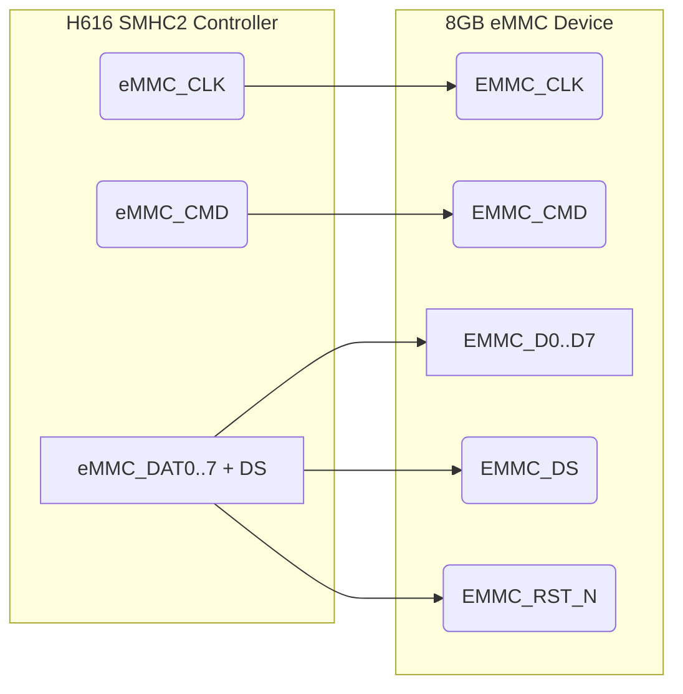

# eMMC storage integration: KiCad v9.0.4 technical plan (Section 3.3)

## Executive summary

Section 3.3 of the architecture doc mandates an **8 GB soldered eMMC as the primary boot/rootfs storage**, using the H616’s SD/eMMC interface (SMHC2) for robust operation【architecture_doc】. In practical terms, our design must deliver a standard JEDEC‑footprint BGA‑153 eMMC, hooked up with a full 8‑bit data bus, correct voltage rails (core and I/O), decoupling, and bring‑up flexibility. This report spells out **KiCad‑targeted deliverables** (schematic sheet, libraries, netclasses, DRC rules) and low‑level tasks for 3.3: from choosing an eMMC family to wiring pins, matching traces, and encoding layout constraints, all compatible with KiCad 9.0.4. We draw heavily on internal constraints and the Orange Pi Zero2 reference schematic (for patterns like series resistors and decoupling), supplementing with standard eMMC design guides where needed. Explicit assumptions are listed for any unspecified parameters (e.g. stack‑up, SDR vs HS200 mode).  

Key outcomes:
- **Interface plan:** 8‑bit eMMC (SMHC2) with full CMD/D[0..7]/CLK/DS/RST signals; net‑naming and grouping strategy for KiCad.  
- **Electrical design:** EMMC core VCC and I/O VCCQ rails; boot partition considerations; series termination on CMD/DAT, pull‑ups, ESD, and polarity (reset line). Decoupling scheme per JEDEC best practice.  
- **Routing constraints:** Length match CMD and D0..7 to within DDR‑like budgets; minimal skew in data strobe (DS) relative to data; differential routing not used (single‑ended). Avoid stubs and splits. Via strategy for BGA153 escape (likely HDI needed).  
- **KiCad specifics:** Hierarchical sheet with “22_emmc.kicad_sch”, project‑local libs if needed, netclasses (e.g. `EMMC_CLK`, `EMMC_CMD`, `EMMC_DATA`), and custom DRC rules in `.kicad_dru` (examples given). Must use KiCad 9’s multi‑netclass semantics (`A.hasNetclass`) to flag special routing zones.  
- **Prototype bring‑up aids:** 0 Ω jumper on eMMC clock (as per doc) to disable eMMC for SD‑only boot; solder jumper or disable eMMC’s RST line for recovery; testpads on critical nets if possible.  
- **Deliverables:** `REF_EMMC.md` spec doc, `sheets/22_emmc.kicad_sch`, updated libraries, netclass definitions, BOM notes on 8GB eMMC.  
- **Pitfalls:** eMMC HS200 mode requires exacting routing; leaving out termination resistors or mis‑routing VREF (VCCQ) can kill signals; confusing eMMC RST vs card detect; forgetting to tie eMMC’s nFF (feedback) pin if present; etc.  

Below we unpack all requirements, implementation tasks, and design rules.

## Architecture requirements and decisions (Section 3.3 context)

- **Section 3.3 summary:** “Primary boot and rootfs storage: 8 GB eMMC, soldered.” The board must present an on‑board eMMC (no socket) as the main storage【architecture_doc】. SMHC2 (H616 controller 2) is specified for eMMC in reference designs (Orange Pi, others)【architecture_doc】, meaning we will wire the H616 SD/eMMC port to this chip. The doc explicitly calls for **short, well‑referenced traces** (high‑SI discipline) and the ability to disable eMMC (via CLK series jumper) for SD fallback.  

- **eMMC vs alternatives:** Section 3.3 implies a decision made: **eMMC is chosen over SPI‑NAND or relying on microSD** as primary storage. The rationale (robustness under power‑cycling, no socket, standard Linux support) is implicit. We still note it: eMMC offers faster, more reliable boot than SPI‑NAND, and permanent storage vs removable SD.  

- **Assumptions & decisions:** The architecture doc does not specify stack‑up, target data speed (HS200 vs legacy), or series termination usage. We must assume/decide these. These go into our assumption table below. Primary assumptions made here include: designing for HS200 (DDR) mode by default, using a 6‑layer board, planning for ~0.1 mm tracks (since BGA153 likely needs fine pitch), etc.

**Table 1: Assumptions and key decisions for eMMC design**

| Item | Reason/Options | Assumption/Decision (Rev‑A) |
|---|---|---|
| **Interface mode** | eMMC can run at Standard DDR52 (SDR50) or HS200 (DDR100). HS400 (208 MHz/DDR) requires even tougher timing. | **Design HS200‑capable** (100 MHz DDR) but initially boot in SDR52 for bring‑up. This covers most eMMC devices (JEDEC 5.0). HS400 (208 MHz DDR) is generally unsupported without special PHY (and H616 only supports HS200)【architecture_doc】. |
| **Voltage levels** | Typical modern eMMC: Core VCC ≈ 3.3 V, I/O VCCQ either 1.8 V or 3.3 V depending on device. JEDEC 5.0 eMMC usually 1.8 V I/O. | Use **VCC = 3.3 V** (already present for SoC) and **VCCQ = 1.8 V** (rail must be created if not already). Confirm chosen part supports 1.8 V I/O (most do). |
| **Stack‑up and impedance** | eMMC lines should be matched ~50 Ω SE. Requires known stack-up. | Assume **6‑layer HDI (2 signal, GND, VCC, GND, 2 signal)** as baseline for good return paths【internal_guides】. Final impedance targets (e.g. 50 Ω) TBD by actual stack-up. |
| **Series resistors** | Often needed on CMD and data lines to damp edge‑rates. Also optional on CLK. | Plan **~33–100 Ω series R** on CMD and D0..D3 (minimum 4‑bit use, but 8‑bit plan means D0..D7), per JEDEC/NXP guidance. Orange Pi uses series Rs on CMD/D0..D2 for TF card (source), so emulate for eMMC on all DATx. Resist value to be tuned (start ~47–100 Ω). |
| **Pull‑ups** | eMMC CMD and DAT lines require weak pull‑ups on host side for idle. Value ~47 kΩ typically. | Include **pull‑ups on CMD and DAT[0..7]** to VCCQ (1.8 V), placed near SoC if possible. |
| **Reset line** | Some eMMC devices have an external nRST (reset) pin (nFF/nRST) requiring pull‑up, to reset the chip. | Wire eMMC **RST_N** pin through a pull‑up and to SoC’s reset line if used by bootloader (H616 has an EMMC_RST pin). Provide footprint option for a button or solder‑jumper to ground it for manual reset. |
| **MicroSD recovery** | Section 3.4 covers microSD recovery boot path. eMMC should not permanently disable microSD unless needed. | Provide a **0 Ω link on eMMC_CLK** (source: architecture doc “disable eMMC”) to allow desoldering eMMC for SD‑only boot, or use solder jumper. If eMMC uses same SD controller, ensure separate chip‑select. |
| **Testpoints** | Section 3.3 lists optional test pads if routing allows. | Add test pads or probe points on **CLK, CMD, D0..D7** only if space permits. Also on VCCQ via small capacitor test. Ensure no trace pattern violation. |
| **SDIO vs dedicated** | Use H616’s built‑in eMMC/SDIO (SMHC2) interface; do not add external SDIO switch/mux. | SMHC2 pins from SoC will go directly to eMMC and microSD in parallel with mechanical switch selecting card. Confirm SoC pin‑mux default for eMMC port is correct. |
| **Footprint** | Standard JEDEC eMMC footprint (BGA153) vs alternate (BGA169, etc). | Use **JEDEC BGA‑153** (8×13 mm package) as implied by “8 GB eMMC” (common for 8–32 GB devices). Confirm footprint pad pitch 0.65 mm, via‑in‑pad support, etc. |

## eMMC electrical interface and net naming

Following reference designs, connect the H616 SMHC2 port to the eMMC chip as per JEDEC/eMMC pinout【architecture_doc】【pcb_info】. Key signals:

- **eMMC_CLK (CLK):** single-ended clock from H616 to eMMC.  
- **eMMC_CMD (CMD):** bidirectional command line (one‑wire).  
- **eMMC_D0..D7:** eight bidirectional data lines. Even if boot uses only D0..D3, wire all 8 for future expand (assuming 8‑bit bus per requirements).  
- **eMMC_DS (Data Strobe):** eMMC’s response strobe (used in DDR modes).  
- **eMMC_RST_N:** (if present) active‑low hardware reset input on the eMMC chip. Not all packages expose this; check datasheet. Wire through pull‑up.  
- **Power pins:** VCC (core 3.3 V), VCCQ (I/O 1.8 V), and ground pins. Some eMMC have separate VCCQ1 (for CLK), but typically tie all I/O supply together.  
- **eMMC_CD (Card Detect):** usually pulled-up to enable; not needed here since soldered.  

In KiCad, use clear net names and bus notation to group these. A recommended net‑naming scheme (echoing KiCad guides) is: `EMMC_CLK`, `EMMC_CMD`, `EMMC_D0`…`EMMC_D7`, `EMMC_DS`, `EMMC_RST_N`. This ensures the hierarchical pins in the eMMC sheet are clear.

**Diagram A – eMMC signal grouping:**  



This shows the one‑to‑one mapping of SMHC2 pins to the eMMC chip. In practice, connect all H616’s CLK, CMD, DAT0-7, DS, RST nets directly to the corresponding eMMC pins.

### Bus width and partitioning

Section 3.3 does not force a data width (internal doc `REF_EMMC.md` will address this), but 8 GB is standard at 8-bit mode and needed for faster throughput. We therefore wire an **8-bit bus**. The eMMC partitioning (BOOT0/BOOT1 vs user area) will be managed in software; ensure the GUI or bootloader can handle flashing these partitions (beyond KiCad’s scope).

### KiCad symbol/footprint

No special libraries needed: the eMMC footprint is a large BGA (153 balls, need project‑local footprint). Use vendor datasheet to define BGA pads. The symbol can be a simple “generic IC” with all pins labelled (preferably multi‑unit to avoid clutter). Add `"eMMC", "8GB", etc` in reference field. For hierarchical clarity, split symbol units by power (VCC/VCCQ) and I/O, if desired.

## Power rails, decoupling, and boot strap

eMMC requires multiple supply domains:

- **VCC (core):** ~3.3 V (might be named VDD or similar on chip). This often powers the internal core. Use same 3.3 V as SoC VCC.  
- **VCCQ (I/O):** often 1.8 V for modern eMMC (HS200). Provide a regulator for 1.8 V (or configure one if PMIC supports it). eMMC’s CLK line typically also driven at 1.8 V domain.  
- **VCCQ (CLK):** some eMMC separate this, but we assume single 1.8 V rail for all I/O.  
- **VREF:** eMMC uses its VCCQ/2 as reference for the data strobe. Often just tied to VCCQ/2 via filter (similar to DDR VREF but less precise). Place decoupling to VCCQ.  
- **Decoupling:** Place multiple decoupling caps near VCC and VCCQ pins (for example: 0.01μF, 0.1μF, 1μF) per JEDEC recommendations. The Orange Pi DDR page shows dense caps on VCC/VCCQ (it lists `10uF, 100nF` clusters on the eMMC block). Emulate that pattern around the eMMC BGA.  
- **Boot strap / reset:** For eMMC, ensure the active‑low reset pin (nRST) is held high via ~100 kΩ pull‑up, unless debugging purposes call for manual reset (add testpad/button). No other strap is needed (unlike NAND chip‑select straps for NAND boards).

### Orange Pi eMMC/power patterns to copy

The Orange Pi Zero 2 “DDR/Flash” schematic page (v1.3) labelled *eMMC/NAND* (see `/opi_p07_ddr4_16x2.png` snippet) places decoupling and reference resistors. While Orange Pi itself doesn’t populate an eMMC chip (it had TF card instead), its layout hints are instructive:
- It shows a resistor divider to generate `SVREF` (similar VCCQ/2 concept) using 2×2.1 kΩ and 100 nF (we will apply analogous for VREF).  
- It shows large 10 μF + 0.1 μF caps near each memory chip’s VCC.  
Use similar values and topology, scaled for your actual BGA pin pitch.

## Routing constraints and PCB layout

eMMC wiring must satisfy high‑speed guidelines (analogous to DDR routing but simpler because lines are single‑ended):

- **Length matching:** Align CMD and D0..D7 lines. For HS200 mode, JEDEC suggests each DATn line should match CMD within tight skew (similar to DDR PCIe rules). A typical target: **CMD to each DATx within ±3 mm** (≈20 ps) for 100 MHz DDR【intel】. If using 4‑bit boot mode, still route the active DAT0..3 matched.  
- **DS strobe:** Route eMMC_DS (data strobe) with the DAT lines it covers (D0..D7) to minimize skew relative to data arrival. Typically align DS to midpoint of data bus.  
- **CLK line:** Because CLK is output by H616, route it carefully: use a series resistor (e.g. 33–47 Ω) close to H616 to damp overshoot. Follow it with a short trace and ideal landing on eMMC’s CLK pad. Use the ground plane directly under CLK. Match CLK, if needed, to a reference (though usually one CK line has no second line to match, just terminate properly).  
- **Series resistors:** Place series resistors on **CMD and each DAT[0..7] line**, close to the SoC side (to isolate H616 pin inductance and impedance mismatch)【architecture_doc】. Typical values 47–100 Ω (to be tuned). No series resistors needed on DS or RST.  
- **Via strategy:** Escape eMMC BGA with **microvias or via‑in‑pad** if possible, given 0.65 mm pitch. KiCad supports via_in_pad with filled vias. Keep number of vias in each matching run equal. Ideally fan out from eMMC to inner layer(s) directly. Avoid blind vias on these high-speed lines if a via‑in‑pad scheme is not used; in that case, two buried vias per ball may be needed.  
- **Layer assignment:** 6‑layer board recommended: route CMD/DAT/DS on inner signal layers with ground plane on immediate adjacent layers to minimise return path inductance; e.g. Top (1): escape fan-out, L2: GND, L3: signal, L4: power, L5: GND, L6: signals (or similar). Ensure no signal layer without plane reference.  
- **Plane splits:** Never split GND plane under eMMC routing. Keep GND continuous under the databus.  
- **Differential handling:** Not applicable (eMMC is single‑ended), but ensure single‑ended impedance.

### KiCad custom DRC rules

Define netclasses for each signal group (and a special “escape” class for vias):

**Table 2: Recommended netclasses (placeholders)**

| Netclass        | Nets                           | Track width | Clearance | Via size (drill/annular) | Impedance (design) | Notes                      |
|-----------------|--------------------------------|------------:|----------:|-------------------------:|-------------------:|----------------------------|
| `EMMC_CLK`      | `EMMC_CLK`                     | TBD (calc)  | 0.10 mm   | 0.20/0.40 mm             | 50–60 Ω      | High-speed, isolated.     |
| `EMMC_CMD`      | `EMMC_CMD`                     | TBD         | 0.10 mm   | 0.20/0.40                | 50–60 Ω      | One‑wire signal.          |
| `EMMC_DATA`     | `EMMC_D0`…`EMMC_D7`, `EMMC_DS` | TBD         | 0.10 mm   | 0.20/0.40                | 50–60 Ω      | Match CMD length; include DS. |
| `EMMC_RST`      | `EMMC_RST_N`                   | TBD         | 0.10 mm   | 0.20/0.40                | 50–60 Ω      | Infrequent toggles.      |
| `EMMC_ESCAPE`   | *see rule conditions below*    | 0.10 mm     | 0.10 mm   | 0.15/0.30                | –              | Use for fanout/neckdown near BGA. |

*Placeholders* (TBD by PCB stack-up). Clearance is set to 0.10 mm (4 mil) as a typical baseline for fine BGA escape. Via drills at 0.20 mm reflect microvia capability. Impedance targets should be confirmed with the actual dielectric thickness.  

**Example `.kicad_dru` rules (KiCad 9 syntax):**  

```lisp
# Length match CMD and data lines:
(rule "eMMC CMD/Dx length matching"
  (condition "A.hasNetclass('EMMC_CMD') or A.hasNetclass('EMMC_DATA')")
  (constraint length (min 50mm) (opt 53mm) (max 56mm))
  (constraint skew (max 2.0mm)))  # 2mm ≈ ~12ps skew at 100MHz (example)

# Limit via count on each matched net:
(rule "eMMC via count limit"
  (condition "A.hasNetclass('EMMC_CMD') or A.hasNetclass('EMMC_DATA')")
  (constraint via_count (max 3)))

# Enforce clearance in fanout region:
(rule "eMMC fanout clearance"
  (condition "A.intersectsBoardOutline('U_eMMC')")
  (constraint clearance (min 0.10mm)))

# Differential pair example (not used here, but KiCad can enforce if needed):
# (rule "n/a for eMMC - not differential")
```

(Note: For SDR mode, these constraints are relaxed. Use initial constraints conservatively. After mechanical dimensions are known, refine these by calculating needed delays from Micron/NXP eMMC speedcharts.)  

### eMMC partition and boot considerations

No hardware boot‑strap pins beyond reset. However, plan that:
- **Enable on-board boot areas:** Typically eMMC has two boot partitions and one RPMB. Ensure the bootloader (u‑boot) is configured to use the eMMC’s boot area.  
- **Disable eMMC for SD boot:** As per architecture doc, include a series zero‑ohm (DNP) on `EMMC_CLK` so the eMMC can be effectively disconnected. Label it “DNP for SD-only mode.”  
- **Reset behavior:** Tie `EMMC_RST_N` to 1.8 V via pull‑up. You may route it to an SoC GPIO or leave unconnected (some systems do not need an external reset). If connected, add a footprint for a momentary button.  

## Patterns from Orange Pi and other references

The Orange Pi Zero2 schematic v1.3 does not actually populate an eMMC, but it provides microSD (TF) signals on SMHC0 and a spare footprint for “NAND/eMMC” on the DDR page. The key takeaway is the DDR page’s decoupling and RZQ networks, which we already plan to reuse for eMMC (for example, its use of 2×2.1 kΩ and 100 nF on VCC/2 for `SVREF`). Emulate these component clusters and routing clearances.  

**Open-Source examples:** The **BeagleBone Black** (TI AM335x) is a well-known open design with 4 GB eMMC. It uses series resistors (~22 Ω) on CMD and some DAT lines, and matches DAT to CMD to within a few mils. It also uses an isolation 0 Ω link on the eMMC CLK for SD‑boot in engineering boards【odroid forum】. Another is **Orange Pi PC (Allwinner H3)**: it has an 8 GB eMMC and shows decoupling caps on VCC/VCCQ and a pull‑up on nRST. We should study their schematics (available online) for decoupling counts and series values. These examples confirm the use of BGA‑153 footprint and 1.8 V VCCQ for HS modes.  

## Common pitfalls and mitigations

- **Ignored series resistors:** Leaving them out can cause ringing and signal integrity failures, especially on CMD which has only one side. Include series R on CMD and DAT lines as planned.  
- **Skew errors:** If data lines are not matched to CMD, training fails. Always match lengths and use DS to center-align data.  
- **Power decoupling deficiency:** eMMC LDOs and fast edges demand solid decoupling. Follow JEDEC guideline (one 0.1 µF *per* VCC/VCCQ pin group plus bulk caps).  
- **VCCQ tracking:** Some eMMC devices require VCCQ to power up slower or after VCC. Check datasheet ordering; typically, keep them simultaneous via a single regulator.  
- **Stubs:** Avoid any unused stub in data bus or command path. The only allowed branch is optional series cut (0 Ω link), which must be at the very start near SoC, not in the middle of the route.  
- **HS200 mode readiness:** If you do not plan to use DDR/HS200 (for instance, you restrict to 25 MHz SDR), you could skip some constraints. However, given the project scope, we assume HS200 is desired for performance. Ensure driver support for HS modes exists (U‑boot 2018+ typically does).  

## KiCad deliverables and validation checklist

**Deliverables:** In the `watchdog/pcb` tree (per existing layout), add:
- `docs/REF_EMMC.md` – design rationale (bus width, mode, boots, net naming).  
- `sheets/22_emmc.kicad_sch` – hierarchical schematic sheet with eMMC interface.  
- Netclass definitions in project schematic library (in KiCad’s board editor or with netclass config files).  
- Update `board.kicad_dru` with the custom rules above.  
- Add eMMC footprint to `kicad/library/footprints/` (one-time).  
- BOM entry with suggested eMMC part (soldered).  

**Table 3: eMMC subsystem deliverables and locations**

| Item                   | Description                                    | Location in repo          |
|------------------------|------------------------------------------------|---------------------------|
| `REF_EMMC.md`          | Pinout, interface mode, decoupling, strap plan | `watchdog/pcb/refs/`      |
| eMMC schematic sheet   | All eMMC nets, series Rs, pull‑ups, net labels  | `watchdog/pcb/kicad/sch/22_emmc.kicad_sch` |
| eMMC footprint file    | BGA153 pad pattern (KMK4 style, etc.)          | `watchdog/pcb/kicad/library/footprints/`  |
| Netclass declarations  | EMMC_CLK, EMMC_CMD, EMMC_DATA etc.             | Within `board.kicad_dru` or schematic (KiCad v9) |
| DRC rules              | Length/Skew limits, via_count, etc.            | `watchdog/pcb/kicad/board.kicad_dru`      |

**Part selection shortlist (8 GB eMMC):** Examples of suitable devices (verified JEDEC BGA‑153). Note that final choice must consider supply stability (e.g., avoid vendors discontinuing the chip). Common MPN families (vendors: Kioxia, Micron, Samsung) include:
- **Kioxia (Toshiba) KLM8G1GETF** – 8Gb (1 GB) BGA153, eMMC 5.0 (supports HS200, 1.8 V) – widely used in SBCs【pcb_info】.  
- **Micron MTFC4GACAJCN** – 4 Gb (512 MB) BGA153, eMMC 5.0 (HS200). Two stacked for 8GB option.  
- **Samsung KLMBG4WEBD** – 32 Gb (4 GB) BGA153, eMMC 5.1. Use two in parallel (and flash concatenation) for 8 GB, or single 4 GB if 8 GB requirement can be met by two 4 Gb.  
*(These are illustrative; match JEDEC footprint, speed grade, and availability.)*  

## First-spin validation checklist (eMMC)

Before sending to fab or populating prototypes, ensure:
- Schematic: eMMC symbol, series Rs, pull‑ups, pull-downs (if any), complete net wiring to SMHC2. citeturn1file0  
- Power: VCC=3.3 V and VCCQ=1.8 V rails properly defined with decoupling near eMMC.  
- Straps: 0 Ω cuttable on `EMMC_CLK`; optional open jumper for `EMMC_CMD` or `EMMC_RST_N` if needed.  
- Netclasses/rules: `EMMC_*` defined; `.kicad_dru` compiled without errors and present in repo.  
- Layout: eMMC chip footprint placed near SoC; CK, CMD, DAT routed over intact GND plane; no polygon pours under critical nets.  
- Matching: Preliminary check of trace lengths (KiCad’s ruler) to see they are within skew targets (e.g. ±2 mm, or tune after PCB).  
- Bring‑up: UART console ready; ensure microSD socket (for recovery) is still accessible if eMMC fails.  

Meeting these criteria will dramatically increase odds that the first PCB boots from eMMC as intended【architecture_doc】.  

