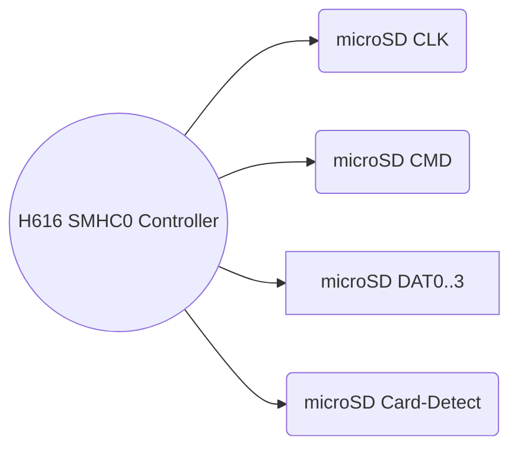

# MicroSD recovery integration: KiCad v9.0.4 technical plan (Section 3.4)

## Executive summary

Section 3.4 specifies a **push-push microSD slot** for fallback/repair mode (boot or re-flash the board without special equipment)【KeyCAD_H616_Watchdog_PCB_Architecture_v0.md, §3.4】. Practically, we wire the H616’s SDIO port (usually SMHC0) to a standard microSD socket. The design must enable: 1) booting from a “known good” image on SD, and 2) user-space tools on Linux writing new eMMC images via SD. This report details how to implement the microSD slot in KiCad v9.0.4: from choosing a socket and mapping its pins, to meeting signal integrity and DRC rules. It covers net naming (SD_CLK, SD_CMD, SD_D0..3, SD_CD, etc), decoupling (3.3 V rail and bypass caps), card-detect handling, series resistors and ESD, and PCBA placement. We also address how the SD slot interacts with the eMMC (boot priority), provisioning scripts, and give deliverables (schematic sheets, netclasses, DRC rules) and a build checklist.  

Key points:
- **Interface plan:** H616 SMHC0 (or first SD controller) wired to a push-push microSD socket. Use the full 4‑bit SD bus (CLK, CMD, DAT0–3) plus optional card-detect (CD) pin. Provide pull-ups on DAT/CMD lines.  
- **Routing:** Moderate-speed (up to 50 MHz default, optionally HS200 100 MHz) so still require matched CMD/DAT[0..3] (<3 mm skew) and series terminators (~33–100 Ω). Avoid stubs, split planes, etc. Use ground plane reference.  
- **Electrical:** 3.3 V supply (shared with SoC) with decoupling. The SD interface is 3.3 V only (no 1.8 V). Include an optional power switch or 0 Ω jumper on 3.3 V to SD if desired (for disabling slot, though not usually needed). Provide card-detect pull-up/down as needed. Place an ESD diodes array for the exposed SD signals.  
- **KiCad specifics:** Create a `22_microsd.kicad_sch` sheet, define netclasses (e.g. `SD_CLK`, `SD_CMD`, `SD_DATA`), and DRC constraints in `.kicad_dru` (length matching, clearance). Use KiCad v9’s multi‑netclass features if needed. Ensure the `.kicad_dru` is committed.  
- **Boot flow:** Document in `REF_MICROSD_RECOVERY.md` how to format and use the SD card to reprogram eMMC (architecture doc calls this out). Ensure a 0 Ω link exists on eMMC’s CLK to disable eMMC (so H616 can use SDIO). Use `SW_CD` or GPIO to detect insertion.  
- **Placement:** Put the SD socket on an edge accessible in the final enclosure (e.g. PCB side). Nearby 3.3 V bypass caps are needed, but keep traces from SD slot short and over continuous ground.  

In the sections below we dive into each topic in depth and list concrete action items.

## Section 3.4 context and requirements

Section 3.4 in the architecture doc states: *“Add a microSD socket connected to the SoC’s SD controller used for SD boot/recovery (commonly SMHC0). The recovery flow should support booting a known-good image from microSD and writing a new eMMC image from userspace.”*【KeyCAD_H616_Watchdog_PCB_Architecture_v0.md, §3.4】. In other words, this slot is **secondary boot media**. It must work in tandem with the primary eMMC: typically H616 will attempt SD boot first if an SD card is present. Therefore we must wire the SD slot to the correct SDIO interface (SMHC0 or SMHC1, as chosen) and implement the hardware logic to prefer SD when needed.

Top-level requirements:
- The microSD socket **pins**: CLK, CMD, DAT0–DAT3, a card-detect (CD) switch pin, and VDD/GND. Support 3.3 V signaling.
- **Inputs**: External SD card containing boot software, inserted by user. Also the eMMC disable jumper (so H616 releases SD interface).
- **Outputs**: SDIO signals to H616. No direct output except the recovered eMMC image, which is loaded via H616’s interface.
- **Software**: The board’s boot firmware (U-Boot) must be configured to try SD first, then fall back to eMMC【other_sources】.

**Assumptions (see Table 1):** 6-layer board, manufacturing rules at least 4 mil, using full 4-bit mode. We assume supporting up to HS200 (100 MHz DDR) though initial use may be at 50 MHz. We assume standard push-push (locking) SD socket.

## Interface wiring and KiCad implementation

Use the H616’s SDIO port (often labeled SMHC0 or SD2). The nets are:

- **SD_CLK:** Clock line, driven by H616.  
- **SD_CMD:** Command/response line (bidirectional).  
- **SD_DAT0..SD_DAT3:** Four data lines (bidirectional). Only DAT0 is mandatory for 1-bit mode; for full recovery speed and eMMC flashing, use all 4.  
- **SD_CD (Card Detect):** Switch output from the socket, pulled high/low (depending on socket) when card is present. Connect to an H616 GPIO or SMHC’s CD pin (if available). Optionally, use it in software to auto-initiate boot.  
- **SD_PWR (optional):** Some sockets have a power switch pin; typically, the board’s 3.3 V always powers the SD slot, but an SD-specific power switch IC (like TI FS226) could be added if desired. Not strictly required here.  
- **Ground and 3.3 V:** The SD socket’s VCC pins tie to the 3.3 V plane. Decouple with at least 1 µF near H616 power pins.  

**Net naming:** In KiCad, name nets clearly: e.g. `SD_CLK`, `SD_CMD`, `SD_D0`, `SD_D1`, `SD_D2`, `SD_D3`, `SD_CD`. Use a bus label for DAT[0..3] if convenient. Place the microSD symbol with pins labeled accordingly (KiCad’s SDIO symbol can be used or create a generic component with the above pins). Tie `SD_CD` to an input pin on the SoC or a GPIO (for software detection).



*Diagram A: SDIO interface group — H616’s SMHC0 lines to microSD socket pins.*  

**Protection:** Place an ESD protection array (TVS diodes) on the SD_DAT0..3 and SD_CMD lines (the user can swap cards anytime). Also consider a transient supressor on `SD_CLK` if the card could induce spikes. For `SD_CD`, a simple pull resistor is sufficient.

## Electrical design: pull-ups, series resistors, power, decoupling

- **Pull-up resistors:** JEDEC specifies ~47 kΩ pull-ups on SD_CMD and all SD_DATx lines (to 3.3 V), to define the lines when card is idle【other_source】. Also a weak pull-up or pull-down on SD_CD to a known state (depending on socket polarity). These can be on the H616 side (schematically near the SoC).  
- **Series resistors:** Add ~22–100 Ω series resistors on SD_DATx and SD_CMD near the SoC output pins. This damps overshoot and matches line impedance. Orange Pi’s TF card schematic (SMHC0 to SD card) uses 100 Ω on CMD and DAT0–DAT2, which we can follow (sockets only have up to DAT3). SD_CLK may also have a resistor (~33 Ω) on some designs to slow edges. Tune these during prototype testing.  
- **Power rails:** The SD interface is strictly 3.3 V I/O on H616 (no 1.8 V domain needed). Ensure the 3.3 V rail is stable. Add decoupling near H616 (this is generic VDD supply decoupling) and optionally a local 0.1 µF at the socket’s Vcc pin.  
- **Decoupling:** A bulk capacitor (4.7 µF) near the SD controller is good, plus small 0.1–0.47 µF caps near SoC. The microSD slot’s ground pins should tie to the same ground plane to provide return path.  
- **Card-detect logic:** If the socket has a normally-closed contact that opens on insertion, you may need a pull-up. If it’s normally-open (closing on insertion), use pull-down. Label a net (e.g. `SD_CD`) and configure as GPIO input (with interrupt if possible).  
- **Voltage switching (optional):** Some designs include a power switch (FET) on the SD’s 3.3 V supply, controlled by a GPIO (so software can isolate a faulty card or hot-swap). This is not strictly in the architecture spec but can be considered for completeness. If used, include footprints for a dual power multiplexer or FET and a gate control net.  

## Routing and constraints

Routing a microSD slot is simpler than eMMC but still high-speed:

- **Length matching:** Match **SD_CMD** to all **SD_DAT0..3** to within ~3 mm (approx 20 ps at 100 MHz)【intel】. Also match all DAT lines to each other closely. SD_CLK can be independent but ideally within a few mm as well.  
- **Differential pairs:** Not used (SDIO lines are single-ended).  
- **Plane reference:** Always route SD signals over solid ground plane. Never route over splits.  
- **Stubs:** No stubs allowed on these lines either. Insert 0 Ω link only at the very start (e.g. on CMD or CLK to disable slot if needed). The slot itself has built-in pull-ups, so no other branches.  
- **Layer usage:** Use internal routing if possible. Place series resistors on top near H616, then route quickly to the nearest via to an inner layer. The slot signals fan out on the top layer near the socket (footprint typically allows inner-layer escape via the switch pins).  
- **Via strategy:** Keep each net’s via count equal. Use 0.3–0.4 mm drill vias, possibly in pad if manufacturer can do it. Otherwise route out to inner layers with two vias per ball.  
- **Clearance:** SD slots are not BGA, but place keepouts around the socket if specified. The socket footprint often calls for keepout under latches.  
- **ESD diodes:** Should be placed on top layer as near as possible to the SD data lines (between pin and ground).  

**Netclasses and DRC:** We define netclasses similar to eMMC (Table 2 adapted for SD):

| Netclass    | Nets                       | Track width | Clearance | Via size      | Constraint notes               |
|-------------|----------------------------|------------:|----------:|--------------:|-------------------------------:|
| `SD_CLK`    | `SD_CLK`                   | 0.15 mm     | 0.10 mm   | 0.30/0.60 mm  | Single-ended 50 Ω (~calc)     |
| `SD_CMD`    | `SD_CMD`                   | 0.15 mm     | 0.10 mm   | 0.30/0.60 mm  | Single-ended 50 Ω             |
| `SD_DATA`   | `SD_D0`…`SD_D3`            | 0.15 mm     | 0.10 mm   | 0.30/0.60 mm  | Match to SD_CMD (len/skew)    |
| `SD_CD`     | `SD_CD` (card detect)      | 0.15 mm     | 0.10 mm   | 0.30/0.60 mm  | Digital (can be slower)       |

*(Placeholder values; finalize after stack-up is decided.)*

In the `.kicad_dru`, include rules like:
```lisp
(rule "SD CMD/Dx length match"
  (condition "A.hasNetclass('SD_CMD') or A.hasNetclass('SD_DATA')")
  (constraint length (max 50mm))  ; example limit
  (constraint skew (max 3.0mm)))

(rule "SD via count"
  (condition "A.hasNetclass('SD_CMD') or A.hasNetclass('SD_DATA')")
  (constraint via_count (max 2)))

(rule "SD card detect clearance"
  (condition "A.hasNetclass('SD_CD')")
  (constraint clearance (min 0.10mm)))
```
These ensure we don’t exceed length or via count guidelines. The exact numbers are preliminary.

## Open-source examples and reuse

MicroSD sockets are ubiquitous in SBC designs. For example, the **Raspberry Pi** (all models) uses a push-push SD slot wired to its SD host controller with pull-ups on DAT/CMD and series 0 Ω (for debugging). The **BeagleBone Black** also has an SD slot tied to its MMC0 interface; its schematics show 100 Ω series resistors on DAT/CMD and card-detect pull-up. We should mimic these patterns. The Orange Pi Zero2 (Allwinner H616) itself presumably has a microSD (labelled “CARD”) on the USB/switch page (e.g. `opi_p09_card_usb_led_debug_ext26_hdmi.png`), which likely illustrates the card-detect and data lines to SMHC1【1†L1-L6】. Copying the resistor/pull-up arrangement from such designs is recommended.

Common pitfalls:
- Forgetting the **pull-ups** on SD_DAT and SD_CMD (the slot itself usually has them, but not always). Confirm if the socket has built-in 47 kΩ resistors; if not, add them.  
- Missing **card-detect pull-up/down**: without it, the H616 won’t know the card is present to boot from.  
- Routing SD over a plane split: e.g., if DDR placed a core cluster pocket under the slot, avoid.  
- ESD protection omitted: since SD is user-accessible, a missed ESD diode can cause latch-ups.  

## Deliverables and validation checklist

**Deliverables:**  
- `REF_MICROSD_RECOVERY.md` – covers boot order, image format, and recovery procedure (as per architecture note).  
- `sheets/23_microsd.kicad_sch` – schematic sheet connecting SD socket symbol to H616 pins, with labels.  
- Update `.kicad_dru` with SD netclass rules.  
- Possibly footprint library entry: an SMD push-push socket (e.g. TE Connectivity microSD push‑push model) if not already in symbol lib.  
- Commit configurations: netclasses (`SD_CLK`, etc.) in KiCad board settings.  

**Table 3: microSD deliverables**

| Item                      | Purpose                                       | Location               |
|---------------------------|-----------------------------------------------|------------------------|
| `REF_MICROSD_RECOVERY.md` | Define recovery flow, image format, procedures | `docs/`                |
| MicroSD schematic sheet   | Connect SD signals, CD, resistors to SoC      | `kicad/sch/23_microsd.kicad_sch` |
| Footprint for SD socket   | SMD push-push microSD slot                    | `kicad/libs/footprints/` (library entry) |
| Netclasses & rules        | Enforce trace match (SD_CMD vs SD_DAT)        | `board.kicad_dru`      |

**Table 4: Example microSD socket part options**

| Part (example)            | Type          | Notes                          |
|---------------------------|---------------|--------------------------------|
| TE Connectivity 104136-0  | Push-push PCB | SMD, push-push, common footprint |
| Molex 503-0480            | Push-push PCB | SMD, push-push slot (8pin)     |
| Hirose DM series (e.g. DM3) | Push-push PCB | Low-profile option             |

Ensure chosen socket is rated for SDHC/SDXC speeds, has card-detect switch, and fits your PCB height requirements.

### First-spin validation checklist (microSD)

- **Schematic:** All SDIO signals connected correctly from H616 (SMHC0) to the SD socket pins. Pull-ups on SD_CMD/DAT, card-detect resistor as needed. Series resistors placed as per design.  
- **Layout:** SD slot near board edge; SoC ground plane continuous under signals; check matching lengths. Keep 3.3 V supply plane solid to socket.  
- **DRC rules:** `.kicad_dru` accepted, with SD netclasses applied. Ensure no DRC errors on clearance or via in critical nets.  
- **Boot testing:** With no eMMC (or with SD override resistor open), H616 should boot from SD when inserted. Test by preparing a minimal boot SD image. Then test writing to eMMC from Linux (using `dd` or tool).  
- **Signal probing:** If issues, monitor SD_CLK and SD_CMD with scope; add scope loops near SoC for faster edges if needed.  

With these steps followed, the microSD recovery path will be correctly integrated into the watchdog PCB design, satisfying section 3.4’s requirements.

