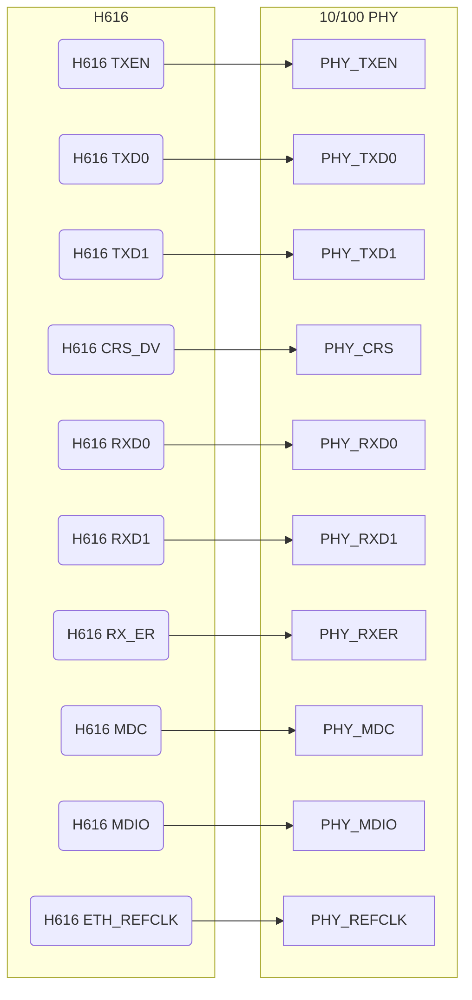
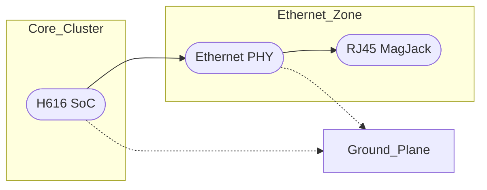

# Ethernet (10/100) integration: KiCad v9.0.4 plan (Section 3.5)

## Executive summary

Section 3.5 mandates a **10/100 Mbps Ethernet** interface as a baseline network (EMAC0 on H616). In practice, this means wiring the H616’s MAC via **RMII** (50 MHz) to an external 10/100 PHY chip, then out through an RJ45 connector with integrated magnetics. The implementation must follow strict EMI/ESD practices at the connector. This report details the low-level design: PHY selection, clocking, strap settings, PCB zoning, routing rules (100 Ω differential, matched pairs), magnetics/RJ45 footprint, LED wiring, etc., all in KiCad v9.0.4 style. We draw from internal guides and the Orange Pi Zero2 reference (which uses similar Ethernet magnetics/LED patterns) and note open-source examples like Raspberry Pi or BeagleBone for best practices. Explicit assumptions (board stack-up, PHY chip choice, etc.) are listed where unspecified. Deliverables include a `REF_ETHERNET_RMII.md` spec, a KiCad sheet (e.g. `25_ethernet.kicad_sch`), netclass definitions, custom DRC rules, and first-spin checklists.

## Architecture requirements (sec 3.5)

The architecture doc calls for **H616 EMAC0 → 10/100 PHY → RJ45 MagJack**. We must:
- Support **RMII 10/100** (H616 does not have GMII for 10/100, so use RMII interface). This requires a 50 MHz reference clock to the PHY.  
- Include **ESD/EMI protection**: TVS diodes at RJ45, keepout around magnetics, solid chassis ground.  
- Provide **bring-up aids**: PHY reset pin exposed to test pad/jumper, strap resistors or jumpers for PHY config (e.g. address, speed/duplex pins) placed accessibly, and LEDs wired so their state (link/activity) is obvious.  
- (Doc suggests writing `REF_ETHERNET_RMII.md` with PHY shortlist, clocking, keepouts, etc.)

**Table 1: Assumptions & design decisions**

| Item                   | Why it matters/Options                              | Decision/Assumption (Rev-A)                                |
|------------------------|-----------------------------------------------------|-----------------------------------------------------------|
| **PHY interface**      | RMII (2×RGMII) vs RGMII (all 4 bits)                 | **RMII 10/100** per spec. (No gigabit PHY needed.)       |
| **PHY chip choice**    | Cost, availability, package, GMII vs RMII support    | Use common 10/100 PHY (e.g. Microchip LAN8720A or TI DP83848) – small QFN. |
| **RMII clock source**  | PHY needs 50 MHz clock; can be H616, PHY, or xtal    | Assume H616 provides 50 MHz on EMAC0_REFCLK pin (or add 50 MHz crystal near PHY). |
| **MagJack type**       | Integrated magnetics vs separate choke + jack        | **MagJack with built-in magnetics** (8-pin RJ45) to simplify assembly and keepout rules. |
| **Stack-up/impedance** | Ensures controlled 100 Ω diff and 50 Ω se routing    | **6-layer board**; inner layers for signals. Target ~50 Ω SE, 100 Ω diff (calc by stackup). |
| **LED interface**      | Use PHY or separate drivers for link/activity LEDs   | Use PHY’s integrated LED outputs (typical) with series resistors (as Orange Pi does). |
| **VTT/ODT**           | Not applicable to Ethernet (no termination resistors needed beyond magnetics) | N/A. |

## PHY and MagJack selection

For 10/100 Mbps we list some PHY part options (BOM table below). Common choices:
- **Microchip LAN8720A** – 10/100 PHY with RMII, small QFN. Requires 3.3 V and has single 50 MHz input.  
- **TI DP83848** – robust industrial PHY (but 20-pin QFN). May be overkill.  
- **Marvell 88E1111R** – 10/100 PHY (rare).  
We must pick one that matches our PCB process (QFN fine pitch) and has needed strapping (e.g. MAC/PHY modes). Often they require pull-ups on pins to select address/clock mode.  

MagJack (Ethernet jack) should be a right-angle RJ45 with integrated transformer and LEDs. Example footprints: 
Pulse H5102NL or Murata NXxEW-AB (8 pins, 2.54 mm pitch) with split ground pins. Ensure jack data lines match PHY MDI pinout or swap in PCB.  

**Table 4: Example Ethernet parts**

| Part (example)                | Type            | Notes                                    |
|-------------------------------|-----------------|------------------------------------------|
| Microchip **LAN8720A** (LGA)  | 10/100 PHY      | RMII, 3.3 V, DIP prototype available     |
| Texas Instruments **DP83848J**| 10/100 PHY      | 3.3 V, extensive apps note for layout    |
| Marvell **88E1512R** (if needed)| 10/100 PHY    | – likely too big                       |
| Pulse **H5102NL**             | RJ45 MagJack    | 8P8C with integrated magnetics & LEDs    |
| Amphenol RJC(ETI)J0112NL      | RJ45 MagJack    | LED and transformer included            |

Footprints for both PHY and MagJack must account for pads and keepouts. The MagJack often has extra shield tabs that connect to chassis ground.

## PHY ↔ H616 RMII mapping

Typical RMII pin mapping (H616 EMAC0 ↔ PHY):
- **TX_EN (H616)** ↔ TXEN (PHY)  
- **TXD0/1** ↔ TXD0/1  
- **RXD0/1** ↔ RXD0/1  
- **CRS_DV** ↔ CRS_DV (combined carrier sense + RX data valid)  
- **RX_ER** ↔ RX_ER (PHY’s receive error)  
- **TXC (H616)** ↔ REFCLK (PHY clock input) *or* use ext 50 MHz oscillator*  
- **MDC/MDIO** ↔ MDC/MDIO (management interface)  
- **LED1/2** (PHY LED outputs) ↔ R/G LED (through resistors)  


*Diagram A: RMII signal mapping between H616 and Ethernet PHY.*  

## Power, decoupling, and straps

- **PHY power:** Typically 3.3 V supply, same as SoC (with own LDO). Ensure decoupling near PHY (0.1 µF + 4.7 µF).  
- **PHY strap pins:** Some PHYs have mode pins (e.g. assign MAC address, enable RMII or MII, enable auto-negotiation). Tie these to VCC or GND via 0 Ω or strapping resistor. Place these resistors near PHY so they can be modified if needed.  
- **Reset:** Expose the PHY’s reset pin (active-low) to the board: use a 0.1 µF cap and a pull-up (common on many PHYs). Provide a test pad or jumper on this net for manual reset if stuck.  
- **MagJack shield:** Tie the RJ45 shield pins to chassis/board ground through 0 Ω or ferrite beads. Usually connect all shield pins to a single “ETH_CHASSIS” net to avoid ground loops.  
- **LEDs:** Most MagJacks have integrated LED connectors (2× for link/activity). If not, wire the PHY’s LED outputs through 330 Ω resistors to panel LEDs. Clearly label these.  
- **Decoupling:** Besides the PHY, decouple the MagJack’s core (some have integrated chokes with center taps; ensure those taps are grounded or filtered per spec). ESD diodes (common-mode TVS arrays) should sit on each pair before the magnetics (but layout-wise near connector pins).  

## PCB floorplan and zoning

Keep Ethernet on an **I/O edge** of the PCB for connector access. Under the RJ45, maintain a “magnetics keepout” on all layers (no traces under the transformer and coil components). The PHY chip can sit near the edge or just inside, but ideally close to the SoC to minimize RMII trace length. Maintain a contiguous ground plane under PHY and between SoC and PHY.


*Diagram B: Core cluster (SoC) and Ethernet zone (PHY + MagJack) on board edge.*  

Reserve keepout around the jack’s cage and magnetics per manufacturer’s instructions. Run the RJ45 shield to chassis ground (via a short trace) and isolate it from digital ground if needed (some designs tie through a ferrite to reduce noise).

## Routing rules and netclasses

Ethernet signals require controlled impedance and precise matching:

- **Magnetics pairs (MDI):** `ETH_TXP/N`, `ETH_RXP/N` should be diff pairs targeting 100 Ω ±10%. Keep trace length equal. They will route from PHY to MagJack, usually on the top layer or an inner layer beneath; often included in connector footprint.  
- **RMII lines:** The 7 RMII signals (TXD0/1, TXEN, RXD0/1, CRS_DV, RXER) are separate single-ended lines to match. **Match TXD0/1 with TXEN**, and **RXD0/1 with RXER+CRS_DV** if possible for timing, but primarily match TX pair together and RX pair together. Keep skew <1 ns (~20 mm) within each side. Use 50 Ω single-ended (calculated by stack-up).  
- **MDIO/MDC:** These are low-speed management signals (2 MHz), no stringent matching needed. Route as normal signals with moderate width.  
- **Pair skew (for diff pairs):** Very small; ensure each differential pair’s lengths match to within 5 mil.  
- **Via strategy:** Minimize vias in high-speed traces. If via-in-pad is needed for diff pairs, use microvias. Each pair should have equal number of vias.  
- **Clearance:** Keep differential pairs close together (5–7 mil), and away from other signals by at least their spacing. Follow layout guides (e.g. TI DP83822 AN5168 recommends 5H spacing from other copper).  
- **Connector strain relief:** Avoid routing critical signals under the jack where board may flex; use plated slot if needed.  

**Table 2: Recommended netclasses (placeholders)**

| Netclass      | Nets                          | Width    | Clearance | Via (drill/annular) | Target Impedance | Comments                   |
|---------------|-------------------------------|---------:|---------:|--------------------:|-----------------:|----------------------------|
| `ETH_DIFF`    | `ETH_TXP/N`, `ETH_RXP/N`      | TBD†    | 0.15 mm   | 0.25/0.50 mm        | 100 Ω diff      | Differential pairs to magjack |
| `ETH_RMII`    | `ETH_TXD0/1`, `ETH_RXD0/1`,   | TBD†    | 0.15 mm   | 0.25/0.50 mm        | 50 Ω single     | TX and RX data lines         |
|               | `ETH_TXEN`, `ETH_CRS_DV`, `ETH_RXER` |         |         |                     |                 |                            |
| `ETH_MGMT`    | `ETH_MDC`, `ETH_MDIO`         | 0.20 mm  | 0.15 mm   | 0.25/0.50 mm        | –               | Low-speed MDIO             |
| `ETH_REFCLK`  | `ETH_REFCLK`                  | 0.20 mm  | 0.15 mm   | 0.25/0.50 mm        | –               | 50 MHz clock (if external) |

†Actual track widths to hit impedance targets must be computed once the PCB stack-up is fixed.  

In `board.kicad_dru`, enforce rules such as:
```lisp
(rule "Ethernet diff pair length match"
  (condition "A.hasNetclass('ETH_DIFF')")
  (constraint length (min 30mm) (opt 32mm) (max 34mm))
  (constraint skew (max 0.1mm)))  # e.g. constrain diff pair skew tightly.

(rule "Ethernet RMII skew"
  (condition "A.hasNetclass('ETH_RMII')")
  (constraint skew (max 5.0mm)))  # example: TXD0 vs TXD1 within ~5mm
```
And use `(condition "A.inDiffPair('ETH_DIFF')")` for truly differential pairs in KiCad 9's language. These ensure length and skew constraints are tracked.

## Termination, magnetics, and ESD

- **Transformer and choke:** The MagJack has built-in common-mode chokes and transformers for each pair (no external term resistors needed). Follow vendor: connect each center tap of the Rx/Tx side to Vcc (often through 75 Ω to 3.3 V) or ground as specified. Use a ferrite bead if recommended.  
- **ESD diodes:** Place a dual- or quad-line TVS array (e.g. Littelfuse SC70-5) right at the RJ45 connector pins (before the magnetics). This protects against high-voltage spikes on the cable. Connect the TVS ground to chassis ground nearby.  
- **LEDs:** The PHY will drive LEDs. If using MagJack with built-in LEDs, wire the PHY LED outputs (usually open-drain) to the LED pins via ~330 Ω resistors, with LED cathodes to ground (for active-low signals). If separate LEDs, drive their anodes from 3.3 V through resistors, cathodes to PHY pins. Test these connections carefully in bring-up to ensure light-up on link/activity.  

## Open-source designs and reuse

Many open hardware boards illustrate Ethernet integration:
- **Raspberry Pi 4**: Uses a Realtek PCIe GbE PHY (for gigabit), but the RJ45 region shows guard traces and ESD arrays. 
- **BeagleBone Black**: Uses DP83865 10/100 PHY; schematics show 4× 49.9 Ω series on TX lines, and 0 Ω links on LED nets, plus an EMI bead on VCC.  
- **Orange Pi Zero2**: On its 1000M Ethernet page, it has integrated magnetics and TVS on each pair, plus link LEDs tied to the jack. We can copy its LED and ESD patterns.  

Follow these example patterns for resistors, TVS, and keepouts. The BeagleBone’s use of 49 Ω series on Tx and an EMI ferrite on VCC at connector are good references.  

Common pitfalls:
- **Misordering pairs**: Don’t swap TX/RX pairs or invert one side. Always confirm PHY datasheet pin mapping vs jack wiring. 
- **Missing shield connection**: Grounding the RJ45 shield incorrectly can introduce noise; often a single ferrite connects cage to chassis ground. 
- **Incorrect LED polarity**: If LEDs use wrong polarity, they won’t indicate properly. Confirm PHY LED pin behavior. 
- **Ignoring keepout**: Routing other signals under the jack/magnetics causes crosstalk. Strictly enforce “no traces” in that zone. 

## Deliverables and validation

**Deliverables:**  
- `REF_ETHERNET_RMII.md` – detailed spec (chosen PHY, strap values, clock scheme, grounding).  
- KiCad sheet `25_ethernet.kicad_sch` – all Ethernet I/O.  
- Updated netclass definitions (`ETH_DIFF`, etc.) in KiCad.  
- Custom rules in `board.kicad_dru` as above.  
- BOM entries for chosen PHY, MagJack, TVS, etc.  

**Table 3: Ethernet subsystem deliverables**

| Item                     | Description                                  | Path in repo                         |
|--------------------------|----------------------------------------------|--------------------------------------|
| `REF_ETHERNET_RMII.md`   | Design rationale, strap map, keepout rules   | `docs/`                              |
| Ethernet schematic sheet | PHY + MagJack + supporting parts schematic   | `kicad/sch/25_ethernet.kicad_sch`    |
| Netclasses / rules       | Differential/single ended classes, constraints| `board.kicad_dru`, netclass defs     |
| Footprints (PHY, MagJack)| Pads and keepout for chosen components       | `kicad/libs/footprints/`             |

**Table 4: PHY and MagJack shortlist (example MPNs)**

| Part                      | Type       | Notes                             |
|---------------------------|------------|-----------------------------------|
| Microchip **LAN8720A**    | 10/100 PHY | QFN-20, RMII, common on Allwinner boards |
| Microchip **DP83822I**    | 10/100 PHY | QFN-48, widely used, all-straps accessible |
| Pulse **ST1P20541NL**     | RJ45 MagJack| RJ45 w/magnetics, LEDs           |
| Amphenol/FCI **81R-01001D**| RJ45 MagJack| with integrated 75 Ω center taps |

(Verify pinouts and package sizes match your design.)

### First-spin validation checklist (Ethernet)

- **Schematic:** RMII pins from H616 correctly mapped to PHY; strap resistors configured; decoupling in place; LEDs and TVS included.  
- **Layout:** MagJack footprint placed on PCB edge with ground fence to shield. PHY placed near SoC or center cluster. Differential pairs routed over solid ground with matched lengths. All RJ45 shield pins tied to ETH_CHASSIS net.  
- **DRC/Rules:** Differential pairs flagged (netclass `ETH_DIFF`), single-ended in `ETH_RMII`; `.kicad_dru` shows no violations on pair skew or clearance.  
- **Clocking:** PHY gets 50 MHz. If not from SoC, verify crystal/oscillator is on board and matches strap settings.  
- **Bring-up:** With a twisted-pair cable and link partner, verify LED activity. Check `mii-tool` or `ethtool` reports link up at 100 Mb. If no link, examine TX/RX waveforms and check MDI pair continuity.  
- **ESD stress:** Optional check with bench ESD gun at RJ45 to ensure TVS clamps correctly without latching up the PHY.  
- **Boot order:** Confirm that when SD is absent, the board falls back to boot from eMMC with Ethernet DHCP (if desired).

By following these detailed guidelines and referencing proven designs (including the Orange Pi schematic patterns for LEDs and magnetics), the Ethernet interface should be reliably integrated into the PCB in KiCad v9.0.4.