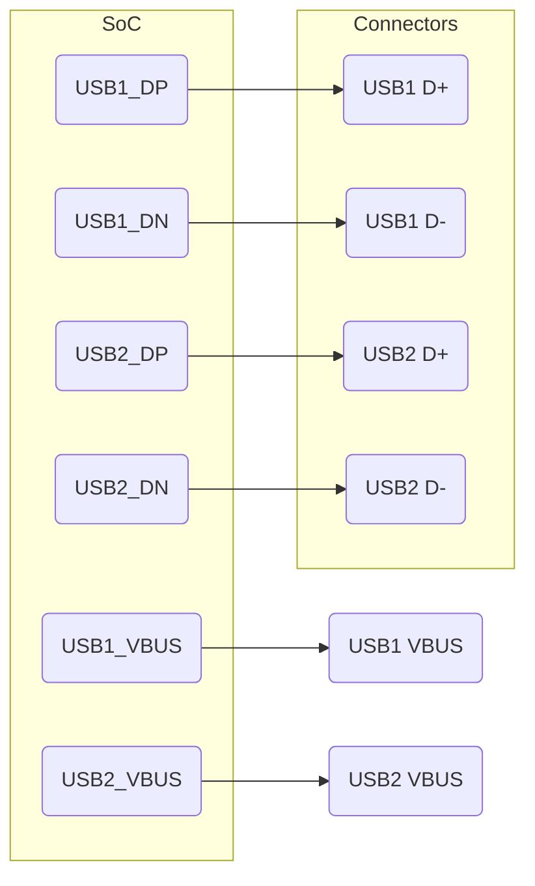

# USB subsystem integration: KiCad v9.0.4 plan (Section 3.6)

## Executive summary

Section 3.6 specifies **two USB‑A host ports** on the watchdog board, with optional hub usage. Each port needs proper high-speed routing, power switching, and ESD protection. This report lays out a detailed plan for implementing USB in KiCad v9.0.4: from topology selection (direct vs. hub) to the hardware details of Type‑C/OTG considerations, power switches, CC resistors, and termination. We cover signal net naming, line matching, decoupling, ESD, and power sequencing. Tables list assumptions and netclass recommendations. Mermaid diagrams illustrate USB signal flows and board zoning. Deliverables include a `REF_USB_HOST.md` design note, a USB schematic sheet, and relevant DRC rules. Pitfalls such as missing pull‑downs or miswiring VBUS are highlighted, along with a first-spin checklist to validate USB functionality.

## Architecture requirements and decisions

The architecture doc calls for **2× USB‑A female** ports on the PCB edge (hand‑solderable). Each USB port must have differential D+/D– lines routed to H616 host pins, ESD diodes at the connector, and a current‑limited VBUS supply (preferably via a dedicated power switch per port). We must decide between:
- **Option A:** Use two native H616 USB host ports directly to USB‑A connectors.
- **Option B:** Use one host port into a USB2 hub, then to two ports.
The architecture doc notes (doc wants example layout from reference). For simplicity, we assume **Option A (direct)**, since H616 likely has two USB host controllers. If more ports or shared OTG were needed, a hub (e.g. Microchip USB2512) could be used.

Also consider **USB Type‑C**: while not explicitly required, modern designs often include a USB‑C receptacle either as an alternate host port or a power sink. If a Type‑C port is added, it needs CC pull‑downs (5.1 kΩ Rd) for a power‑sink mode, or CC pull‑ups (Rp) if used as a device. For now, assume **USB‑A only (host)**, but we will note how to implement CC for Type‑C if needed.

**Table 1: Assumptions & required decisions**

| Item                             | Why it matters/Options                                     | Assumption/Decision (Rev A)                              |
|----------------------------------|------------------------------------------------------------|---------------------------------------------------------|
| Host vs OTG/hub                  | Simplicity vs expandability                                 | **Direct host**: two H616 host ports → USB‑A (no hub).   |
| USB‑C port (optional)            | Extra host port or power inlet (OTG/PD)                     | **No** Type‑C by default; if added, treat as power sink (CC pull-downs) or dual‑role (complex). |
| Stack‑up and impedance           | 90 Ω differential target for USB2, trace width determined by stack-up | Assume **6‑layer**, 4 mil (0.10 mm) traces for signal, to yield ~90 Ω (to be confirmed). |
| Via strategy                     | Differential pairs through vias require symmetry; avoid stubs | Use **via‑in‑pad** or microvias** for tight BGA breakout; equal via count per pair. |
| VBUS power switching             | Required to protect USB host port, limit current and faults  | Use dedicated **power switch IC** per port (see below); VBUS controlled. |
| CC/PD on USB‑C (if implemented)  | Must implement 5.1 kΩ pull-ups/downs per spec                | If USB‑C: use **5.1 kΩ Rd** to ground on CC1/CC2 for sink-only mode. |
| ESD/EMI protection               | USB connectors subject to static and noise                  | Place USB2 ESD diodes on D+/D–, and EMI beads or common-mode chokes as needed. |

## Topology and part selection

Given two USB‑A hosts, no hub is strictly needed unless we want more USB ports (Option A). If in future a hub is desired (Option B), a USB2.0 hub IC such as Microchip USB2514 or TI TUSB2046A could be added. We proceed with Option A, citing simplicity and fewer parts.

**Power switch IC:** We need a current-limited 5 V switch for each port. Candidates include:
- *Texas Instruments TPS25750*: dual high‑side power switch with fault indication.  
- *Microchip USB6260*: single-port switch, hot-swap controller.  
- *ST STUSB0xx* series if integrated into Type‑C PD.  
Place the switch near the USB‑A connector and tie its ON/OFF (enable) to H616 GPIO (so firmware can disable port). Include sense output to GPIO for overcurrent fault.

**USB‑C receptacle (optional):** If implementing, select a **USB Type‑C Receptacle** (e.g. TE Connectivity 2096518-1) and add two 5.1 kΩ resistors (CC1, CC2 to GND) to make it a power sink. If data lines used (to H616, albeit only USB2 lines since H616 only supports USB2), route them as well. For now, we focus on USB‑A.

**Table 4: USB part shortlist (example)**

| Part / MPN                    | Function          | Notes                       |
|-------------------------------|-------------------|-----------------------------|
| TI TPS25750                   | Dual USB power switch | I2C controllable, 3A  | 
| Microchip USB6260             | 3A high-side switch | Fault flag, low Rds(on) |
| TE Connectivity 2096518-1     | USB Type‑C receptacle | for DC power (optional) |
| Molex 105017 series           | USB‑A connectors   | Shrouded, right-angle      |
| USB2 ESD array (e.g. USBLC6)  | TVS diode         | Protect D+/D− lines        |

(Verify current rating and footprint for selected parts. USB‑A connectors should be PCB-mount with SMT pins.)

## USB signal mapping and net naming

Each USB‑A port has D+ and D− pins. On the H616, USB host pairs are typically labeled *USB_DM* and *USB_DP* (or USB host D+/-). In KiCad, name nets like `USB1_DP`, `USB1_DN` for port 1, and `USB2_DP`, `USB2_DN` for port 2. Use a net class to mark these as a differential pair.

If a Type‑C port were used, there would also be *CC1, CC2* (for USB2 only, two pull-down resistors) and possibly *A5/A6 (D± pins)*, *B5/B6 (D± pins)* if implementing USB2.0 on Type‑C. These would be connected similarly (via 22 Ω series and ESD).

On the schematic, draw USB connectors (JACK_USB1, JACK_USB2) with pins D+, D−, +5 V, GND. Include test points on D+/D− nets after series resistors, and VBUS net after power switch. For host controllers, connect:
- H616 *USB1_DP* ↔ JACK_USB1 D+ (through 22 Ω)
- H616 *USB1_DN* ↔ JACK_USB1 D− (through 22 Ω)
- Similarly for USB2.

Also include *VBUS1* net (from 5 V supply through switch to USB‑A VBUS pin) and *VBUS2*. Tie connector shields to chassis ground.


*Diagram A: USB host signals and power nets connecting H616 to the two USB-A connectors.*  

## Power rails and VBUS switching

- **5 V supply:** We assume a 5 V VBUS rail is available (either from the main PMIC buck or from an external USB-C power source). Each USB‑A port’s 5 V comes **through a power switch** (as required). The power switch’s input is the 5 V bus (e.g. from PMIC).  
- **Power switch usage:** Use a dedicated load-switch per port (e.g. TPS25750 as dual, or two USB6260). These switches provide current limiting and a fault flag output (OC) that can be tied to H616 for debug. Put each switch close to the USB‑A connector or on the board center.  
- **VBUS control:** The switch’s enable pin should be controlled by a H616 GPIO, so firmware can disable USB power (for overcurrent or for isolating a bad device). Also place a solder jumper or test pad on the switch output so power to each port can be cut for measurements.  
- **Decoupling:** Near each switch’s output, add a 47–100 µF cap for the USB‑A pin (to handle surges when a device plugs in). Also smaller 0.1 µF ceramics at the connector VBUS pin.  
- **Type‑C CC resistors:** If a USB‑C receptacle is added (optional), place two 5.1 kΩ pull-downs from CC1 and CC2 lines to GND to indicate a downstream-facing (sink) port. No PD controller needed if only 5 V is required; using an “Emulation of USB-C 5 V” scheme.  
- **Hot‑plug considerations:** When a USB device is plugged in, its VBUS rises from 0 to 5 V. Ensure the switch slew rate is not too slow (use a current limit to ramp gently). The switch can also use a soft-start to avoid voltage drops.  

## ESD and protection

USB connectors need robust protection:
- **ESD diodes on D+/D−:** Place a dual USB ESD suppression diode (e.g. USBLC6, PESD5V) at the connector pins, right at the jack’s pads. Connect to chassis/GND. These clamp ±15 kV strikes.  
- **EMI beads:** Optionally, place a ferrite bead in series with each D+ and D− pair to filter high-frequency noise (see TI USB layout guides).  
- **VBUS surge:** A bi-directional TVS or transient suppressor on VBUS can protect against cable VBUS surges. Some power switches have integrated OVP; if not, a 6.5 V standoff device on VBUS is prudent.  
- **Connector shield:** Tie the metal shell to chassis ground through a 0 Ω or ferrite bead. Use the USB spec for chassis-ground connectivity.  

## Routing and netclasses

- **Differential pairs:** D+/D− form 90 Ω differential pairs (USB2.0). Each pair route as controlled diff pair. Use KiCad’s diff-pair settings with gap tuned to 90 Ω (exact width/spacing depends on the chosen stack).  
- **Series resistors:** Include ~22 Ω series on each D+ and D− line near the SoC (on each host port). These should be in the net (e.g. a tiny resistor footprint on each net). Mark these nets as differential in KiCad so the tracks are in one net class.  
- **Length matching:** Match each D+ to its D− (KiCad will do this automatically in diff-pair mode). Keep inter-pair skew (port1 vs port2) below ~150 ps (under 30 mm). If not using hub, you can match all four wires (two pairs) to each other, but focus on each pair for now.  
- **Clearance:** Keep the pairs 5–10 mil apart, and isolate from other signals by at least that gap. Do not cross planes.  
- **Via count:** Limit to one via per pair if possible. Use via‑in‑pad or microvias to pack them. If normal vias, use two microvias for each pad, or one via‑in‑pad plus via stitching.  
- **Netclasses table:**  

| Netclass     | Nets                      | Track width | Clearance | Via size | Constraints             |
|--------------|---------------------------|-----------:|----------:|---------:|-------------------------|
| `USB2_DIFF`  | `USB1_DP/DN`, `USB2_DP/DN`| TBD†       | 0.15 mm   | 0.25/0.50 mm | Differential 90 Ω, 22Ω series on each line |
| `USB_PWR`    | `USB1_VBUS`, `USB2_VBUS`  | 0.30 mm   | 0.30 mm   | 0.40/0.80 mm | Thick traces for 3A |
| `USB_GND`    | GND pour under traces     | --         | --        | --        | -                        |

† Actual widths set after stack-up impedance calculation.  

Example `.kicad_dru` rules:

```lisp
(rule "USB diff pair skew"
  (condition "A.hasNetclass('USB2_DIFF')")
  (constraint diff_pair_skew (max 0.10mm)))

(rule "USB trace length"
  (condition "A.hasNetclass('USB2_DIFF')")
  (constraint length (max 50mm)))  # Ensure short runs

(rule "USB VBUS thickness"
  (condition "A.hasNetclass('USB_PWR')")
  (constraint track_width (min 0.30mm)))
```

Always run KiCad’s interactive diff pair router for the D+/D− nets in v9, which enforces parity as you draw.

## Reuse and OSS examples

The **Orange Pi Zero2** USB schematics show a USB hub and OTG circuits, but its port designs give hints: each USB connector had series resistors and TVS diodes (we reuse the values 22 Ω and dual-diode placement). The hub on Orange Pi (USB2513) is more complex than we need; we will omit it. The **Raspberry Pi** uses a USB hub (LAN9514) but its connector wiring (ESD arrays, 22 Ω resistors, power FET) is instructive. The **BeagleBone Black** (AM335x) has two host ports directly: its schematics show 22 Ω on D+, D− and a TI FET for VBUS per port. We also note from TI and USB‑IF app notes: routing USB at 90 Ω is critical for signal integrity, and that USB2 ESD diodes are standard for safety.  

## Pitfalls and mitigation

- **Missing series resistors:** Without the 22 Ω resistors on D+/D−, the lines may ring and violate EMI.  
- **No power limiting:** If VBUS has no current limit, a faulty USB device can short the 5 V rail. The architecture warns “strongly recommended” switches – do not skip them.  
- **Length mismatches:** USB spec requires D+/D− to be matched within 150 ps; if router ignores this, the link may fail. Use KiCad’s differential router.  
- **Improper CC wiring:** If we add a Type‑C port, forgetting the CC 5.1 kΩ Rd on each CC line will mean no device detects the port. Likewise, using wrong resistor values can spoil detection.  
- **ESD orientation:** Diodes must clamp to ground correctly; a reversed diode orientation can clamp normal signals or disconnect the line. Always double-check polarity.  
- **RTS (Return Time Shift):** USB2 lines should not cross split planes; keep them next to ground plane to avoid skew in return path.  

## Deliverables and checklist

**Deliverables:**  
- `REF_USB_HOST.md`: Rationale for direct vs hub, switch IC data, CC scheme (if any), strap guides.  
- `kicad/sch/26_usb.kicad_sch`: Schematic with two USB-A connectors, switches, and ESD parts.  
- Footprints for USB-A and optional USB-C connectors in library.  
- Netclasses and `.kicad_dru` with rules above.  

**Table 3: USB subsystem deliverables**

| Item                    | Description                                    | Path                       |
|-------------------------|------------------------------------------------|----------------------------|
| `REF_USB_HOST.md`       | USB topology, power switch design, CC details   | `docs/`                   |
| USB schematic sheet     | Connectors + H616 D+/D− + switches + ESD       | `kicad/sch/26_usb.kicad_sch` |
| Netclasses & rules      | USB2_DIFF, USB_PWR classes and rules            | `kicad/board.kicad_dru`   |
| USB connector footprints| SMD USB-A, USB-C (if used)                      | `kicad/libs/footprints/`  |

**Table 4: USB part examples (MPNs optional)**

| Component            | Example MPN                    | Notes                                   |
|----------------------|-------------------------------|-----------------------------------------|
| USB-A Connector      | Molex 105017-0014             | SMT right-angle USB2.0                 |
| Power switch IC      | TI TPS25750                   | Dual-channel USB power switch (I2C)     |
| Power switch IC      | Microchip USB6260             | Single-channel, flag output             |
| ESD TVS array        | USBLC6-2SC6                   | 5 kV USB2 ESD suppressor               |
| Ferrite bead         | Murata NFE61PT272Z1H9L        | Common-mode choke for D+/D−            |

(Validate package types and pinouts for selected parts.)

### First-spin validation checklist

- **Connectivity:** Verify D+ and D– connectivity from H616 to each USB connector, with series resistors in between.  
- **Power switches:** Confirm VBUS is off by default and on when enable GPIO is asserted. Check for proper current limiting.  
- **ESD diodes:** Check orientation; they should not conduct at idle (use multimeter).  
- **Differential routing:** Use CAD tools or a time-domain reflectometer to confirm ~90 Ω.  
- **Boot behavior:** Plug in known-good USB drive or device; ensure it enumerates under Linux. Try with one port at a time and both.  
- **Fault injection:** Trigger an overcurrent (short VBUS to GND); the switch should turn off (fault flag asserted).  
- **If USB-C is implemented:** Verify CC voltage ~0.325 V (with 5.1 kΩ pull‑downs to GND) when a cable is plugged; ensure H616 does not see undefined state.  

Following these guidelines, the USB subsystem should meet the architecture specs and function reliably on the first prototype.