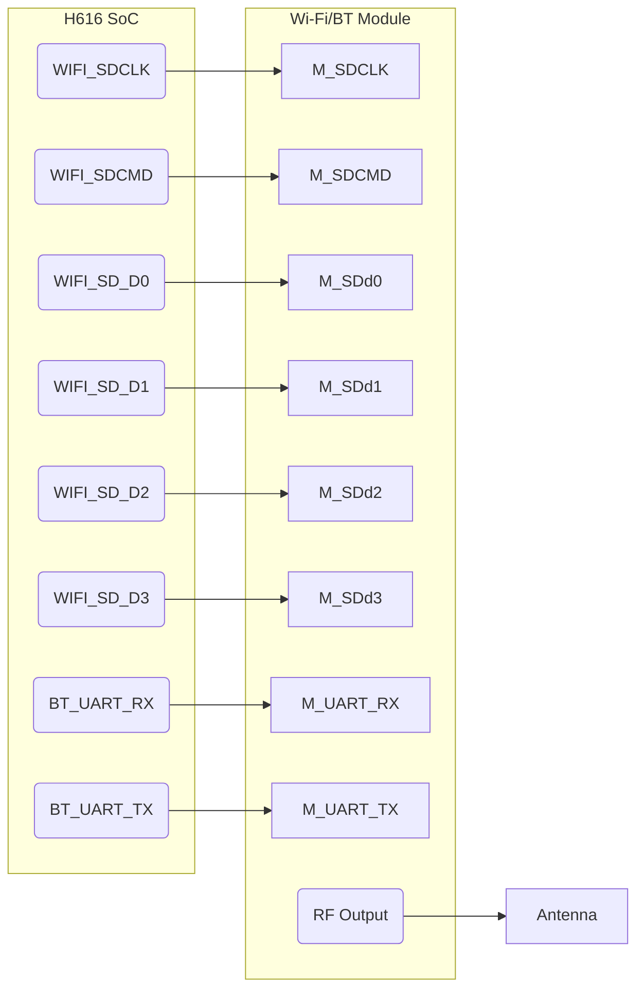

# Onboard Wi‑Fi/BT integration: KiCad v9.0.4 plan (Section 3.7)

## Executive summary

Section 3.7 calls for **integrated Wi‑Fi (with Bluetooth)** using a certified module, not an external dongle. We will place a pre‑certified SDIO-based Wi‑Fi/BT module on the board, which handles RF functions internally. Key tasks include mapping the module’s SDIO and UART interfaces to the H616, designing the RF front-end (antenna or u.FL), and enforcing RF layout rules. This report details module selection (e.g. AP6256, CYW43455, etc.), power supply decoupling, RF ground keepout zones, microstrip matching to the antenna, and USB/SDIO net naming. We prescribe KiCad netclasses (90 Ω differential where needed, SDIO bus groups) and example DRC rules. Tables list our assumptions and netclasses. Mermaid diagrams show signal routing (SoC ↔ module ↔ antenna) and board zoning (core cluster vs RF area). Pitfalls (antenna clearance, SDIO noise) are addressed. Deliverables include `REF_WIFI.md`, a `27_wifi.kicad_sch` sheet, and updated DRC rules. A first-spin checklist ensures the wireless link is tested properly.

## Section 3.7 context and assumptions

The architecture doc advises using a **pre-certified SDIO Wi‑Fi/BT module** (with integrated antenna or a u.FL connector) to avoid raw RF design. The module handles PHY and radio; our job is to connect it to H616 and design the antenna path. Key assumptions (see Table 1):

**Table 1: Assumptions & decisions**

| Item                    | Why/Options                                  | Assumption/Decision (Rev-A)                          |
|-------------------------|----------------------------------------------|------------------------------------------------------|
| **Module interface**    | SDIO (H616 has SDIO) vs USB (USB Wi‑Fi dongle) | Use **SDIO** (lower power, native).                   |
| **BT connectivity**     | UART or PCM for BT data                       | Use **UART** (often built-in in module) or PCM if needed. |
| **Module choice**       | e.g. Murata CYW43455 (BCM43455), Espressif, TI | Pick a common module like **AP6256** (SDIO+BT) or **ESP32C3**. |
| **Antenna type**        | On‑module PCB antenna vs external (u.FL)      | Use **module’s PCB antenna** if performance OK; otherwise external u.FL. |
| **Stack-up**            | RF layer clearances, impedance control        | **6‑layer** stack (two signals per layer), with dedicated top ground pour. |
| **Trace width**         | RF 50 Ω microstrip on top layer               | Track width (e.g. 0.6 mm) set after stack-up calc; use same for antenna feed. |
| **Via size/PDN**       | Solid RF via stitching                       | Use **0.2 mm/0.4 mm** microvias, densely around ground pour. |
| **SDIO signal class**   | Balanced vs single                            | Standard single‑ended (SDIO), netclass for 33 Ω series on SD_CLK. |
| **RF keepout**          | Antenna clearance (no copper)                | Keep copper **3–5 mm** away from on-module antenna area on all layers. |

## Module selection and power

We choose a **Wi‑Fi/BT module** with SDIO interface (for Wi‑Fi) and UART (for BT). Examples: *Murata AW-CM275* (BCM43455), *Espressif ESP32-C3* (if using Wi‑Fi4/BT), or *Realtek RTL8723DS* modules. The module should be FCC-certified and support 2.4 GHz. The module typically needs **3.3 V** (core/VCC) and sometimes a separate **1.8 V** for SDIO I/O. We must ensure H616’s SDIO and UART pins are 3.3 V tolerant (they are).

**Power rails:** Provide clean 3.3 V (and 1.8 V if needed). Use an LDO or PMIC output; decouple heavily (0.01 µF + 0.1 µF + 4.7 µF) near module power pins. If module has internal DC‑DC, follow its datasheet for bypass.  

**Reset and enable:** Many modules have a reset pin. Tie it with pull-up and allow H616 to drive low via a GPIO to reset the module. Optionally include a test-pad on reset. No special strap pins are usually needed for Wi‑Fi modules.

## Signal interfaces and net naming

Connect the module’s SDIO pins to H616’s SDIO controller (e.g. SD2). Typical signals: **SDIO_CLK**, **CMD**, **D0–D3**. Also connect **UART_RX/TX** for BT control (or PCM for audio). In KiCad, group them clearly:

- `WIFI_SDCLK`, `WIFI_SDCMD`, `WIFI_SDD[0..3]` for SDIO bus. Mark `WIFI_SDCLK` with 33 Ω series. 
- `WIFI_UART_RX`, `WIFI_UART_TX` for BT UART.
- `WIFI_RST` for module reset line.
- If external antenna: `ANT1` (feedline net to connector). If on‑board: trace from module RF pin to antenna feed.

We illustrate grouping:



*Diagram A: SDIO and UART signals between H616 and Wi‑Fi/BT module, and the RF antenna connection.*  

## RF layout and antenna

This is critical. **Antenna placement** requires:
- A keepout (no copper) of at least 3–5 mm around the antenna. If module has a PCB antenna, align board keepout accordingly. If using u.FL, keep a clear area around the connector’s coax path.
- **Feedline routing:** Use a 50 Ω microstrip from the module RF pad to antenna feed. On top layer with a solid ground plane below. The trace length should be as short and straight as possible; miter any 90° bends at 45°.
- **Matching network:** Follow module datasheet for any required inductors/capacitors between RF pad and antenna. Place those close to the module pad.
- **Ground stitching:** Place many vias connecting ground pour around the antenna area to tie planes together and provide a solid reference. Avoid ground plane on the antenna side (if on top layer).
- **Antenna type:** If using on‑board antenna (chip or PCB), follow its design guide for dimensions. If off‑board (u.FL + external), place u.FL at board edge or corner, and draw some reference plane beneath it.

For example, if Orange Pi Zero2 used **AP6256** (Murata module) with a chip antenna, it left a ground flood except under the antenna. We copy such a keepout.

**RF rules:** In KiCad, define a net class for the antenna feed (e.g. `WIFI_RF`) with width set for 50 Ω. For DRC, add a rule `(rule "RF antenna keepout" (condition "A.intersectsBoardOutline('ANTENNA_ZONE')") (constraint clearance ...))` to ensure no copper enters the antenna zone. Use `(rule "No ground near antenna" ... )` if needed via custom constraints.

## Decoupling, ESD, and test points

- **Decoupling:** As above, bypass caps at module power pins. If module has internal regulators, ensure the correct input bypass. Use ferrite beads on the 3.3 V feed if module is noisy.
- **ESD:** Place a small ESD diode on the SDIO lines (especially SDIO CMD/D0 if exposed to external signals; usually not needed). The RF antenna line often uses a lightning protector (gas tube or PIN diode) for surge. For development, a series resistor on UART (or ferrite) can protect from static.
- **Test points:** Add test hooks on SDIO clock or CMD to observe signaling if needed, and on UART lines for sniffing. Also pad near antenna feed (e.g. SMA connector footprint) for RF test equipment.

## KiCad netclasses and DRC rules

Suggested netclasses:
- `WIFI_DIFF` (if any diff lines, e.g. internal PCM, but mostly none here).
- `WIFI_SDIO` for all SDIO nets: track ~0.25 mm, clearance 0.15 mm.
- `WIFI_UART` for UART: normal 0.2 mm.
- `WIFI_PWR` for 3.3 V: thick (e.g. 0.5 mm).
- `WIFI_RF` for antenna feed: 50 Ω (calc width), clearance from ground plane edges 0 mm (right along ground).
- `WIFI_GND` keepout area for antenna.

**Table 2: Example netclasses**

| Netclass     | Nets                           | Width   | Clearance | Notes                          |
|--------------|--------------------------------|--------:|----------:|--------------------------------|
| `WIFI_SDIO`  | `WIFI_SDCLK`, `WIFI_SDD0..3`, `WIFI_SDCMD` | 0.25 mm | 0.15 mm   | Single‑ended ~50 Ω (placeholder) |
| `WIFI_UART`  | `WIFI_UART_RX`, `WIFI_UART_TX` | 0.20 mm | 0.15 mm   | Standard UART lines           |
| `WIFI_PWR`   | `WIFI_VDDIO`, `WIFI_VDD`       | 0.50 mm | 0.40 mm   | Low-impedance 3.3 V supply    |
| `WIFI_RF`    | `WIFI_ANT`                     | Calculated (~0.6 mm) | 0    | 50 Ω microstrip; over ground   |

† Pin spacing on modules often handles all IO near each other; still, use separate nets for clarity.  

**DRC example rules:**  
```lisp
(rule "Antenna clearance keepout"
  (condition "A.label('WIFI_ANT') != ''")
  (constraint clearance (min 5.0mm)))  # no copper within 5mm of antenna feed

(rule "SDIO series resistors"
  (condition "A.label('WIFI_SDCLK') or A.label('WIFI_SDCMD')")
  (constraint via_count (max 1)))   # ensure series R inserted on clock/command

(rule "SDIO diff pair"
  (condition "A.isDiffPair")
  (constraint length (max 50mm)))   # optional length limit
```

KiCad v9 supports single-ended and diff conditions; use them as needed.

## Reference designs and pitfalls

The Orange Pi Zero2 schematic (e.g. page with Wi‑Fi AP6256 module) shows an SDIO bus with 22 Ω series resistors on CMD and D0, and 33 Ω on CLK. We can copy these values. It also placed a Pi-network for the chip antenna (Murata), which we should study if using a similar module. The **Raspberry Pi Compute Module 4** has an on-board Wi‑Fi module: its board layout (public) shows ground pour separation and small microstrip. Other references: *NXP AN6496* (Wi‑Fi PCB guidelines) or IEEE 802.11 layout recommendations.

Common pitfalls:
- **Antenna blockage:** Placing the module near metal or high-speed nets will kill performance. Ensure the module’s antenna zone is clear per its datasheet.  
- **Poor matching:** If a separate antenna is used, wrong matching component values will detune. Use the module manufacturer’s reference.  
- **Digital noise:** SDIO lines can jitter; keep them short and avoid routing near RF. Consider ferrites on power lines for RF filtering.  
- **Stack-up issues:** Incorrect impedance on SDIO lines can cause signal integrity problems. Confirm with actual stack-up.  

## Deliverables and checklist

**Deliverables:**  
- `REF_WIFI.md` – design rationale, module pinout, antenna spec (copy from Orange Pi reference).  
- `kicad/sch/27_wifi.kicad_sch` – schematic sheet for Wi‑Fi/BT module and antenna.  
- Updated netclasses in board config.  
- Footprint for chosen module (often vendor provides one) and antenna/u.FL connector.  
- Add DRC rules (in `.kicad_dru`).  

**Table 3: Wi‑Fi subsystem deliverables**

| Item                    | Description                      | Path                         |
|-------------------------|----------------------------------|------------------------------|
| `REF_WIFI.md`           | Module selection, RF plan        | `docs/`                      |
| Wi‑Fi schematic sheet   | Module (SDIO, UART) + antenna    | `kicad/sch/27_wifi.kicad_sch`|
| Module footprint        | SDIO Wi‑Fi/BT module PCB layout  | `kicad/libs/footprints/`     |
| Antenna footprint/lib   | Chip antenna or u.FL connector   | `kicad/libs/footprints/`     |
| Netclasses/DRC rules    | As above                         | `kicad/board.kicad_dru`      |

**Table 4: Example Wi‑Fi modules and antennas (MPNs optional)**

| Part                            | Type              | Notes                                |
|---------------------------------|-------------------|--------------------------------------|
| Murata **AW-CM276NG**           | Wi‑Fi+BT module   | SDIO (BCM43455), integrated antenna  |
| Murata **AW-CM358**             | Wi‑Fi+BT module   | SDIO (CYW43455), u.FL antenna option |
| U.FL connector **Hirose U.FL**  | RF connector      | For external antenna (omnidirectional) |
| On‑board PCB chip antenna       | PCB antenna       | e.g. Johanson 2450AT (example)       |

(Choose parts that match region/Bluetooth needs. Use exact footprints from manufacturer.)

### First-spin validation checklist (Wi‑Fi/BT)

- **Configuration:** Ensure H616 boot config enables SDIO1 (or whichever bus) and UART for BT.  
- **Power rails:** Verify module’s VDD = 3.3 V is present and stable (no dropout when RF active).  
- **Reset line:** Try resetting the module (drive reset low) and see it reinitialise.  
- **SDIO signals:** Use an oscilloscope to check SDIO_CLK when Wi‑Fi scans or connects (should see clock).  
- **UART:** Enable a BT terminal log (if accessible) to test communication.  
- **RF testing:** With a Wi‑Fi client (e.g. smartphone), attempt to scan/associate. Measure RSSI; a strong signal indicates correct antenna placement. If weak, check antenna clearance.  
- **Spectrum check:** (Optional) Use a spectrum analyser near 2.4 GHz to confirm the module is transmitting.  
- **BT test:** Pair the board with a phone via BT (if implemented) and send data.  
- **Return loss:** If on-board antenna, use a VNA on an included test SMA to measure S11; should be < –10 dB in 2.4 GHz band.

By carefully following the layout guidelines and copying known good patterns (from Orange Pi or other references), the wireless subsystem should function without requiring RF debugging.