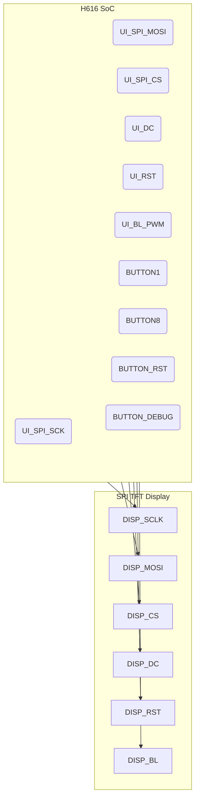

# SPI TFT display and buttons (UI) integration: KiCad v9.0.4 plan (Section 3.8)

## Executive summary

Section 3.8 requires an **SPI‑driven TFT display** plus **8 GPIO buttons** and optional debug LEDs, matching the Pi Zero 2 W’s UI model. We will wire an SPI display (SCLK, MOSI, CS, plus DC, Reset, Backlight) to the H616 and attach eight active‑low buttons to its GPIO pins, each with pull‑ups. The design includes: connector footprints for the TFT module and button blocks, backlight power control (via FET/PWM), pull‑ups on inputs, optional status LED, and basic ESD/series resistors. We define KiCad sheet(s) for the UI, netclasses (e.g. `UI_SPI`, `UI_GPIO`), and DRC rules. Tables list design assumptions and deliverables. Mermaid diagrams illustrate signal mappings (SoC↔display/buttons) and board zoning (core cluster vs UI connectors). Pitfalls (floating lines, poor debounce) are noted. Deliverables include `REF_UI_SPI_GPIO.md`, a `28_ui.kicad_sch` file, and a first-spin test checklist focusing on UI functionality.

## Architecture context and assumptions

Section 3.8 states: **“SPI connection for TFT (SCLK/MOSI/CS + DC/RESET/backlight)”** and **“8 buttons as GPIO inputs (active-low with pull-ups)”**. We assume the TFT is a 1.3″ 240×240 SPI display (e.g. ST7789-based) or similar. The 8 buttons likely are user inputs; we also include 2–3 debug buttons (Reset, etc.) as separate. Pull-ups: internal H616 pull-ups suffice, but we may add 10–100 kΩ externals. 

**Table 1: Assumptions & key decisions**

| Item                         | Why/Options                                        | Decision/Assumption (Rev‑A)                             |
|------------------------------|----------------------------------------------------|--------------------------------------------------------|
| **Display interface**        | SPI vs parallel TFT                                 | **SPI** (saves pins, matches arch). Use 4‑wire SPI + DC, RST, BL. |
| **Display resolution**       | 128×128 vs 240×240, color or mono                    | Assume **240×240 color SPI** (common type, like ST7789).  |
| **Connector type**           | FFC vs pin header                                  | Use **10‑pin shrouded header** (2×5) or similar for module. |
| **Button grouping**          | Individual headers vs single multi-pin connector    | Use **single 10-pin header** (2×5) for all 8 buttons + 2 debug/LED. |
| **Button pull-ups**          | Internal vs external                               | Use **internal pull-ups** (can add 47 kΩ on PCB optionally). |
| **Debounce method**          | Hardware RC vs software                            | Assume **software debouncing** in firmware (fast MCUs manage 50Hz). Hardware RC optional (e.g. 4.7 µF/10 kΩ). |
| **Series resistors**         | 0–22 Ω on SPI, 0–100 Ω on LED                       | Include **~22 Ω** on SCLK and MOSI (reduce ringing); **0.47 Ω** fuse resistor on BL or omit. |
| **ESD/EMI**                  | Protection for exposed lines                       | Add ESD diodes or RC filter on Reset/Debug lines; SPI lines usually internal. |
| **Backlight drive**          | Direct from 3.3V or via PWM/FET                    | Use **N‑MOSFET** controlled by H616 PWM for BL, for brightness control. |
| **Pinout reuse**             | Copy existing device-tree for TFT/Wi‑Fi            | Use similar pin mapping as Pi Zero 2 W (e.g. DISP SPI on SPI1). |

## Signal mapping and schematic

We allocate one SPI bus (e.g. SPI1) for the display. The required signals:
- **SPI SCLK, MOSI, CS**: connect to H616 SPI pins (e.g. SPI1_SCLK, SPI1_MOSI, CS0). 
- **DC (Data/Command)**: a GPIO (to module DC pin).
- **Reset**: a GPIO (tied to module RST pin). Include 0.1 µF cap if using boot-time reset stretch.
- **Backlight PWM**: a PWM-capable GPIO driving an N‑MOSFET gate, with drain to BL+ and source to GND.
- **Power**: 3.3 V to display VCC; some modules need 5 V to a boost converter, but assume 3.3 V only.

Buttons: label them `BTN1`…`BTN8` (wired to H616 GPIO inputs). Also two `BTN_RST` and `BTN_DEBUG` (Reset and e.g. Boot). These go to H616 (with internal pull‑ups enabled).

Use headers: e.g. J17 (Display 2×5), J18 (Buttons 2×5). For simplicity, group all 10 button pins on one header (8 buttons + 2 for debug/LED). Provide +3.3 V and GND pins on headers for consistency.

Net naming (KiCad):
- `UI_SPI_SCK`, `UI_SPI_MOSI`, `UI_SPI_CS`, `UI_DC`, `UI_RST`, `UI_BL_PWM`.
- `BUTTON1` ... `BUTTON8`, `BUTTON_RST`, `BUTTON_DEBUG`.
- `UI_3V3`, `GND`.
- If ESD diodes used, nets stay same.


*Diagram A: SPI display signals and button inputs interfacing the H616.*  

## Pin/footprint selection

**Display connector:** Use a 10-pin ribbon header (0.1″ pitch) keyed for the SPI TFT module. Pin assignment: VCC, GND, SCLK, MOSI, CS, DC, RST, BL_PWM, GND, VCC. Mark shrouded. Example: Samtec IDC10.

**Button connector:** Use a 10-pin shrouded header (2×5) for all buttons. Label pins 1–8 as BUTTON1..8, plus a RESET and a spare GPIO (LED or reserved). Tie each button line to 3.3 V via internal pull-up (or external 47 kΩ). Debounce: optionally add 0.01–0.1 µF on each input if hardware filtering is desired.

**Footprints:** Create project-local symbols for the display connector and the button header. Ensure pins are correctly labelled. Use stable footprints for connectors (e.g. standard IDC). For the TFT module itself, rely on vendor-provided footprint or treat it like a “load” (no footprint needed).

## Routing and netclasses

Signal integrity is not critical at SPI‑TFT speeds (~10–20 MHz). However, keep lines short (under 5 cm), especially SCLK and MOSI. Define netclasses:

**Table 2: Recommended netclasses**

| Netclass      | Nets                                    | Width | Clearance | Via (drill/ann) | Notes                         |
|---------------|-----------------------------------------|------:|----------:|---------------:|-------------------------------|
| `UI_SPI`      | `UI_SPI_SCK`, `UI_SPI_MOSI`, `UI_SPI_CS`, `UI_DC`, `UI_RST` | 0.20 mm | 0.15 mm | 0.25/0.50 mm | SPI lines (~50 Ω)             |
| `UI_PWM`      | `UI_BL_PWM`                             | 0.20 mm | 0.15 mm | 0.25/0.50 mm | PWM line to FET                |
| `UI_GPIO`     | `BUTTON1`…`BUTTON8`, `BUTTON_RST`, `BUTTON_DEBUG` | 0.20 mm | 0.15 mm | 0.25/0.50 mm | Button inputs (low-speed)     |
| `UI_PWR`      | `3V3_TFT` (display VCC)                 | 0.50 mm | 0.30 mm | 0.40/0.80 mm | 3.3 V supply for display      |

Use 45–90 Ω microstrip rules for SPI (board calc needed) and widen VBUS. 

Example `.kicad_dru` rules:
```lisp
(rule "SPI trace length"
  (condition "A.hasNetclass('UI_SPI')")
  (constraint length (max 50mm)))

(rule "Button input clearance"
  (condition "A.hasNetclass('UI_GPIO')")
  (constraint clearance (min 0.15mm)))
```
Set series resistor nets by netclass if needed: e.g. `UI_SPI_SCK` with inline `SPI_SER`.

## Electrical details

- **Pull-ups:** Enable internal pull-ups on all BUTTONx and BUTTON_RST lines (10–47 kΩ). Alternatively, add 10 kΩ on each line. This ensures a defined high when unpressed.  
- **Debouncing:** We assume **software debounce** (the H616 running Linux/firmware can sample). If hardware filtering is desired, a 10 kΩ + 0.01–0.1 µF RC on each button input yields ~1–10 ms time constant.  
- **Backlight drive:** Backlight pin (BL_PWM) goes to an N‑MOSFET (logic-level gate) switching 3.3 V to the LED pin. Include a 10 Ω resistor at the FET gate to suppress ringing. A 100 nF cap from gate to ground can filter PWM noise if needed. The display’s backlight may require a current-limiting resistor or constant-current driver (check module specs).  
- **ESD protection:** SPI and button lines are not exposed externally (inside connectors), so ESD is low risk. If desired, place a 0402 series resistor (10–22 Ω) or TVS on the Reset or debug lines.  
- **Debug LEDs:** If using a status LED, connect via a 330 Ω resistor from 3.3 V to a GPIO (active low). Add that GPIO to `UI_GPIO` netclass.  

## Reference patterns and pitfalls

The Orange Pi Zero2 schematics include an SPI display pinout (through FPC) and a set of buttons labeled KEY0–KEY7. We copy its pull-up strategy (it uses 10 kΩ to 3.3 V on each KEY). Common designs (e.g. Waveshare TFT examples) use 10 kΩ or 4.7 kΩ.  

Pitfalls:
- **Floating inputs:** Without pull-ups, buttons can float and cause false triggers. Always tie to Vcc.  
- **Incorrect orientation:** Ensure button numbering and polarities match intended connector. Miswiring can confuse device-tree.  
- **SPI misclock:** Avoid long clock lines; mismatches can garble the display.  
- **PWM noise:** The FET switching backlight can inject noise. Keep PWM traces short and consider RC snubbers.  
- **No ESD:** Directly swappable boards can get static on connectors. If planned for field service, tiny TVS diodes on SPI lines do no harm.  

## Deliverables and validation

**Deliverables:**  
- `REF_UI_SPI_GPIO.md` – pin mapping, debounce strategy, connector outlines.  
- KiCad sheet `28_ui.kicad_sch` for the display and buttons.  
- Footprint for the 10‑pin display connector (from vendor datasheet) and button header.  
- Netclasses and `.kicad_dru` updated for UI.  

**Table 3: UI deliverables**

| Item                      | Description                           | Path                          |
|---------------------------|---------------------------------------|-------------------------------|
| `REF_UI_SPI_GPIO.md`      | Display spec, button wiring scheme    | `docs/`                       |
| UI schematic sheet        | SPI TFT + buttons + backlight circuit | `kicad/sch/28_ui.kicad_sch`   |
| Connector footprints      | 2×5 pin headers for TFT and buttons   | `kicad/libs/footprints/`      |
| Netclasses / rules        | `UI_SPI`, `UI_GPIO`, etc. in DRC      | `kicad/board.kicad_dru`       |

**Table 4: Connector/part shortlist**

| Component                    | Example P/N            | Notes                                  |
|------------------------------|-----------------------|----------------------------------------|
| 10-pin IDC shrouded header   | Samtec FTSH-107-01-L-DV-K  | 2×5, 2.54 mm, compatible with TFT and buttons |
| N-channel MOSFET (SOT-23)    | AOZ1246A             | Logic-level FET for backlight (3 A)    |
| 10 kΩ resistor, 0603         | RC0603FR-0710KL      | Pull-ups for buttons                   |
| 22 Ω resistor, 0603          | ERJ-2GEJ222X         | SPI series resistor (MOSI/SCLK)        |
| TVS diode, SOD-523           | PESD1CAN            | USB/ESD protection for debug lines     |

### First-spin validation checklist (UI)

- **Display test:** Connect TFT, power on, verify H616 boots and writes splash screen. Confirm correct orientation (rotate if needed in settings).  
- **Button test:** In OS or baremetal, read each button input. Press each button and ensure the input goes low in software. Check pull-up (idle = high).  
- **Debounce:** Hammer buttons and confirm no chatter (using logic analyzer if unsure). Adjust firmware debounce if needed.  
- **Backlight PWM:** Test brightness by toggling PWM. Ensure FET and resistor are sized so PWM duty varies LED brightness smoothly.  
- **LED indicator:** Toggle status LED via software; confirm polarity.  
- **Routing checks:** Visually inspect no ground plane split under display connector area. Check footprint alignment for connectors.  
- **ESD robustness:** (If deployed in field) try an ESD gun or static on display ribbon; watch for latch-ups.

Following this plan and copying verified patterns (from Orange Pi’s SPI and key circuits) will minimize issues. All UI lines should meet KiCad 9 constraints as defined above.