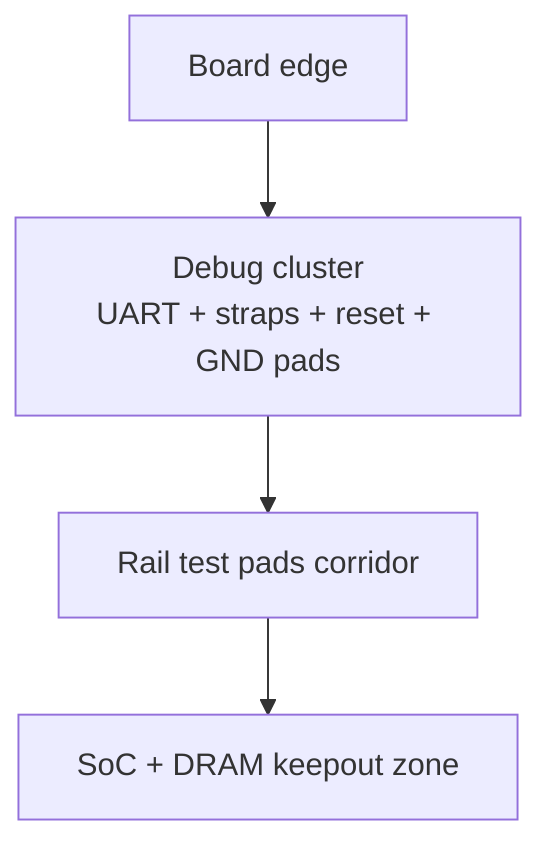

# Debug & test instrumentation integration: KiCad v9.0.4 plan (Section 3.9)

## Executive summary

Section 3.9 turns the board from “it boots (maybe)” into “it boots **and we can prove why**.” The goal is to make first‑spin bring‑up *measurable*, *recoverable*, and *repeatable* using:

- **UART0 console** (always available)
- **Boot / recovery strap access** (FEL + boot select)
- **Reset / power‑cycle control** (clean reset + optional power domain isolation)
- **Rail and bus test points** (power integrity + signal sanity)
- **Optional JTAG footprint** (pad-only or Tag‑Connect / Cortex‑10) for “deep hell” debugging
- **DFT-minded layout rules** (pads you can actually touch with probes / bed-of-nails)

This document defines what gets instrumented, *where* it lands in the KiCad v9 project, how nets are named, what is optional vs mandatory, and what you should be able to validate on the bench in under an hour.

---

## Architecture context and assumptions

From the architecture doc: this is an **instrumented bring‑up board** first. That means we intentionally spend a little area and BOM on:

- **test access** (rails, clocks, reset, strap states)
- **isolation links** (0Ω jumpers / shunts)
- **recovery paths** (you can always unbrick without hot‑air)

We assume:

- **SoC:** Allwinner **H616**
- **Power entry:** USB‑C 5 V (simple sink)
- **Console:** UART0 at **3.3 V TTL**
- **Boot/recovery:** microSD recovery exists (Section 3.4) and we also want **FEL** access (USB boot mode).

**Design principle:** If a signal can brick you (boot straps, reset, storage select), it must be *observable* and *overrideable* without microscope surgery.

---

## What “debug/test instrumentation” means on this board

### Inputs (things you intentionally drive)

- **UART RX** (from USB‑UART dongle to SoC)
- **RESET_N** (button, header pin, or pogo pad)
- **FEL strap** (force USB boot mode)
- **BOOT_SEL straps** (force boot source / override)
- **Optional JTAG TCK/TMS/TDI/TRST_N** (debug probe drives)

### Outputs (things the board produces for you)

- **UART TX** (serial console output)
- **Boot status indicators** (optional LED(s) or test pads)
- **Rail measurements** (test pads for DMM/scope)
- **Optional JTAG TDO** (debug probe receives)

### Where the inputs come from

- A **USB‑UART adapter** (3.3 V logic) for console
- A **debug pogo adapter** (Tag‑Connect / bed‑of‑nails)
- Physical **buttons** (Reset)
- Temporary jumpers / tweezers across pads (strap override)

### Where the outputs go

- UART console into your dev machine
- Scope/DMM probes onto rail test pads
- Logic analyzer clips onto strap/UART pads if needed

---

## KiCad v9 integration plan

### Schematic sheet structure

Add a dedicated sheet:

- `pcb/3.9_debug-test-instrumentation/`
- KiCad schematic sheet name suggestion: `39_debug_test.kicad_sch`

This sheet owns:

1. Console header + protection
2. Reset network (button + supervisor hook)
3. Strap override circuitry (pads/jumpers + default resistors)
4. Test points (power rails + key signals)
5. Optional JTAG header footprint
6. Isolation links / shunts (for current measurement + subsystem disable)

### Net naming conventions

Keep the naming boring and grep‑friendly:

- Console: `DBG_UART0_TX`, `DBG_UART0_RX`, `DBG_UART0_GND`, `DBG_3V3_REF`
- Reset: `DBG_RESET_N`, `DBG_POR_N` (if you have a supervisor)
- Boot straps: `DBG_FEL_N`, `DBG_BOOTSEL1`, `DBG_BOOTSEL2`, … (match your final strap count)
- JTAG: `DBG_JTAG_TCK`, `DBG_JTAG_TMS`, `DBG_JTAG_TDI`, `DBG_JTAG_TDO`, `DBG_JTAG_TRST_N`, `DBG_JTAG_SRST_N`, `DBG_JTAG_VREF`
- Rails: `TP_5V0_IN`, `TP_3V3_SYS`, `TP_1V8_SYS`, `TP_1V1_CORE`, `TP_DRAM_VDD`, `TP_EMMC_VCC`, etc.

Use the `TP_` prefix for anything you expect to probe.

---

## Console (UART0) design

### Minimum requirement

A 3‑pin or 4‑pin header:

- **GND**
- **SoC TX → adapter RX**
- **SoC RX ← adapter TX**
- (optional) **3.3 V reference** (do *not* power the board from this pin)

### Electrical details

- Place **~22–100 Ω series resistors** close to the SoC on TX/RX (optional but helps with ringing/ESD).
- Add **ESD diodes** only if the header is externally exposed and you expect field plugging/unplugging.
- Mark silkscreen clearly: `GND / TX / RX / 3V3`.

### Footprint suggestion

- Simple: 1×4 2.54 mm header
- Cleaner: 1×4 1.27 mm header
- Production-friendly: Tag‑Connect footprint that includes UART pins (combined debug cluster)

---

## Reset, power-cycle, and “make it stop” controls

### Reset network

- Provide a **Reset button** tied to the SoC reset input via the same conditioning network used in your compute-core sheet.
- Provide a nearby **reset test pad**: `TP_RESET_N`.

### Optional but extremely useful

- A **power domain isolation jumper** for the SoC core rail enable (or PMIC enable), so you can force a full cold boot without yanking cables.
- A **shunt footprint** (2‑pin 1206/2512 or dedicated current sense jumper) on the 5 V input or the 3.3 V system rail to measure current quickly.

---

## Boot/recovery strap access (FEL + boot select)

This is the “don’t brick me” section.

### Default strap behavior

- Straps must default to a known‑good boot path: **eMMC primary**, **microSD recovery available**.
- Use **pull resistors** (e.g., 10 kΩ–100 kΩ) that match the H616 strap sampling requirements.

### Override mechanisms (pick at least one)

1. **Solder‑jumper pads** (2‑pad “short to enable”) for:
   - `DBG_FEL_N`
   - `DBG_BOOTSELx`
2. **3‑pad solder jumpers** (A/B select) for boot source selection.
3. **Pogo pads** where a jig can temporarily assert straps.

### FEL access requirements

FEL is only useful if you have a physical path to the SoC’s USB‑OTG port:

- Ensure the **OTG D+/D‑ pair** is routed to a connector (USB‑C or micro‑USB) or at minimum to test pads.
- If USB‑C is power‑only in your main IO plan, consider **dedicating a small, cheap micro‑USB OTG connector** strictly for FEL/bring‑up, or provide a pad‑only “FEL port” footprint.

---

## Test points: what to probe on day 1

### Rails (mandatory)

At minimum, add one test point per rail, placed near the consumer and near the source when practical:

- `TP_5V0_IN` (after input protection)
- `TP_3V3_SYS`
- `TP_1V8_SYS`
- `TP_1V1_CORE` (or whatever core rail your tree uses)
- `TP_DRAM_VDD` (1.35 V or 1.5 V depending on DDR choice)
- `TP_EMMC_VCC` (and `TP_EMMC_VCCQ` if split)
- `TP_WIFI_VDD` (if Wi‑Fi has its own rail)

If you’re using a PMIC, also add:

- `TP_PMIC_EN`
- `TP_PMIC_PGOOD` (or equivalent)

### Critical signals (recommended)

- `TP_UART0_TX`
- `TP_RESET_N`
- `TP_FEL_N`
- `TP_OSC_24M` (via a *high‑impedance* probe point / tiny series resistor)

### Physical DFT rules (so probes actually fit)

- Prefer **round pads** ~0.9–1.3 mm diameter.
- Keep at least **1.27 mm pitch** if you expect bed‑of‑nails.
- Put rail test points along a **single board edge corridor** where possible (fast probing).
- Always add **GND test pads** near every cluster.

---

## Optional JTAG: plan for it without betting the board on it

Linux bring‑up usually succeeds with UART + FEL + good power rails. JTAG is for:

- early boot ROM mysteries
- DRAM training disasters
- “the CPU is alive but the world is on fire” scenarios

### Connector strategy

Pick one:

1. **ARM Cortex 10‑pin (0.05")** footprint (compact, standard)
2. **Tag‑Connect TC2050/TC2030** style footprint (no permanent connector)
3. **Pads only** (hand‑probe or pogo adapter)

### Electrical notes

- Include **VREF** from the relevant IO bank so the probe knows the logic level.
- Keep JTAG traces short and avoid stubs.
- Consider small series resistors (e.g., 22 Ω) on TCK/TMS if needed.

---

## Isolation links and current measurement hooks

These are cheap and save days.

### Suggested links

- 0Ω link in series with:
  - Wi‑Fi rail enable or supply
  - USB VBUS switch enable
  - eMMC CLK (last resort for isolating a bad part)

### Suggested shunts

- Shunt footprint on `5V0_IN` or `3V3_SYS` for quick current measurement.
- Optional shunt on DRAM rail during stress testing.

---

## Placement in the PCB layout

### Board zoning

- Put the debug cluster near an edge.
- Keep it **away from DDR routing** (don’t create length‑matching obstacles).
- Keep it **accessible when the board is mounted** (don’t hide under the display).

### Silkscreen requirements

- Label every header/pad group.
- Add a tiny “**UART: TX/RX are board perspective**” note.
- Mark FEL and boot select pads with **default state**.

---

## Deliverables and validation

### Deliverables

| Item | Description | Target path |
|---|---|---|
| Section 3.9 doc | This plan | `pcb/3.9_debug-test-instrumentation/` |
| `REF_DEBUG_BRINGUP.md` | Bench checklist + triage map | `pcb/3.9_debug-test-instrumentation/` |
| KiCad sheet | Console/straps/testpoints/jtag | `kicad/sch/39_debug_test.kicad_sch` |
| Footprints | test pads + chosen debug connector | `kicad/libs/footprints/` |
| Netclasses/rules | `DBG_UART`, `DBG_JTAG`, `TP_PWR` | `*.kicad_dru` |

### First-spin validation checklist (must pass)

1. **Rails:** all rails present within tolerance, ripple acceptable at idle and boot.
2. **UART0:** console prints boot ROM / U‑Boot / Linux logs.
3. **Reset:** button produces clean reset; system reboots reliably.
4. **Straps:** FEL can be forced; boot select overrides behave as expected.
5. **Recovery:** microSD recovery boots and can reflash eMMC.
6. **Isolation links:** you can disable Wi‑Fi/USB/eMMC safely for debugging.

---

## Practical reference patterns (boards to shamelessly copy)

- **Orange Pi Zero2 (H616):** strap + UART patterns, placement of headers, conservative pull networks.
- **Typical Cortex debug header usage:** standard 10‑pin connector footprints and VREF semantics.
- **DFT practices:** testpoint sizing/spacing that works with probes and bed‑of‑nails.

