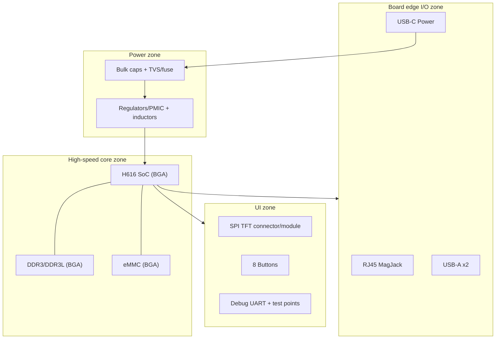

# H616 Watchdog Board KiCad Design Document

## Executive summary

This document converts the attached **“H616 Watchdog Board Breakdown (Scenario 2)”** into an **actionable KiCad implementation plan** that a competent engineer can follow to produce a **manufacturable prototype** and a **clean, maintainable KiCad repository**. The board is intended to be a low-cost, portable, single-purpose embedded Linux device built around **Allwinner H616**, **512 MB DDR3/DDR3L**, and **8 GB eMMC**, with **10/100 Ethernet (RJ45 MagJack)**, **USB‑C 5 V sink power input**, **two USB‑A host ports**, an **SPI TFT**, and **eight buttons**. The assembly model is “factory SMT/BGA, hand-solder through-hole/chunky connectors”. fileciteturn1file0

Prototype success criteria (minimum viable, measurable):
- Powers from USB‑C (5 V), with stable rails and acceptable inrush/current draw.
- Boots from soldered eMMC and can be provisioned reproducibly.
- Ethernet link comes up reliably; USB host enumerates devices; UI display works with responsive input.
- Manufacturing handoff is clean: Gerbers/drills, BOM, placement, assembly drawings, and DNP/hand-solder rules are unambiguous. fileciteturn1file0turn1file1
- KiCad project is structured so a second engineer can pick it up without archaeology, and design rules/constraints are encoded in-project (not tribal knowledge). citeturn10search0turn8search0

## System requirements and architecture overview

### Functional requirements

Locked requirements from the breakdown (treat as “non-negotiables” unless explicitly revised):
- **Compute**: Allwinner H616 (quad Cortex‑A53 class).
- **Memory**: 512 MB DDR3/DDR3L minimum (1 GB optional).
- **Storage**: 8 GB eMMC (soldered).
- **Networking**: 10/100 Ethernet via RJ45 MagJack; Wi‑Fi via USB dongle (keep PCB RF out of scope).
- **USB**: USB‑C 5 V sink for power input; two USB‑A host ports on-board.
- **UI**: SPI TFT (ST7735-class assumed compatible); eight buttons.
- **Assembly**: factory assembles all SMT/BGA; you hand-solder RJ45/USB‑A/headers. fileciteturn1file0

Environmental assumptions (explicitly assumptions; confirm in product requirements):
- Operating temperature: **0–40 °C** (assumed for consumer enclosure; revise if industrial).
- Power: **5 V USB‑C supply**, assume **≥3 A capable** to cover peak load and USB peripherals (design headroom).
- Enclosure: not defined; assume internal PCB is not earth-referenced unless enclosure provides a chassis ground path.

### Architecture overview

Textual block diagram:

```mermaid
flowchart LR
  PWR[USB-C 5V Input] -->|5V| PWRMGT[Input protection + 5V distribution]
  PWRMGT --> PMIC[Power tree / regulators]
  PMIC -->|core rails| SOC[Allwinner H616 SoC]
  PMIC -->|VDDQ/VDD| DDR[DDR3/DDR3L 512MB]
  PMIC -->|VCC/VCCQ| EMMC[eMMC 8GB]

  SOC -->|RMII + MDC/MDIO + REFCLK| PHY[10/100 RMII Ethernet PHY]
  PHY --> MAG[Magnetics / MagJack]
  MAG --> RJ45[RJ45]

  SOC -->|USB2 Host| HUB[USB2 Hub (if needed)]
  HUB --> USBA1[USB-A Port 1]
  HUB --> USBA2[USB-A Port 2]

  SOC -->|SPI| TFT[SPI TFT (ST7735-class)]
  SOC -->|GPIO| BTN[8 Buttons]
  SOC -->|UART| DBG[Debug UART Header]
```

Major subsystems to implement in KiCad:
- SoC + DDR + eMMC (high-density BGA cluster)
- Power tree and sequencing
- Ethernet PHY + MagJack front end
- USB‑C power input + USB2 host + (optional) hub + 2× USB‑A (plus ESD/port power switching)
- SPI TFT connector + button matrix/inputs
- Debug/programming headers + test points

## Power tree and sequencing

This section is written to be **implementable in KiCad without inventing hidden rails**—so where the breakdown doesn’t provide rail numbers, the design document explicitly treats them as **assumptions to validate**.

### Rail list template

Populate this in the schematic as a “Power Rails” table (and keep it in the repo as `doc/power_budget.md`). Use it to drive regulator selection and test point planning.

| Rail name | Nominal | Tolerance | Estimated current (idle/peak) | Consumers | Notes / dependencies |
|---|---:|---:|---:|---|---|
| +5V_IN | 5.0 V | USB‑C source | TBD | USB‑A VBUS, regulators | Input protection + inrush |
| +5V_USB | 5.0 V | ±5% | up to 2× USB load | USB‑A ports | Consider per‑port power switch |
| +3V3 | 3.3 V | ±5% | TBD | PHY, hub, TFT, GPIO pullups | Common I/O rail |
| +1V8 | 1.8 V | ±5% | TBD | SoC I/O domains, eMMC VCCQ (if 1.8V) | Validate with SoC/eMMC |
| +VDD_DDR | 1.35 V or 1.50 V | ±2–5% | TBD | DDR3L or DDR3 | Depends on chosen DRAM |
| +VREF_DDR | VDD_DDR/2 | tight | small | DDR VREF | Must be low-noise |
| +VCORE_SOC | ~0.9–1.1 V | tight | TBD | H616 core | Validate with H616/PMIC |
| +VPLL / analog rails | TBD | tight | small | SoC analog | Validate with reference |

This is intentionally incomplete because the breakdown doesn’t name the H616’s full rail set. Treat the above as **assumed constraints to be validated against datasheets/reference schematics**.

### USB‑C 5 V sink implementation

For a simple 5 V-only USB‑C power input (no USB‑PD), implement UFP/Sink CC pull-down resistors. Microchip’s USB‑C introduction note states that a UFP connects **Rd pull-down resistors** to CC1/CC2, and **5.1 kΩ** is the valid value when Type‑C current advertisement detection is desired. citeturn3search45turn3search46

Design note to encode in schematic:
- CC1 → 5.1 kΩ to GND  
- CC2 → 5.1 kΩ to GND  
- ESD on CC lines if your enclosure/user handling makes it likely.
- Do not back-drive VBUS; protect against reverse current where relevant. citeturn3search45

### Reset and brownout strategy

The breakdown doesn’t specify a hardware watchdog supervisor; therefore the reset plan is framed as required + optional.

Required minimum reset elements:
- A deterministic **power-on reset** path that ensures the SoC comes out of reset only after rails are valid.
- A **manual reset** (button or header pin) for bring-up.
- A **debug UART** to observe boot failure modes.

Optional reliability upgrade (explicitly optional; decide intentionally):
- External reset supervisor / watchdog timer to recover from hard lockups. If you include it, make it defeatable (strap/jumper) for early bring-up.

### Decoupling and placement rules

Encode these as design checklist items (and implement with KiCad rule areas where possible):
- Place decoupling capacitors as close as possible to the consuming pins/balls; keep loops small.
- Separate noisy switching power regions from DDR and Ethernet front end.
- Plan test points on every rail in the Rail table.

KiCad tip: ensure the physical stack-up is correct because KiCad can include stack-up thickness in via length calculations used for tuning/length analysis. citeturn0search0turn8search0

## Interface details and PCB constraints

This is where the plan becomes “layout actionable”. All numerical constraints not defined in the breakdown are clearly labelled as **assumed** until verified.

### DDR3 / DDR3L interface

Risk level: **highest** (dominates first-spin success probability).

Assumed constraints to be validated (reasonable defaults aligned with widely used DDR3 layout guidance):
- Match **DQ, DQS, DM** within each byte lane to within **±10 ps**. citeturn2search0  
- Match **ADDR/CMD/CTRL** to clock within **±20 ps**. citeturn2search0  
- Keep each byte lane on the same layer where possible to avoid velocity differences. citeturn2search0  
- Minimise vias, avoid stubs, keep routes short. citeturn2search0  

Topology assumption:
- Single DDR device close to SoC → point-to-point nets (best case for KiCad length tuning; avoid branches).

KiCad-specific implementation decision:
- Rename DDR differential nets to KiCad-friendly diff pair naming conventions so you can use the diff-pair router. KiCad forms differential pairs based on `_P/_N` or `+/-` suffixes with a common base name. citeturn1search2turn1search1  
  Example: `DDR_CK_P`, `DDR_CK_N`; `DDR_DQS0_P`, `DDR_DQS0_N` rather than `CK/CK#`, `DQS/DQS#`.

### eMMC interface

Goals:
- Boot and root filesystem on soldered eMMC (8 GB), per the breakdown. fileciteturn1file0

Assumed constraints to validate:
- Bus width: typically 8‑bit on SBC-class designs; confirm with H616 pinmux and BSP.
- Pullups: follow eMMC spec and SoC reference design (CMD/DAT pull-ups are typical; verify values).

Routing assumptions:
- Keep eMMC close to SoC; avoid layer changes; treat as high-speed digital.
- If enabling faster timing modes, treat length and impedance with tighter discipline.

### Ethernet (RMII + MagJack)

Breakdown target is 10/100 Ethernet with an RJ45 MagJack. fileciteturn1file0

Key constraints to implement (authoritative, manufacturable guidance):
- **Magnetics noise zone**: void power/ground planes under magnetics on all layers; do not route unrelated digital signals between PHY and RJ45; extend chassis ground from magnetics to RJ45 connector region. citeturn7search38
- Route TX/RX pairs as controlled impedance differential, keep pairs tightly coupled and matched, route each pair on the same layer where possible. citeturn7search38turn7search6

RMII-specific constraints:
- RMII uses a **50 MHz reference clock** that is sensitive to noise; NXP’s RMII guidance (for i.MX28) emphasises minimising trace length, routing in isolation over a continuous ground plane, and avoiding plane splits. citeturn7search6

Design decision (recommended for first spin):
- Use 10/100 RMII PHY (simpler routing/EMI/integration) unless you have a clear need for gigabit.

### USB2 host, USB‑C power, and two USB‑A ports

The breakdown requires USB‑C power input and two USB‑A host ports. fileciteturn1file0

USB2 routing constraints (authoritative):
- Length-match differential pair carefully: within a high-speed pair, mismatch should be ≤ **1.25 mm (50 mil)**. citeturn2search47
- Avoid 90° corners; route over unbroken reference planes; keep pairs short; minimise vias and keep via usage symmetric within a pair. citeturn2search47

USB topology decision:
- If H616 exposes enough USB host ports directly, avoid adding a hub.
- If a hub is needed, place it close to SoC USB pins; place ESD near connectors.

### SPI TFT and eight buttons

UI constraints from the breakdown: SPI TFT (ST7735-class) and eight buttons. fileciteturn1file0

Electrical assumptions to encode:
- Buttons should be wired “active-low to GND” with pull-ups (internal to SoC or external resistors) to reduce susceptibility to noise.
- TFT SPI should be routed as a short, clean low-speed bus; keep away from Ethernet front end and power switch nodes.

Open question (needs a decision before schematic freeze):
- Do you want a **module connector** (0.1” header, easy assembly) or a raw panel + FPC (harder mechanics, cleaner packaging)?

### Debug UART, straps, and test points

Minimum bring-up interfaces:
- 3-pin UART header (GND, TX, RX) for boot logs.
- Boot configuration straps (if required by H616 boot architecture).
- Test points: all major rails, reset line(s), key clocks (RMII REFCLK), and representative high-speed nets (USB D+/D− test pads placed to avoid stubs).

KiCad note: because length tuning works only for **point-to-point** nets (no branching topologies), keep DDR nets clean (avoid hidden stubs) and use KiCad cleanup tools when tuning gets blocked. citeturn8search0turn8search2

## KiCad implementation plan

This section is written as a “do-this-first” recipe for building the KiCad project.

### Project structure and repository hygiene

Recommended repo layout:
- `/kicad/`
  - `watchdog_h616.kicad_pro`
  - `watchdog_h616.kicad_sch`
  - `watchdog_h616.kicad_pcb`
- `/kicad/sheets/` (hierarchical schematics if you prefer separate files)
- `/kicad/lib_symbols/` (custom symbols)
- `/kicad/lib_footprints/` (custom footprints)
- `/kicad/lib_3d/` (optional)
- `/doc/` (power budget, interface tables, manufacturing notes)
- `/fab/` (generated outputs, per release tag)
- `/scripts/` (BOM generation scripts/plugins config if used)

KiCad supports hierarchical design naturally; use it to keep reviewable pages. citeturn10search0

Recommended schematic sheet breakdown (hierarchical):
- `SOC_DDR_EMMC` (SoC + memory + boot straps + crystals)
- `POWER` (USB‑C input + regulators + sequencing + measurement points)
- `ETHERNET` (RMII PHY + magnetics/MagJack + ESD + shield/chassis handling)
- `USB` (USB2 host, hub if needed, port power switches, ESD, connectors)
- `UI` (SPI TFT connector, backlight control, 8 buttons, LEDs)
- `DEBUG_TEST` (UART header, test pads, manufacturing jumpers)

### Net naming conventions

#### Differential pair naming

KiCad detects differential pairs by base name + suffix (`+/-` or `_P/_N`) and requires consistency. citeturn1search2turn1search1

Enforce:
- USB: `USB0_DP`, `USB0_DM` is common in Linux nomenclature but **not a KiCad diff pair** automatically. Prefer `USB0_P`, `USB0_N` (or `USB0+`, `USB0-`) for routing support. citeturn1search2
- Ethernet MDI: `ETH_TX_P/N`, `ETH_RX_P/N` (PHY ↔ magnetics).
- DDR clocks and strobes: `DDR_CK_P/N`, `DDR_DQS0_P/N`, etc.

#### Group naming for DDR length matching

Choose a name scheme that makes KiCad grouping easy:
- `DDR_DQ0…DDR_DQ15` etc (by byte lane), `DDR_DM0`, `DDR_DQS0_P/N`
- `DDR_A0…DDR_Axx`, `DDR_BA0…`, `DDR_RAS`, `DDR_CAS`, `DDR_WE`, `DDR_CKE`, `DDR_CS`, `DDR_ODT`
- Define byte lanes explicitly: `DDR0_DQ0…DDR0_DQ7`, `DDR0_DQS_P/N`, `DDR0_DM` and same for lane 1, etc.

This enables:
- net-class assignment by prefix
- net grouping in Net Inspector and rule targeting by net name patterns. citeturn8search0

### Design rules and constraints setup in KiCad

#### Board stack-up definition

Use **Board Setup → Physical Stackup** to define layer count and thickness. KiCad supports stack-up parameters and notes that via height and layer thickness can influence length calculations; it also notes KiCad currently supports only an even number of copper layers. citeturn0search0turn8search0

Recommended baseline: **6-layer FR‑4** (assumed, aligns with “DDR is the boss fight” guidance in the breakdown). fileciteturn1file0

Example stack assignment (confirm with your fabricator):
- L1: Signal + components
- L2: Solid GND plane
- L3: Power plane / split rails (avoid splitting under high-speed routes)
- L4: Signal (DDR/USB/Ethernet as needed)
- L5: Solid GND plane
- L6: Signal + connectors

#### Net classes

Create net classes aligned to interface constraints. You will fill widths/gaps from impedance calculators once your fab stack-up is selected (values below are placeholders).

| Net class | Use | Constraint type | KiCad settings to define |
|---|---|---|---|
| `DDR_DATA_L0`, `DDR_DATA_L1` | byte-lane DQ/DQS/DM | length matching | max skew targets via custom rules |
| `DDR_ADDR_CMD` | address/command/control | length matching to CK | rule-based target length windows |
| `DDR_CK` | CK pair | differential + tight match | diff pair width/gap + skew target |
| `USB2` | D+/D− pairs | differential + intra-pair skew | diff pair width/gap + skew target |
| `ETH_MDI` | TX/RX pairs | 100 Ω diff | diff pair rules + keepouts |
| `RMII_CLK` | 50 MHz REFCLK | crosstalk control | spacing/isolation rules |
| `PWR_5V_USB` | USB VBUS | high current | width rules, thermal relief notes |
| `PWR_CORE/DDR` | regulator-to-load rails | PI/IR drop control | width + via stitching guidance |

KiCad supports rule-driven constraints and DRC for modern workflows (including differential pairs and length/skew tuning). citeturn10search0turn8search0

#### Length tuning workflow in KiCad

KiCad provides:
- Single-track length tuning and differential-pair length/skew tuning tools. citeturn8search0
- Important limitation: tuning supports **point-to-point** nets; branched topologies break the tuner. citeturn8search0
- KiCad can include via length in tuning calculations, dependent on stack-up configuration; you can disable via length inclusion in constraints if needed. citeturn8search0turn8search2

Practical KiCad guidance for DDR:
- Avoid series resistors that split nets unless you have a strong reason; they complicate matching in KiCad because the tuner works pad-to-pad.
- Keep nets strictly point-to-point between SoC and DDR balls/pads; remove accidental stubs with cleanup tools when tuning behaves unexpectedly. citeturn8search0
- Consider using “Pad-to-die length” properties if you are accounting for BGA package contributions in the toolchain; KiCad exposes pad-to-die length as a property in advanced rule contexts. citeturn8search3

### Layout strategy and floorplan

Placement order (enforced as a review gate):
1. SoC + DDR + eMMC cluster (place and escape routing plan)
2. PMIC/regulators + bulk caps + main power entry
3. Ethernet front end (PHY + magnetics + MagJack keepout regions)
4. USB2 paths (SoC↔hub↔USB‑A), ESD, port power switching
5. UI (TFT connector, buttons)
6. Debug + test points + silkscreen clarity + fiducials

Ethernet front-end keepouts:
- Implement a “magnetics noise zone” keepout consistent with 10/100 guidelines: void planes under magnetics and avoid routing digital signals between PHY and RJ45. citeturn7search38  
In KiCad, this should be implemented as:
- zone keepouts on all copper layers under magnetics
- rule area restricting tracks/vias in the zone
- explicit chassis ground strategy at the connector/shield

USB rules:
- Keep USB differential pairs short, matched, with minimal vias and continuous reference plane. citeturn2search47

RMII clock:
- Route REFCLK short, isolated, over continuous ground, away from noisy power switching and from MDI pair routing. citeturn7search6

Suggested PCB floorplan (conceptual):



### Library and footprint policy

Because the design includes BGA parts, your library policy is a yield policy.

Rules:
- Custom symbols and footprints must be traceable to a datasheet land pattern, and pin names/numbers should match datasheet conventions (KiCad library conventions emphasise pin name matching). citeturn8search4
- Every footprint must include:
  - clear pin‑1 indicator
  - courtyard
  - fabrication layer outline/orientation
- For through-hole connectors you will hand solder, add clear assembly notes and consider setting fabrication attributes appropriately so they don’t appear in SMT placement outputs.

### ERC/DRC review gates

Gate these before generating manufacturing files:
- Schematic ERC is clean; no floating supplies; no unintentional power pin errors.
- PCB DRC is clean; impedance-critical nets are in correct classes.
- Stack-up is defined (so length measurements are meaningful). citeturn0search0turn8search0
- Ethernet keepout rules are present and reviewed against your front-end strategy. citeturn7search38
- USB pair length mismatch within tolerance assumptions. citeturn2search47

## Manufacturing and assembly outputs

This section maps directly to KiCad menus and avoids “hand-wavy manufacturing”.

### Required outputs

KiCad supports generating manufacturing outputs from the **File** menu, and explicitly documents the **Fabrication Outputs** flow for Gerbers and drill files. citeturn10search0

Deliverables (suggested per release tag / fab folder):
- **Gerbers** for all copper, mask, paste, silkscreen layers
- **NC drills** (Excellon recommended by most manufacturers) citeturn10search0turn9search2
- **Board outline** (Edge.Cuts included in plots)
- **Pick-and-place / placement (.pos)** in CSV (for SMT parts)
- **BOM** (prefer schematic-driven BOM; KiCad notes PCB BOM tool is legacy and may be removed) citeturn10search0
- Assembly drawings (top/bottom PDFs with polarity and connector orientation)
- DNP list (connectors and other hand-solder items explicitly marked)

Optional but increasingly useful:
- **IPC‑2581** as a single package containing fab + assembly data, if your manufacturer accepts it. citeturn10search0turn10search1

### KiCad-specific DNP and hand-solder handling

The board is explicitly intended for factory SMT/BGA plus hand-solder connectors. fileciteturn1file0  
In KiCad, the goal is to ensure your placement file doesn’t confuse the assembler.

KiCad’s placement file generation dialog includes options such as:
- include only SMD footprints
- exclude footprints with through-hole pads
- exclude footprints with the Do Not Populate flag set citeturn0search5turn1search3

Recommended approach (robust across assemblers):
- Set connectors (RJ45 MagJack, USB‑A, headers) as **through-hole footprints** so they can be excluded by “exclude footprints with through-hole pads” when generating SMT placement files. citeturn0search5turn1search3
- Additionally apply a clear field in BOM for `ASSEMBLY=HAND` vs `ASSEMBLY=SMT` (and use that field to filter in BOM exports).
- Use KiCad’s “Do Not Populate” flag only where parts are genuinely optional variants; be explicit in assembly notes about what ships. citeturn1search3turn0search5

Placement origin:
- Use the drill/place file origin option so assembly coordinates are stable and intentional (especially if you panelise later). KiCad’s placement dialog supports using a drill/place origin rather than page origin. citeturn0search5turn10search0

## Bring-up and validation plan

This is designed to be executed with common lab kit: bench supply, DMM, scope, USB analyser (optional), and Ethernet link partner.

### Step-by-step bring-up sequence

1. **Pre-power inspection**
   - Visual check: polarity of TVS, regulators, inductors; BGA orientation markers.
   - Resistance check to ground on major rails (compare to known-good reference expectations once you have them).

2. **Power-on (current-limited)**
   - Start at 5 V with current limit low; monitor for abnormal draw.
   - Verify all rails in the rail table at test points.

3. **Reset and boot visibility**
   - Confirm reset line behaviour; use UART to verify boot ROM and bootloader logs.
   - If boot fails: diagnose first by clocks and strap pins.

4. **Memory/storage sanity**
   - Confirm DDR initialisation (bootloader/kernel logs, memory test).
   - Confirm eMMC device detection and partition mounting.

5. **Ethernet**
   - Verify link up/down and stable negotiation; run sustained traffic.
   - Pay attention to disturbances when USB devices are inserted (grounding/ESD coupling).

6. **USB**
   - Enumerate devices on both ports; test high-throughput transfers.
   - Confirm per‑port current limit behaviour (if implemented).

7. **UI**
   - Bring up TFT; validate correct orientation and refresh.
   - Validate all 8 buttons with debouncing behaviour.

8. **Soak test**
   - Sustained CPU load + active Ethernet + active USB + display for thermal and stability validation.

### Test point plan

Minimum recommended test points (place and label in KiCad as a dedicated “TESTPOINTS” footprint class):
- +5V_IN, +5V_USB, +3V3, +1V8, +VDD_DDR, +VCORE_SOC
- GND (multiple)
- RESET_N
- UART_TX/UART_RX
- RMII_REFCLK (scope pad, low capacitance)
- Optional: USB D+/D− test pads (placed carefully to avoid stubs)

KiCad note: incorporate testpoints into schematic and PCB early so you don’t “forget them out of pride” late in layout.

## Risks, open questions, and assumptions

### Highest risks

DDR3 routing and power integrity  
DDR constraints are tight and dominate first-spin success. Use conservative topology, keep nets point-to-point, and apply length-matching assumptions aligned to established DDR3 guidance (±10 ps within byte lane; ±20 ps addr/cmd to clock) until validated against SoC/memory datasheets. citeturn2search0turn8search0

Ethernet front-end EMI/return path errors  
If you violate the magnetics noise-zone rules (planes under magnetics, digital signals crossing PHY↔RJ45 region), you can create hard-to-debug EMI and link stability issues. citeturn7search38turn7search6

USB2 signal quality and ESD robustness  
USB2 HS routing and ESD placement must be disciplined; length mismatch guidance and “route over unbroken planes” should be treated as hard requirements. citeturn2search47

KiCad constraint correctness  
KiCad’s length tuning and via-length inclusion depend on accurate stack-up definitions; tuning only supports point-to-point nets. Misconfiguration can mislead your DDR matching effort. citeturn0search0turn8search0turn8search2

### Open questions to resolve before schematic freeze

- Which exact H616 package variant and its required rail set/sequencing?
- DDR3 vs DDR3L (1.5 V vs 1.35 V) and exact memory part/package?
- eMMC part/package and VCCQ choice (1.8 vs 3.3); boot configuration.
- Do you need a USB hub, or can H616 provide two host ports directly?
- TFT mechanical: module/header vs FPC; and exact pinout standardisation.
- Button mapping: physical layout and whether to include a matrix or direct GPIO lines.
- Chassis/shield grounding strategy for RJ45 shield and ESD return.

### Explicit assumptions (must be validated)

- 6-layer PCB is required for DDR routing density and reference plane control. (Assumption supported by common practice; KiCad supports even-layer stackups and encourages defining stackup for accurate length calculations.) citeturn0search0turn8search0
- USB‑C will be 5 V sink only (no USB‑PD), using Rd pull-downs on CC1/CC2. citeturn3search45turn3search46
- DDR length-matching defaults from industry guidance are acceptable starting constraints. citeturn2search0

---

**Primary internal sources used:** the attached breakdown document is treated as the scope authority. fileciteturn1file0  
**Supplementary technical references used:** KiCad official documentation for stackup, outputs, differential pairs, and length tuning; and authoritative interface layout guidance for DDR3, USB2, USB‑C CC resistors, and Ethernet front-end layout. citeturn10search0turn0search0turn8search0turn2search0turn2search47turn3search45turn7search38turn7search6