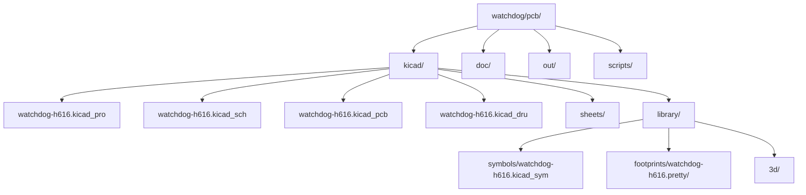
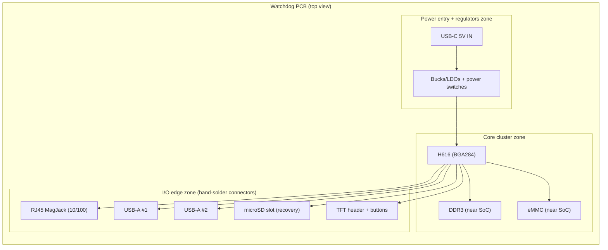

# KiCad v9.0.4 Guide for the H616 Watchdog PCB Mapping Orange Pi Zero2 Reference Subsystems into Deliverables

## Executive summary

This report defines a **KiCad v9.0.4–specific implementation guide** for the **H616 Watchdog PCB** that turns your project constraints into **a concrete set of KiCad deliverables**: a reproducible repository structure, a hierarchical schematic plan with exact sheet files and responsibilities, a PCB zoning plan, and a constraints/rules strategy that encodes the risky parts (DDR3, high‑speed I/O, BGA escape, eMMC) into KiCad’s design-rule system and workflow.

The guiding idea is to treat the **Orange Pi Zero2 (H616) schematic v1.3** as a *proven integration reference* for subsystem patterns (USB‑C sink, DDR3 topology, SD card wiring style, USB power switching, and Ethernet front-end hygiene), while deliberately adapting it to the Watchdog board’s fixed requirements: **H616 + DDR3 (512MB)**, **8GB eMMC**, **microSD recovery**, **USB‑C 5V sink (no PD)**, **2× USB‑A host**, **10/100 Ethernet (RMII + MagJack)**, **external USB Wi‑Fi dongle**, and **SPI TFT + 8 buttons** (with the existing UI contract). The outcome is a **KiCad-first reference**: everything important is named, grouped, and checked in KiCad, rather than living as “tribal knowledge.”

The highest first-spin risks are **(a) DDR3 layout + power integrity**, **(b) BGA pin/ball mapping correctness**, **(c) boot storage (eMMC + microSD) stability**, and **(d) Ethernet/USB connector edge EMI/ESD robustness**. The report therefore prioritises: a 6‑layer stack-up assumption, strict net naming/netclass patterns, rule areas (keepouts) for Ethernet magnetics, and custom DRC rules to enforce length/skew targets (where defined) and flag topology mistakes (e.g., branching nets that prevent KiCad’s length tuner from working). KiCad’s DRC/erc and export are integrated into the workflow using **kicad-cli**, enabling automated checking and deterministic manufacturing outputs. citeturn18search0turn19search5turn2search0

## Project constraints, primary sources, and explicit assumptions

### Constraints treated as non-negotiable for this guide

Your internal project documents define the “Scenario 2” build model and core BOM intent: factory SMT/BGA for all fine-pitch parts; you hand-solder only through-hole/chunky connectors (RJ45 MagJack, USB‑A receptacles, headers). The locked functional targets are: **Allwinner H616**, **512MB DDR3**, **8GB soldered eMMC**, **microSD recovery**, **10/100 Ethernet via MagJack**, **USB‑C 5V sink**, **2× USB‑A host**, **SPI TFT (ST7735‑class)**, **8 buttons**, and **Wi‑Fi via external USB dongle**. (Project docs: `/mnt/data/h616_watchdog_board_breakdown_v2.md` L1–L25; `/mnt/data/H616 Watchdog Board KiCad Design Document.md` early sections; `/mnt/data/h616_custom_board_bom_and_fab_breakdown.md` L1–L25.)

A software-facing constraint worth baking into the hardware definition early is the existing UI contract: the ST7735 UI crate expects a spidev device and named control pins, plus eight GPIO inputs. One project document records a current baseline mapping (Pi-centric) of **DC=25, RST=27, BL=24** and eight button GPIO line numbers; even if these numbers will change on H616, the hardware must expose at least the signals (SPI + DC/RST/BL + 8 inputs) and make them device-tree/configurable. (Project doc: `/mnt/data/h616_custom_board_bom_and_fab_breakdown.md` L1–L10.)

### Primary sources used for mapping patterns

The primary hardware reference is your local copy of: **`/mnt/data/Orange_Pi_Zero2_H616_Schematic_v1.3.pdf`** plus the rendered page images already extracted in your workspace (e.g., `opi_p08_power.png`, `opi_p07_ddr4_16x2.png`, `opi_p09_card_usb_led_debug_ext26_hdmi.png`, `opi_p10_1000m_eth.png`). These provide *known-good subsystem wiring patterns* and explicit schematic annotations like “USB differential pairs Zo = 90 ohm” and Ethernet “Zo = 100 ohm” that inform how we encode constraints and net naming in KiCad.

### Explicit assumptions where project docs are silent

Because your project documents do not fully specify fabrication service, stack-up, impedance geometry, or exact component MPNs, this guide includes the following explicit assumptions (and calls out “no specific constraint” values when a number cannot be honestly fixed yet):

Assume a 6‑layer FR‑4 stack-up (SIG/GND/PWR/SIG/GND/SIG) for the first spin. This aligns with the project’s repeated framing that DDR is the dominant routing challenge and with common high-speed mixed-interface practice, but the exact dielectric thickness and Dk must come from your chosen fabricator.

Assume controlled impedance targets only where specified: **USB2 HS 90Ω differential**, **Ethernet MDI 100Ω differential**. Numeric trace width/spacing in KiCad netclasses remains “no specific constraint” until the stack-up is chosen and impedance geometry is calculated.

Assume the DDR implementation follows Orange Pi’s topology pattern (two x16 devices on a 32-bit bus) *or* a single x16 device on a 16-bit bus; your internal docs express a preference to mirror a known-good board topology, but do not lock bus width. This guide therefore provides rules that work for either, with lane-group naming that scales.

Assume eMMC is routed to be HS200‑capable (short, matched, clean reference plane) even if you initially run at slower modes; this preserves performance headroom. HS200-specific numeric guidelines below are based on an authoritative NXP hardware development guide and are labelled as “adopted as a conservative design target,” not as an H616 datasheet requirement. citeturn8search34

Assume Ethernet is implemented as **H616 external MAC → RMII PHY → MagJack**. This is consistent with the board constraint (10/100) and with the H616’s published capability set (USB2 OTG + 3× host; multiple memory types; BGA package). citeturn9search1

## KiCad v9.0.4 requirements and features leveraged for this project

### Why v9.0.4 specifically

KiCad 9.0.4 is a **9.0 stable bug-fix release** with “critical bug fixes and other minor improvements,” and is explicitly recommended by the KiCad project to upgrade to. For a high-risk board (DDR + BGA + controlled impedance), version pinning matters: everyone on the team should use the same KiCad major/minor/patch to avoid silent changes in DRC, file format behaviour, or plot outputs. citeturn0search0

### KiCad 9 features this guide relies on

Multiple netclasses per net (and netclass ordering/aggregation). KiCad 9 introduced the ability to assign **multiple net classes to a single net**, with ordered priority and “effective aggregate net classes” built from non-null properties. This is extremely useful for the Watchdog board because you can combine orthogonal constraints (e.g., “DDR lane rules” + “tight clearance” + “length tuned”). citeturn2search1turn2search2

Length tuning + custom rules enforcement. KiCad’s length tuner supports single  
track, differential-pair length, and differential-pair skew tuning, and—critically—**only supports tuning point‑to‑point nets**. This makes topology discipline in the schematic/netlist a hard requirement (avoid stub branches on DDR and eMMC nets). citeturn2search0

Differential pair routing by net naming convention. KiCad recognises diff pairs only for nets with a shared base name and suffix styles `P/N` or `+/-`, and the suffix style cannot be mixed. This guide therefore specifies naming conventions like `USB0_P/USB0_N`, `ETH_TX_P/ETH_TX_N`, and `DDR_CK_P/DDR_CK_N`. citeturn3search42turn1search2

Rule areas (keepouts) used as enforceable constraints. KiCad supports “rule areas” (keepouts) that restrict placement of tracks/vias/zones/footprints and can be used with custom DRC rules, including rule-areas embedded in footprints (useful for MagJack keepouts). citeturn3search3turn3search2

Custom DRC rules stored as a first-class project artefact (`.kicad_dru`). KiCad stores custom design rules in a dedicated `.kicad_dru` file that is created automatically and should be committed with the project (and not edited externally). citeturn19search0

### KiCad CLI for automation and manufacturing reproducibility

KiCad’s command-line interface (`kicad-cli`) supports schematic ERC, BOM export, netlist export, PCB DRC with JSON reports and CI-friendly exit codes, and PCB export formats including Gerbers, drill, centroid/position files, ODB++, IPC‑2581, and STEP. This capability is central to the recommended CI/automation workflow later in this report. citeturn18search0turn19search5turn0search1

## Repository file tree, naming conventions, and library management

### Repository placement in the existing project ZIP

Your ZIP includes a software repository structure with a `/pcb/` directory holding architecture docs and the Orange Pi reference schematic, but no KiCad project yet. A pragmatic approach is to keep all hardware under:

`watchdog/pcb/kicad/`

…so the PCB project lives next to the existing PCB documentation, and the software repo remains the single source-of-truth for versioned hardware+software integration.

### File tree template

The template below is intentionally “release-ready”: it includes a place for generated manufacturing outputs (per board revision), CI scripts, and project-local libraries.

| Path | Purpose | Notes |
|---|---|---|
| `watchdog/pcb/kicad/watchdog-h616.kicad_pro` | KiCad project | Version pinned to KiCad 9.0.4 in `doc/` below. |
| `watchdog/pcb/kicad/watchdog-h616.kicad_sch` | Root schematic | Contains hierarchy sheet symbols linking to `/sheets/…`. |
| `watchdog/pcb/kicad/watchdog-h616.kicad_pcb` | PCB layout | Contains board setup, stack-up, design rules, zones. |
| `watchdog/pcb/kicad/watchdog-h616.kicad_dru` | Custom DRC rules | Must be committed; managed by KiCad. citeturn19search0 |
| `watchdog/pcb/kicad/sheets/` | Hierarchical schematic sheets | One file per subsystem sheet (names defined below). |
| `watchdog/pcb/kicad/library/symbols/watchdog-h616.kicad_sym` | Project-local symbol library | H616 multi‑unit symbol, custom connectors, etc. |
| `watchdog/pcb/kicad/library/footprints/watchdog-h616.pretty/` | Project-local footprint lib | H616 BGA284, eMMC BGA, MagJack, USB-A, etc. |
| `watchdog/pcb/kicad/library/3d/` | 3D models | Prefer STEP; optionally embed in KiCad where appropriate. citeturn3search3 |
| `watchdog/pcb/kicad/sym-lib-table` | Library binding | Project-specific, committed for reproducibility. |
| `watchdog/pcb/kicad/fp-lib-table` | Footprint library binding | Project-specific, committed for reproducibility. |
| `watchdog/pcb/doc/constraints.md` | Human-readable constraints | Mirrors netclasses, DRC rules, impedance targets, assumptions. |
| `watchdog/pcb/doc/power_budget.md` | Rail table + current budget | Drives regulator selection + testpoint plan. |
| `watchdog/pcb/doc/kicad-version.txt` | Toolchain pin | “KiCad 9.0.4 only.” Cite in PR review gates. |
| `watchdog/pcb/scripts/export_all.sh` | One-button exports | Calls `kicad-cli` for DRC/ERC + exports. citeturn18search0 |
| `watchdog/pcb/out/revA/…` | Generated outputs | Never hand-edit; generated by scripts and CI. |

Mermaid view of the same structure:



### Naming conventions that make KiCad constraints workable

Schematic sheet names (file names) should be stable, sortable, and match the subsystem mapping table below. Use a numeric prefix to set review order without renaming later:

- `sheets/00_root_interconnects.kicad_sch` (optional: if you want a “bus glue” sheet)
- `sheets/10_power_entry_usb_c.kicad_sch`
- `sheets/11_power_tree_regulators.kicad_sch`
- `sheets/20_soc_h616_core.kicad_sch`
- `sheets/21_ddr3.kicad_sch`
- `sheets/22_storage_emmc_sd.kicad_sch`
- `sheets/30_usb2_host.kicad_sch`
- `sheets/31_ethernet_rmii_10_100.kicad_sch`
- `sheets/40_ui_spi_tft_buttons.kicad_sch`
- `sheets/50_debug_straps_testpoints.kicad_sch`

Net naming rules (crucial for diff-pairs and netclass patterns):

- Differential pairs: `{BASE}_{P,N}` (e.g., `USB0_P/USB0_N`, `ETH_TX_P/ETH_TX_N`, `DDR_CK_P/DDR_CK_N`). KiCad’s diff pair router depends on this naming convention. citeturn3search42turn1search2
- DDR lane naming: `DDR_L0_DQ0..7`, `DDR_L0_DM`, `DDR_L0_DQS_P/N`, etc. Make lanes explicit so netclass patterns can target each lane.
- Rails: `+5V_IN`, `+5V_USB`, `+3V3`, `+1V8`, `+VDD_DDR`, `+VREF_DDR`, and per-domain `+3V3_ETH`, `+3V3_USB` if you want bring-up isolation.

### Symbol and footprint library management

For this project, treat **project-local libraries as mandatory** for anything high-risk or non-standard, especially:

- H616 SoC symbol and footprint (BGA284)
- DDR3 device(s) footprint(s)
- eMMC footprint (likely BGA family, exact variant chosen later)
- MagJack footprint (mechanical errors here are fatal to hand-soldering)
- USB‑A connectors (mechanical durability; through-hole tabs)
- USB‑C receptacle footprint (if used; likely SMT placed by factory)

Use KiCad’s project library tables (`sym-lib-table`, `fp-lib-table`) committed in-repo so the project opens identically on any machine. Encode paths relative to `${KIPRJMOD}`.

If you include 3D models, prefer storing them under `library/3d/` and referencing them relative to the project, or embedding models when appropriate (KiCad supports embedding 3D model files into the project via the “Embed File” checkbox). citeturn3search3

## Hierarchical schematic plan mapping Orange Pi subsystems into KiCad sheets

### Subsystem-to-sheet mapping table

| Watchdog subsystem | KiCad sheet file | Contents (exact responsibilities) | Orange Pi schematic pages to reference |
|---|---|---|---|
| USB‑C 5V sink entry | `10_power_entry_usb_c.kicad_sch` | USB‑C receptacle; CC1/CC2 Rd resistors (5.1k); VBUS TVS; input fuse/ideal diode (if used); power LED; testpoints | Orange Pi “POWER / TYPE‑C” sheet style; CC pull-downs pattern |
| Power tree / regulators | `11_power_tree_regulators.kicad_sch` | +5V distribution; per-rail bucks/LDOs; sequencing; enables; bulk + decoupling strategy; rail testpoints | Orange Pi “AXP305 PMIC” rail breakup (conceptual) |
| H616 core | `20_soc_h616_core.kicad_sch` | H616 symbol (multi-unit); 24MHz crystal; reset; boot straps/FEL pads; UART0 header; pinmux planning notes | Orange Pi SoC sheets (pin naming + strap exposure) |
| DDR3 memory | `21_ddr3.kicad_sch` | DDR3 device(s); VDD/VREF nets; ZQ resistor; termination stuffing options; decoupling network; lane net naming | Orange Pi DDR sheet (labelled DDR3 but file name references DDR4); use DDR3 electrically |
| eMMC + microSD | `22_storage_emmc_sd.kicad_sch` | eMMC (8-bit); microSD socket and card detect; pull-ups; ESD; optional “disable eMMC” link; testpoints where non-invasive | Orange Pi T-Card wiring style and ESD placement |
| USB2 host + 2× USB‑A | `30_usb2_host.kicad_sch` | Host port allocation; optional USB2 hub; per-port power switches (VBUS); ESD arrays; connector nets; shield grounding | Orange Pi USB port sheet (90Ω note + VBUS switch pattern) |
| 10/100 Ethernet (RMII) | `31_ethernet_rmii_10_100.kicad_sch` | RMII PHY; 50MHz refclk strategy; strap resistors; MDI pair routing interfaces; MagJack wiring; ESD; chassis/shield net | Orange Pi Ethernet sheet pattern for MDI pair handling (but adapt gigabit → 10/100) |
| UI: SPI TFT + buttons | `40_ui_spi_tft_buttons.kicad_sch` | SPI signals; TFT connector/header; DC/RST/BL; optional backlight FET; 8 button inputs with pull strategy; ESD for user buttons (optional) | Orange Pi header breakout philosophy (not pinout) |
| Debug/test/bring-up | `50_debug_straps_testpoints.kicad_sch` | Testpoints; measurement shunts/0Ω isolation links; “factory-only pads”; strap jumpers; JTAG decision (optional) | Orange Pi debug UART approach |

### USB‑C 5V sink implementation and how to encode it in KiCad

For a simple “5V only” USB‑C power input (no USB‑PD), treat the port as a **UFP/sink** and place Rd pull-down resistors on **both CC1 and CC2**. ST’s USB Type‑C introduction note explicitly states the UFP must expose Rd pull-down resistors on CC1/CC2, and gives **5.1kΩ** as the nominal value for the resistor-to-ground implementation. citeturn5search49

Embed a visual reference near your implementation (Orange Pi uses 5.1k to GND on CC1/CC2, shown on its Type‑C power page), and annotate the schematic symbol with an explicit note: “No PD; 5V sink; do not back-power VBUS.”


Practical KiCad deliverables for this block:
- A dedicated connector footprint + mechanical courtyard and Edge.Cuts alignment markers.
- Testpoints: `TP_5V_IN` and `TP_GND` physically near the USB‑C entry to support first-power bring-up.
- A DNP footprint option for an input protection element (TVS diode) if you want two assembly variants (lab vs field).

### USB2 host + USB‑A mapping pattern and constraints to encode

USB2 high-speed routing needs controlled differential impedance and tight intra-pair matching. Microchip’s AN26.2 states each member of a **High-Speed** USB differential pair should be no more than **1.25mm (50 mil)** longer than the other member, and recommends avoiding 90° corners, routing over unbroken reference planes, keeping pairs short, and minimising vias. citeturn5search50

Use net names that KiCad will treat as diff pairs (e.g., `USBH0_P/USBH0_N`, `USBH1_P/USBH1_N`). The diff-pair naming convention is necessary for KiCad’s diff-pair router to recognise complementary nets. citeturn3search42

Orange Pi also explicitly annotates “USB Differential pairs Zo = 90 ohm” on its USB sheet; for an authoritative external anchor, Microchip’s LAN951x layout guideline reiterates USB2 requires nominally **90Ω differential impedance** and a continuous ground plane beneath the pair. citeturn5search51


### Ethernet subsystem mapping from Orange Pi gigabit reference to Watchdog 10/100 RMII

Orange Pi uses gigabit, but the *layout hygiene* carries over. For Watchdog (10/100 via RMII), the two core patterns to preserve are:

- **MDI pairs are treated as controlled-impedance differential lines**, cable-side protections exist, and the PHY-to-jack region is kept “quiet.”
- The **magnetics/RJ45 keepout discipline** is explicit and enforceable.

Microchip’s AN18.6 Ethernet Physical Layer Layout Guidelines states: “Under no circumstances should a ground plane exist under the magnetics, the RJ45 connector, or in between the magnetics and RJ45 connector.” citeturn6search37  
NXP’s i.MX28 layout guidelines likewise state that a ground plane must not be placed under the magnetics, RJ45 connector, or the area between them. citeturn6search36

For impedance: NXP’s i.MX6 SoloLite hardware development guide includes an “impedance recommendations” table that lists **USB differential signals 90Ω diff** and “DDR, PHY IC to Ethernet Connector” **100Ω diff**. citeturn7search48


## PCB implementation in KiCad: outline, zoning, stack-up, netclasses, DRC, and routing rules

### PCB outline and zoning plan

Your own project architecture emphasises a three-zone floorplan: **core cluster**, **I/O edge**, and **power entry**. Encode this in layout early so that placement and routing constraints become obvious.

Mermaid zoning diagram (top view conceptual):



Key “KiCad objects” to create to support this zoning:
- **Board-edge connector alignment drawings** on `Dwgs.User` (mechanical fit for hand-solder connectors).
- **Rule areas**:
  - `ETH_MAGNETICS_KEEPout`: forbids copper zones under magnetics/RJ45 and restricts unrelated routing.
  - `USBC_KEEPout`: enforces component height clearance near the connector mouth.
  - Optional `DDR_KEEPin`: a “soft” rule area to keep the DDR region compact (review aid more than DRC). citeturn3search3turn6search37

### Stack-up and impedance assumptions

Because the project docs do not pin the fabricator stack-up, this guide sets only what you can safely commit now:

- Layer count: **6 copper layers** (assumed for DDR + BGA escape headroom).
- Controlled impedance targets:
  - USB2 HS: **90Ω differential** target. citeturn5search51turn5search47
  - Ethernet MDI: **100Ω differential** target. citeturn7search48turn6search37

Numeric geometry (width/spacing) is **“no specific constraint”** until you choose a fab stack-up, because even small dielectric differences change trace width requirements materially.

### Netclasses and DRC rules

KiCad netclasses define defaults; KiCad 9 allows multiple netclasses per net, resolved by priority into an effective aggregate class. citeturn2search1turn2search2

#### Suggested netclass table (initial values)

The numeric values below are **assumptions** based on typical “prototype 6‑layer controlled‑impedance” capabilities and should be replaced with your fab’s published minimums before ordering. Where we cannot responsibly select numbers (impedance geometry), the entry is marked **no specific constraint**.

| Netclass | Use | Track width | Clearance | Via (pad/drill) | Diff pair (width/gap) | Length / skew constraints |
|---|---|---:|---:|---:|---|---|
| `DEFAULT` | General signals | 0.20mm | 0.20mm | 0.60/0.30mm | n/a | none |
| `PWR_5V` | 5V input + VBUS | 0.80mm (assumed) | 0.25mm | 0.80/0.40mm | n/a | none |
| `PWR_3V3` | 3.3V rails | 0.50mm (assumed) | 0.20mm | 0.70/0.35mm | n/a | none |
| `PWR_1V8` | 1.8V rails | 0.40mm (assumed) | 0.20mm | 0.70/0.35mm | n/a | none |
| `USB2_HS` | USB D+/D− | 0.20mm | 0.20mm | 0.60/0.30mm | no specific constraint (solve for 90Ω) | intra-pair mismatch ≤ 1.25mm (50mil) citeturn5search50turn5search47 |
| `ETH_MDI` | PHY ↔ magnetics pairs | 0.20mm | 0.20mm | 0.60/0.30mm | no specific constraint (solve for 100Ω) | length-match within each pair: “tight”; set as review requirement; keep vias minimal |
| `ETH_RMII` | RMII single-ended | 0.20mm | 0.20mm | 0.60/0.30mm | n/a | keep REF_CLK short; no specific constraint |
| `EMMC` | eMMC CLK/CMD/DAT/DS | 0.15mm (assumed) | 0.15mm | 0.55/0.25mm (assumed) | n/a | adopt HS200 target: max length 60mm; max length diff 8mm; skew ≤ 50ps citeturn8search34 |
| `DDR3_DQ_Lx` | DDR3 DQ/DM by lane | 0.15mm (assumed) | 0.15mm | 0.55/0.25mm (assumed) | n/a | match lane nets within ±1.0mm (assumed; see DDR refs) citeturn4search50turn4search49 |
| `DDR3_DQS_Lx` | DDR3 DQS diff pairs | 0.15mm | 0.15mm | 0.55/0.25mm | no specific constraint (impedance depends) | intra-pair skew very tight (e.g., ≤0.25mm assumed) citeturn4search49turn4search2 |
| `DDR3_CLK` | DDR3 CK diff pair | 0.15mm | 0.15mm | 0.55/0.25mm | no specific constraint | match P/N tightly; keep as longest reference (assumed) citeturn4search2turn4search50 |
| `DDR3_ADDR_CMD` | DDR3 addr/cmd/ctrl | 0.15mm | 0.15mm | 0.55/0.25mm | n/a | match to CK within a small budget (initial ±3mm assumed) citeturn4search2 |

Important KiCad mechanism note: netclass values are not “hard limits” by themselves; to enforce width/clearance/length beyond defaults, you use **Constraints** and **Custom Rules**. KiCad’s custom rules also permit length/skew constraints and can flag violations in DRC. citeturn3search1turn2search0turn19search0

#### DDR3-specific routing constraints and how to encode them in KiCad

Because your project explicitly uses **DDR3**, use DDR3 (not DDR4) in all naming and documentation even if a reference page title is mislabelled. (Orange Pi’s DDR page shows DDR3 devices and wiring despite “DDR4_16x2” in the title block.)

Authoritative DDR3 routing guidance varies by controller, but several high-quality public references provide usable starting targets:

- Intel’s DDR3 layout guideline states clock pairs should be length-matched to ±5ps, and P/N within a differential pair to ±2ps; and that address/command should match clock to within ±20ps (for the referenced architectures). citeturn4search2turn4search4
- ST’s DDR routing guideline provides explicit byte-lane rules such as DQ/DQM to DQS ±40 mil (≈1.016mm) and a relationship between DQS and CLK lengths (CLK must be the longest; DQS is allowed shorter within a bound). citeturn4search50
- Microchip/Microsemi’s RTG4 layout guidance recommends keeping DQS with its byte lane on the same layer and avoiding more than three vias between controller and memory, and gives example single-ended impedance approaches (40Ω or 50Ω) depending on stack-up/spacing. citeturn4search49

KiCad implementation strategy:
- Use naming that lets you apply custom DRC rules by pattern: `DDR_L0_*`, `DDR_L1_*`, etc.
- Ensure DDR nets are point-to-point; KiCad’s length tuning only supports point-to-point nets and stops at branches. citeturn2search0
- Use custom rules primarily to enforce **relative skew** within a lane group and to guard against topology mistakes, not to enforce absolute lengths (because absolute targets depend on your placement and training strategy).

Example KiCad custom rules (illustrative; adjust values once placement is known):

```lisp
(rule "DDR DQS intra-pair skew"
  (condition "A.hasNetclass('DDR3_DQS_L0') || A.hasNetclass('DDR3_DQS_L1')")
  (constraint skew (max 0.25mm) (within_diff_pairs))
)

(rule "DDR lane0 DQ/DM skew budget"
  (condition "A.hasNetclass('DDR3_DQ_L0')")
  (constraint skew (max 1.0mm))
)

(rule "DDR lane1 DQ/DM skew budget"
  (condition "A.hasNetclass('DDR3_DQ_L1')")
  (constraint skew (max 1.0mm))
)

(rule "DDR addr/cmd to CK budget"
  (condition "A.hasNetclass('DDR3_ADDR_CMD')")
  (constraint skew (max 3.0mm))
)
```

These rules use KiCad’s `skew` constraint mechanism, which is supported by the DRC engine and integrates with the length tuning tools (for differential pairs and single tracks). citeturn2search0turn3search1

#### eMMC and microSD routing constraints

For eMMC, if you want HS200 readiness, NXP’s i.MX6ULL Hardware Development Guide provides concrete, board-level HS200 recommendations: propagation time skew within **50ps**, maximum trace length **60mm**, and maximum length difference **8mm**. citeturn8search34  
Even though this is not an H616-specific document, it is a defensible “engineering target” for keeping the eMMC interface clean and short to preserve headroom.

For SD/SDIO class interfaces, NXP’s i.MX28 layout guidelines note these interfaces can be high speed (50MHz or higher) and emphasise minimising trace capacitance, avoiding plane splits, and that length matching may be beneficial if trace length is long (>3 inches). citeturn7search45turn6search36

### BGA escape strategy for H616 and routing order

The H616 is published as a **TFBGA284, 0.65mm pitch, 14×12mm body** in the linux‑sunxi hardware summary. citeturn9search1  
A 0.65mm pitch BGA is often feasible with **dogbone fanout** and a 6‑layer board without resorting to via-in-pad, but the exact routing feasibility depends on your fab’s minimum trace/space and via rules—hence why you should lock the fab capability early.

Recommended escape approach (assumption-based but practical):
- Use dogbones on outer rows and via transitions to internal signal layers for inner rows.
- Reserve at least one internal signal layer primarily for DDR escape and one for general high-speed escape.
- Keep DDR escape symmetric: DQS and its lane DQs should see similar via count and similar layer transitions (this is consistent with vendor guidance that emphasises routing DQS with its lane and limiting vias). citeturn4search49turn4search50

Routing order (to reduce rework):
- Place and route DDR3 first.
- Then eMMC.
- Then RMII and Ethernet MDI pairs (place keepouts first).
- Then USB2 pairs and port power.
- Then the UI (SPI + buttons) and remaining low-speed.

## Outputs, BOM/fab notes, automation/CI, and first-spin validation checklist

### Deliverables and export files table

KiCad’s CLI supports exporting the complete set of fabrication, assembly, and 3D deliverables from scripts/CI, including Gerbers, drill, position files, ODB++, IPC‑2581, and STEP. citeturn18search0turn0search1

| Deliverable | Recommended filename | Format | KiCad source | Notes |
|---|---|---|---|---|
| Schematic PDF | `out/revA/docs/watchdog-h616_schematic.pdf` | PDF | `kicad-cli sch export pdf` | Use for review + assembly docs. citeturn18search0 |
| ERC report | `out/revA/reports/erc.json` | JSON | `kicad-cli sch erc --format json` | Gate CI on no errors. citeturn18search0 |
| PCB 3D model | `out/revA/3d/watchdog-h616.step` | STEP | `kicad-cli pcb export step` | Use for enclosure fit + mech review. citeturn18search0 |
| DRC report | `out/revA/reports/drc.json` | JSON | `kicad-cli pcb drc --format json --exit-code-violations` | CI-friendly exit codes + machine parsing. citeturn19search5 |
| Gerbers | `out/revA/fab/gerbers/…` | RS‑274X | `kicad-cli pcb export gerbers` | In KiCad 9, use `gerbers` for one-layer-per-file (preferred for fab). citeturn0search1turn18search0 |
| Drill | `out/revA/fab/drill/…` | Excellon | `kicad-cli pcb export drill` | Include map file if fab wants it. citeturn18search0 |
| Pick-and-place | `out/revA/assembly/watchdog-h616.pos.csv` | CSV | `kicad-cli pcb export pos --format csv` | Feed PCBA; ensure origin conventions fixed. citeturn0search1turn18search0 |
| BOM | `out/revA/assembly/watchdog-h616_bom.csv` | CSV | `kicad-cli sch export bom` | Ensure MPN fields are present and DNP marked. citeturn18search0 |
| ODB++ package | `out/revA/fab/watchdog-h616.odb.zip` | ODB++ | `kicad-cli pcb export odb` | Optional all-in-one fab package. citeturn0search1turn18search0 |
| IPC‑2581 | `out/revA/fab/watchdog-h616_ipc2581.xml` | IPC‑2581 | `kicad-cli pcb export ipc2581` | Alternative “single package”; supported by KiCad CLI. citeturn18search0turn0search1 |

### PCBA handoff requirements and BOM/CPL hygiene

PCB assembly services commonly require three key files: **Gerber**, **BOM**, and **CPL (pick-and-place / centroid)**. JLCPCB’s assembly documentation explicitly lists these as required for assembly orders. citeturn18search1turn18search5  
Also, ensure that BOM and CPL reference designators match exactly (JLCPCB explicitly recommends consistency). citeturn18search5

In KiCad terms, build your schematic symbol fields and footprints so the BOM exporter includes:
- MPN (manufacturer part number)
- Manufacturer
- Value, package/footprint, and DNP marker
- (If using JLCPCB/LCSC) a supplier part-number field

### Recommended plugins/scripts

This project benefits more from **deterministic scripting** than from GUI plugins, because exports and checks should be identical across machines:

- Use `kicad-cli` for: ERC, DRC (JSON), Gerbers, drill, position exports, BOM exports. citeturn18search0turn19search5
- Use KiCad custom rules in `.kicad_dru` and keep rule areas named, so DRC output messages are actionable and reviewable. citeturn19search0turn3search3
- Optional: “Interactive HTML BOM” is helpful for assembly review, but treat it as a convenience artefact, not the primary BOM source (primary BOM should come from schematic fields and CLI export).

### CI/automation suggestions

A pragmatic CI structure for this repo:

- **Pre-commit hook** (developer machine):
  - run `kicad-cli sch erc …` and fail on ERC errors
  - run `kicad-cli pcb drc --exit-code-violations …` and fail on errors/warnings (or fail only on errors initially)
- **GitHub Actions** (or your CI tool):
  - restore KiCad 9.0.4 environment
  - run ERC/DRC and upload JSON + human report artefacts
  - export “rev” outputs (Gerbers, drill, BOM, CPL, STEP) as CI artefacts for each tag/release

This is directly supported by KiCad CLI’s DRC JSON output and CI-friendly exit codes. citeturn19search5turn18search0

### Step-by-step build and validation checklist for first spin

This checklist is designed to make first spin measurable and to prevent “we forgot to encode the constraints” failures. It prioritises early power and boot validation, consistent with established bring-up guidance from NXP that emphasises current limiting and producing a “voltage report” table before first power-on. citeturn8search0

Schematic capture stage:
- Freeze net naming conventions (diff pairs and DDR lane naming) before routing begins; diff naming must obey KiCad’s suffix rules. citeturn3search42
- Confirm USB‑C sink CC resistors are present and sized (Rd 5.1k). citeturn5search49
- Confirm all boot-critical nets exist and are accessible: UART0 header, reset, and any boot strap access pads.
- Confirm the UI nets exist: SPI + DC/RST/BL + 8 button inputs; ensure any Pi-centric numbering is treated as “software configurable,” not “hardwired identity.”

PCB setup stage (before placement):
- Define stack-up in Board Setup (even if dielectric values are placeholder) so via length accounting and length tuning behaviours are predictable. KiCad’s length tools and net inspector distinguish via length contributions based on stack-up settings. citeturn3search0turn2search0
- Create netclasses, then create custom rules for DDR/eMMC/USB length and skew budgets (even if initial values are conservative assumptions). citeturn3search1turn19search0
- Place rule areas for Ethernet magnetics keepout: no copper under magnetics/RJ45; no unrelated routing between PHY and jack. citeturn6search37turn6search36

Placement stage:
- Place SoC + DDR3 + eMMC as one tight cluster (same side of PCB) and treat this as a placement lock.
- Place Ethernet PHY behind the MagJack with a clear “magnetic keepout” region between jack/magnetics and the rest of the board.
- Place USB power switches and ESD devices adjacent to connectors; keep USB2 pairs short and direct.

Routing stage:
- Route DDR first; enforce point-to-point topology (no hidden stubs); use length tuning only after topology is clean. citeturn2search0
- Route eMMC next; keep within the HS200-inspired budgets (or tighter), even if you’ll start slow. citeturn8search34
- Route Ethernet MDI pairs as 100Ω diff, minimise vias; keepouts enforced. citeturn7search48turn6search37
- Route USB2 D+/D− with 90Ω diff target and mismatch within 1.25mm; minimise vias and avoid 90° corners. citeturn5search51turn5search50

Pre-fab release stage:
- Run ERC and DRC; require zero DRC errors for release, and document any warnings with rationale.
- Export Gerbers, drill, BOM, and CPL from `kicad-cli` for deterministic outputs. citeturn18search0turn19search5
- Ensure DNP strategy is explicit (connectors excluded from PCBA if you hand-solder them).

Bring-up stage (bench):
- Use a current-limited supply for first power-on and record current draw; create a rail “voltage report” table and measure rails at testpoints near loads (SoC/DDR). citeturn8search0
- Validate power first, then UART boot logs, then microSD recovery boot, then eMMC boot.
- Validate Ethernet link/activity, then USB enumeration with a known-good low-power device, then UI (SPI TFT + button input recognition).

This is the minimum path to a confident “first spin success”: power integrity, bootability, and at least one I/O path working.