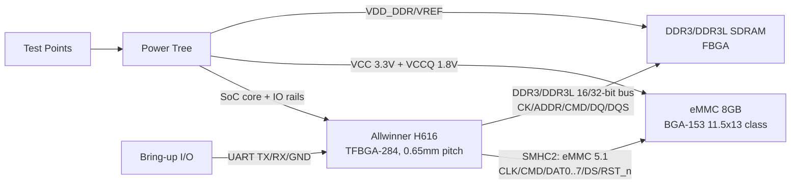
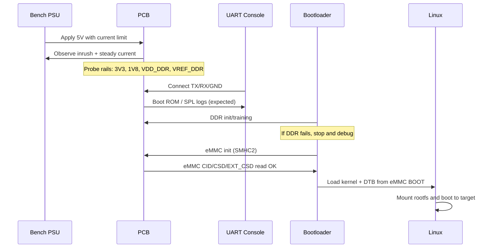

# H616 Watchdog PCB Architecture Deep Dive for KiCad: Memory and Boot Storage Subsystem

## Executive summary

**Chosen subsystem:** the **high‑speed memory + boot storage complex**: **H616 ↔ DDR3/DDR3L** and **H616 ↔ eMMC (SMHC2, eMMC 5.1)**, including the rails, clocks, constraints, and bring‑up hooks that make the board boot reliably.

**Why this subsystem:** it is the **highest first‑spin risk** (DDR routing + power integrity), it is **non‑negotiable** in the provided breakdown (H616 + DDR3/DDR3L + soldered eMMC), and it has the **largest KiCad-specific workflow impact** (stack‑up definition, length tuning, net naming, rules, via strategy, BGA escape, manufacturing/X‑ray). The H616 datasheet explicitly positions this as a core capability: **Boot ROM supports SD/eMMC (SMHC0/SMHC2)** and the SDRAM controller supports **DDR3/DDR3L**; the eMMC interface is provided on **SMHC2 with an 8‑bit bus** and higher‑speed 1.8 V modes (which drives your VCCQ choice). citeturn26search37turn26search35

**Key architecture decisions (implementation ready):**
- Connect the **soldered eMMC to SMHC2** (8‑bit eMMC 5.1) to align with the H616’s dedicated eMMC controller capability. citeturn26search35turn26search37
- Implement DDR as a **short, single‑topology point‑to‑point bus** with strict grouping (byte lanes), and encode constraints into KiCad net classes + tuning workflow. KiCad’s length tuner only works on **point‑to‑point topologies** and will stop at branches, so topology discipline is not optional. citeturn0search1turn28search37
- Start with a **6‑layer stack-up** (SIG/GND/PWR/SIG/GND/SIG) so you can route DDR and BGA escapes while keeping solid return planes. This is a standard high‑density approach, and typical 6‑layer capability/stack options and controlled‑impedance support are widely offered by prototype fabs. citeturn27search1turn27search0
- Plan for **BGA manufacturing reality**: H616 is a **TFBGA‑284, 0.65 mm pitch**, so “normal” dogbone escape is feasible, but X‑ray is still recommended/required by common turnkey assemblers; treat this as a DFM gate, not a surprise. citeturn25search43turn16search7turn16search2

---

## Subsystem selection and requirements

### Scope locked by the breakdown

The attached breakdown defines (as non‑negotiables) a board built around **Allwinner H616**, **512 MB DDR3/DDR3L minimum (1 GB optional)**, and **8 GB soldered eMMC**, with factory SMT/BGA and hand‑soldered connectors. (Source-of-truth: attached breakdown document.)

### H616 capabilities that constrain the architecture

From the (publicly available) H616 datasheet:
- **Boot ROM** supports system boot from **SD/eMMC (SMHC0, SMHC2)** and supports a **mandatory upgrade process through SMHC0 and USB** (relevant for recovery strategy). citeturn26search37turn26search36
- SDRAM controller supports **DDR3/DDR3L** (among others) on a **32‑bit interface** and claims capacity up to 4 GB. citeturn26search37turn26search36
- **SMHC2** is the eMMC controller: **eMMC 5.1, 8‑bit bus**, with 3.3 V and 1.8 V modes including DDR at 100 MHz @1.8 V (so VCCQ=1.8 V becomes an enabling choice). citeturn26search35turn26search0
- Package: **TFBGA‑284, 14 mm × 12 mm, 0.65 mm pitch**. This dictates BGA escape and your minimum design rules. citeturn25search43turn16search1

---

## Technical architecture

This section specifies **signals, rails, clocks, footprints, and test points** in a way that can be lifted into a KiCad schematic + PCB.

### Block diagram of the chosen subsystem

### Signals and nets

#### DDR3/DDR3L bus grouping (schematic net naming)

The most important thing at schematic time is **naming for grouping** so that KiCad net classes and length tuning are usable.

Recommended net naming pattern (KiCad-friendly, byte-lane explicit):
- **Clock:** `DDR_CK_P`, `DDR_CK_N`
- **Control:** `DDR_RESET_N`, `DDR_CKE`, `DDR_CS_N`, `DDR_ODT`, `DDR_RAS_N`, `DDR_CAS_N`, `DDR_WE_N`
- **Address/Bank:** `DDR_A0..DDR_A15`, `DDR_BA0..DDR_BA2`
- **Lane 0:** `DDR_DQ0..DDR_DQ7`, `DDR_DM0`, `DDR_DQS0_P`, `DDR_DQS0_N`
- **Lane 1:** `DDR_DQ8..DDR_DQ15`, `DDR_DM1`, `DDR_DQS1_P`, `DDR_DQS1_N`
- For 32‑bit wide implementations: lanes 2/3 similarly (`DQ16..31`, etc.)

**Assumed — validate with datasheet:** Whether H616 DRAM is configured as 16‑bit or 32‑bit in your chosen memory topology. The datasheet states “32‑bit DDR3/DDR3L interface” as a capability; many controllers can also run narrower buses, but treat that as a configuration dependency requiring confirmation from H616 DRAM controller documentation and a known-good reference design. citeturn26search37

#### eMMC on SMHC2 (signals and required pins)

H616 specifically describes SMHC2 as the eMMC controller with **8‑bit bus width** and both 3.3 V and 1.8 V operating modes up to **DDR 100 MHz@1.8 V**, which is a strong hint to route eMMC as an 8‑bit interface and plan a 1.8 V VCCQ option. citeturn26search35turn26search37

Minimum nets to implement:
- `EMMC_CLK`
- `EMMC_CMD`
- `EMMC_DAT0..EMMC_DAT7`
- `EMMC_DS` (Data Strobe; used for HS400-class modes on many eMMC parts—route it as a high-speed single-ended net alongside the bus)
- `EMMC_RST_N` (hardware reset)
- Optional but recommended: `EMMC_PWR_EN` (if you want to power-cycle eMMC under software control; not required for first spin)

RST_n considerations:
- Some host controllers treat hardware reset as required support for robust recovery; a representative SoC platform manual notes that eMMC hardware reset (`RST_n`) is expected/required for eMMC devices compared to legacy MMC families. citeturn17search0  
**Assumed — validate with chosen eMMC datasheet and H616 SMHC2 pinmux:** connect `EMMC_RST_N` to an H616 GPIO (or a dedicated reset-capable pin if provided) with a defined default state via pull-up/down, so it never floats at boot.

### Power rails used by this subsystem

#### DDR3/DDR3L rails (example memory: Micron 4Gb x16 DDR3L)

Micron’s 4Gb DDR3L family specifies DDR3L operation with **VDD = VDDQ = 1.35 V** and backward compatibility to 1.5 V mode depending on device and configuration. citeturn14search48turn24search0

Rails to implement:
- `VDD_DDR` = **1.35 V** (DDR3L) **assumed**; or 1.5 V if DDR3
- `VREF_DQ` and `VREF_CA` ≈ **VDD_DDR / 2** (must be low noise; usually generated by divider + buffer or dedicated reference LDO)
- `VTT` termination rail: **assumed not required** for point-to-point, short-trace SoC-to-one-memory routing; validate against H616 DRAM controller guidance and the exact topology you choose. TI reference material shows “no VTT termination” is feasible under restrictions (short routing, limited number of DDR parts, controlled topology). citeturn3search1

Required DDR3 components that should exist in the schematic (example Micron MT41K256M16):
- `RZQ` (typically 240 Ω to GND) on the memory’s `ZQ` pin for output driver calibration (Micron calls out ZQ and external resistor usage in ball descriptions). citeturn24search0
- Adequate decoupling at all VDD/VDDQ pins/balls (see PI plan below).

#### eMMC rails

eMMC devices generally require:
- `VCC` (core supply) typically **2.7–3.6 V (nominal 3.3 V)**
- `VCCQ` (I/O supply) **1.8 V or 3.3 V**, depending on interface voltage mode (1.8 V enables high-speed signalling modes on many hosts)
- Many devices expose an internal regulator node (`VDDi`) that expects an external capacitor to stabilise the internal regulator output (vendor-specific, but common enough that you should plan for it in footprints/placement). citeturn17search43turn17search1

H616 SMHC2 explicitly supports 1.8 V high-speed modes (150 MHz SDR and 100 MHz DDR at 1.8 V), so **choose VCCQ = 1.8 V by default** unless your BSP/boot chain forces 3.3 V. citeturn26search35turn26search37

### Footprints and mechanical constraints

- **H616 package:** TFBGA‑284, **14 mm × 12 mm, 0.65 mm pitch**. citeturn25search43turn16search1
- **Example DDR3L package:** 96‑ball FBGA x16 variants exist in multiple body sizes (e.g., Micron lists 96‑ball options like 8×14 mm, 7.5×13.5 mm, 9×14 mm depending on revision), so footprint selection must match the exact ordering code. citeturn24search0turn14search48
- **Micron DDR3L pad reference:** Micron’s package drawings reference solder balls post‑reflow on **Ø0.42 mm SMD ball pads** for at least one 96‑ball x16 package option—this is a concrete starting point for pad sizing (still validate against your exact package variant). citeturn14search48turn24search0
- **eMMC 8 GB typical package:** many 8 GB eMMC parts are in **BGA‑153 11.5×13×0.8 mm** class packages (Kingston lists multiple 8 GB eMMC options in that exact package envelope). citeturn17search2turn15search0

### Test points (minimum set for this subsystem)

Place these as labelled test pads (or small loop points) and reflect them in the schematic:
- Rails: `TP_5V_IN`, `TP_3V3`, `TP_1V8`, `TP_VDD_DDR`, `TP_VREF_DDR`, and at least one `TP_GND` cluster near the SoC.
- Clocks: `TP_DDR_CK_P` (via a high-impedance probe pad), `TP_EMMC_CLK` (same caveat).
- Resets: `TP_RESET_N_SOC`, `TP_DDR_RESET_N`, `TP_EMMC_RST_N`
- UART: `TP_UART_TX`, `TP_UART_RX` (or expose on header)

---

## Detailed schematic-level guidance

This section is written as “what you actually draw” in KiCad, including starting values and optional stuffing for risk mitigation.

### Candidate component options and practical selection

#### H616 SoC (fixed by breakdown)

| Part | Package | Notes for schematic/PCB | Availability snapshot |
|---|---|---|---|
| Allwinner H616 | TFBGA‑284 | 0.65 mm pitch; treat as BGA requiring X‑ray in turnkey flows; MSL‑3 is commonly flagged by assemblers. citeturn16search7turn25search43 | LCSC/JLC list stock and pricing; expect variability. citeturn16search6turn16search7 |

#### DDR3/DDR3L options (512 MB target)

For 512 MB, a common approach is **4Gb x16** DDR3/DDR3L (because 4Gb = 512MB). Whether you need **one chip (16‑bit)** or **two chips (32‑bit)** depends on DRAM controller configuration.

| Option | Density / bus | Voltage | Package | Cost/availability snapshot | Notes |
|---|---:|---:|---|---|---|
| Micron MT41K256M16 (DDR3L) | 4Gb x16 | 1.35 V (DDR3L) | 96‑ball FBGA x16 variants | LCSC lists this family/ordering as in stock with volume-dependent pricing. citeturn20search1turn24search1 | Strong documentation; Micron package drawings give concrete pad guidance. citeturn14search48turn24search0 |
| SK hynix H5TQ4G63EFR (DDR3) | 4Gb x16 | 1.5 V | FBGA‑96 | LCSC lists some H5TQ4G63EFR variants in stock. citeturn20search5turn20search4 | DDR3 (not “L”) increases power and may complicate rails if rest of design is 1.35V-oriented. |
| ISSI IS43TR16256 (DDR3) | 4Gb x16 | DDR3-class | BGA‑96 | LCSC lists in stock. citeturn20search6 | Good alternate vendor; still validate timing vs your DRAM init. |

**Assumed — validate with datasheet:** choose DDR3L over DDR3 unless your H616 DRAM init tooling or validated reference design uses DDR3, because 1.35 V generally helps power and thermals at similar densities. This assumption should be validated against the “known-good” DRAM on an Orange Pi Zero2 reference design and your chosen bootloader DRAM timing parameters. Orange Pi publicly positions Zero2 as using DDR3 and having 512 MB/1 GB variants, which suggests multiple DRAM configurations exist in the ecosystem. citeturn29search0turn29search38

#### eMMC options (8 GB soldered)

| Option | eMMC spec | Package | Cost/availability snapshot | Notes |
|---|---|---|---|---|
| Samsung KLM8G1GETF‑B041 | eMMC 5.x class | FBGA‑153 (11.5×13) | LCSC shows stock and pricing bands (snapshot). citeturn21search6turn21search2 | Samsung’s own site flags this product status as **EOL**, so treat it as risky for long-term production even if available short-term. citeturn1search8 |
| Kioxia THGBMUG6C1LBAIL (example) | eMMC class | BGA‑153 (13×11.5) | LCSC lists this MPN with limited stock snapshot. citeturn21search5turn21search3 | Good multi-source planning; validate exact ballmap/pinout and mechanical envelope. |
| Kingston EMMC08G‑MV28 | eMMC 5.1 HS400 | 11.5×13×0.8 | Kingston publishes part numbers and package dimensions for 8 GB in this class. citeturn15search0turn17search2 | Datasheet access may be gated via “request info”; plan procurement early. |

### Pull-ups, series resistors, and “DFM-friendly optionality”

#### DDR3/DDR3L

Starting point recommendations (typical, conservative; **assumed — validate with datasheet/controller guidance**):
- Provide 0 Ω “option resistors” footprints (0402/0603) close to the SoC for:
  - `DDR_CK_P/N` series damping (optional)
  - Address/command group series damping (optional, either per-net or per-group)
  - These allow SI fixes without respin if you find ringing.

Hard requirement (for many DDR3 parts, confirmed for Micron family):
- Include a **ZQ resistor** (commonly 240 Ω to GND) at the DRAM’s `ZQ` pin. citeturn24search0

Reset/pulls:
- Provide `DDR_RESET_N` with a defined default (pull-up/pull-down per DRAM datasheet expectations; many designs pull-up to VDD_DDR through ~10 kΩ) (**assumed**).

#### eMMC over SMHC2

Signal bias:
- eMMC has internal behaviour differences between power‑up and configured bus modes: a representative eMMC device description notes the device has internal pull-ups for DAT lines initially and may disconnect them in wider bus modes, so host-side pull strategy must be validated per device. citeturn17search43  
**Assumed — validate with chosen eMMC datasheet + H616 SMHC2 requirements:** include weak pull-ups (47 kΩ–100 kΩ) on `CMD` and `DAT0` at minimum; keep optional footprints for `DAT1..DAT7` if needed for strap stability and EMI robustness.

Reset:
- Route `EMMC_RST_N` to a controllable SoC pin; ensure it is never floating. Platform documentation on eMMC support highlights hardware reset as an expected feature, typically implemented via a GPIO. citeturn17search0

Decoupling:
- If the eMMC exposes `VDDi`, place the specified capacitor directly adjacent to the ball escape (vendor-defined, but commonly 1 µF class). citeturn17search43turn17search1

### Decoupling values and placement starting points

These are **starting points** (assumed) that you should refine once you commit to exact parts and see the reference schematic power tree.

DDR3/DDR3L:
- Per DRAM: at least **one 0.1 µF** per local VDD/VDDQ cluster and **one 1–4.7 µF** bulk close to the part (place multiple 0.1 µF that can tuck into the BGA escape keepout).
- `VREF` rails: **0.1 µF + 1 µF** close to the VREF generator and near the DRAM VREF pins/balls (minimise noise injection).

H616:
- Without the full PMIC reference, do not guess the exact rail split; instead, implement **dense 0.1 µF arrays** around the SoC and have footprints for additional bulk (10–47 µF) per rail region. (Assumed; validate against the H616 power-tree reference schematic you select.)

Manufacturing implication: do not push these caps to the bottom if your assembler is SMT‑only on top—your breakdown assumes factory SMT/BGA parts, so top-side clustering is usually best.

---

## KiCad PCB implementation rules

This is the “encode it so the tools enforce it” section: stack-up, rules, net classes, tuning, via strategy, and routing order.

### Stack-up and layer assignments

**Recommended baseline:** 6‑layer FR‑4, **SIG/GND/PWR/SIG/GND/SIG**. This is a standard 6‑layer stack motif with good return paths and plane adjacency. citeturn27search1

A practical “prototype‑friendly” approach is to select a known manufacturer stack-up and then set KiCad trace widths/gaps accordingly. JLCPCB publishes controlled impedance stack-ups (including dielectric constants for prepregs/cores) and supports high‑density rules down to ~3.5 mil/0.2 mm vias depending on service. citeturn27search0turn27search1

### PCB stack-up table (assumed template)

This is an **assumed** 1.6 mm class 6-layer template. You should replace dielectric thicknesses with your fab’s exact stack once chosen.

| Layer | Role | Notes |
|---|---|---|
| L1 | Signals + components | DDR escape + short routes; microstrip impedance depends on fab prepreg stack. |
| L2 | Solid GND plane | Primary return for L1; keep unbroken under DDR/eMMC. |
| L3 | Power plane(s) | Split rails, but avoid splits under DDR/eMMC routes; use islands + stitching. |
| L4 | Signals | DDR address/command or eMMC bus if needed; keep stable reference above/below. |
| L5 | Solid GND plane | Return plane and shielding; good for EMI. |
| L6 | Signals | Lower-speed or secondary routing; avoid DDR here unless unavoidable. |

### KiCad net classes and constraints

You want net classes that map to how you *will actually tune*.

Minimum net classes:
- `DDR_CK` (diff pair)
- `DDR_DQS0`, `DDR_DQS1`, … (diff pairs by lane)
- `DDR_DQ_L0`, `DDR_DQ_L1`, … (single-ended, lane by lane)
- `DDR_ADDR_CMD` (single-ended group)
- `EMMC_HS` (CLK/CMD/DAT/DS group)
- `RESET_STRAPS` (slow but critical)

#### Differential pair naming (KiCad behaviour)

KiCad detects differential pairs by **base name + suffix** using either `+/-` or `P/N`, but you cannot mix suffix styles. citeturn18search1turn18search3  
So use:
- `DDR_CK_P` / `DDR_CK_N`
- `DDR_DQS0_P` / `DDR_DQS0_N`
…and avoid formats like `_DP1/_DN1` unless you’re willing to rename for KiCad routing. citeturn18search8turn18search1

#### Length matching and delay conversions

KiCad length tuning is powerful, but:
- It only supports **point‑to‑point nets**; branches break the tuner. citeturn0search1turn28search37
- Via length may be included or excluded depending on stack-up settings; Net Inspector and length tuner can differ, and via height inclusion depends on “use stackup height” settings. citeturn28search37turn28search37

For converting mm to ps, you need an assumed propagation delay:
- A commonly used rule of thumb is **~150 ps/in for microstrip** and **~180 ps/in for stripline** on FR‑4. citeturn19search2turn19search6  
That equates to approximately:
- **Microstrip:** 150 ps/in ÷ 25.4 ≈ **5.9 ps/mm** (assumed)
- **Stripline:** 180 ps/in ÷ 25.4 ≈ **7.1 ps/mm** (assumed)

**Assumed — validate with fab stack-up + field solver:** actual delay depends on your effective dielectric constant and routing layer.

Suggested initial skew targets (pragmatic, based on common vendor guidance ranges; validate against H616 and DRAM datasheets / reference):
- **DQS_P vs DQS_N intra‑pair:** ≤ **0.25 mm** (≈1.5 ps microstrip) assumed
- **DQ/DM to associated DQS within a byte lane:** ≤ **0.5 mm** (≈3 ps microstrip) assumed  
These are consistent in spirit with high‑performance reference guidance that targets sub‑millimetre skew matching for DDR byte lanes. citeturn2search40turn1search48

### Via strategy and BGA escape (0.65 mm pitch H616)

H616 is 0.65 mm pitch; this is “escapeable” on 6‑layer without HDI, but you must choose drill/pad sizes that your fab supports and that leave routing channels between pads.

Practical constraints from common proto/turnkey providers:
- Example capabilities include **3.5 mil track/spacing**, **0.2 mm vias**, and small BGA pad sizes. citeturn27search0turn27search1

**Recommended escape approach (cost‑balanced):**
- Use **dogbone fanout** for the SoC BGA outer rings to L1 and transition to L3/L4 for deeper signals.
- Avoid via‑in‑pad as a first default unless routing density forces it; if you do use via‑in‑pad, ensure the fab supports filling/capping (some fabs offer it, but the assembly yield assumptions must be explicit). citeturn27search1
- Ensure DDR nets in a length‑matched group use **matching via counts**; multiple DDR guides explicitly warn that vias add delay and variability, so keep via usage symmetric inside a group. citeturn2search40turn19search6

### Keepouts, plane splits, and “no surprises” DRC

Even though this deep dive focuses on memory/eMMC, you still require strict plane discipline around the memory cluster:
- Keep **solid reference planes** under DDR and eMMC; do not route DDR over plane splits.
- Use KiCad **Rule Areas / Keepouts** to enforce “no copper pours / no vias / no tracks” regions where needed. KiCad supports rule areas as keepouts and allows restriction of tracks/vias/zone fills within them. citeturn28search2turn28search1

KiCad workflow note:
- KiCad’s Net Inspector includes effective via height in length; the length tuner includes vias only when stack-up height usage is enabled. This matters for DDR tuning; you should lock stack-up early. citeturn28search37turn28search37

### Placement order for this subsystem

A layout order that matches reality:
1) Place H616 BGA, DDR BGA(s), eMMC BGA on the **same side** in a tight cluster (the breakdown recommends this clustering conceptually).  
2) Place DDR decoupling in the escape perimeter first, then eMMC decoupling, then SoC decoupling.  
3) Route DDR first (escape + byte lanes + clocks), then eMMC, then everything else.

---

## Bring-up, manufacturing, and risk management

### Boot and bring-up considerations

The H616 Boot ROM supports SD/eMMC boot on SMHC0 and SMHC2 and also supports a mandatory upgrade path via SMHC0 and USB. citeturn26search37turn26search36  
Given you are using eMMC on SMHC2, define a recovery plan:

**Recommended bring-up stance (implementation guidance):**
- Keep **UART console** always available (header).
- Ensure you can force a recovery/upgrade mode via strap(s) or test pads (**assumed — validate with Allwinner boot documentation**).
- Consider (as an *open question*) whether to expose SMHC0 pads (or a microSD footprint) purely for bring-up/recovery; Boot ROM explicitly supports SMHC0 boot and upgrade. citeturn26search37turn26search35  
This is not mandated by the breakdown, so treat it as a decision gate.

### Manufacturing and assembly notes

- H616 is a BGA with 0.65 mm pitch; turnkey assemblers commonly require or strongly recommend **X‑ray inspection** for BGA/QFN/bottom‑terminated packages. One major turnkey flow explicitly flags H616 as “X‑ray inspection required”, and JLC’s own documentation describes X‑ray as critical for hidden solder joints. citeturn16search7turn16search2
- Choose stencil thickness with the finest pitch in mind; stencil providers commonly recommend ~80–120 µm class thickness for 0.5 mm pitch µBGA class designs (exact choice depends on your smallest apertures and whether you need step stencils). citeturn16search3

**Assumed — validate with your assembler’s capability + package land patterns:**
- Use **ENIG** finish for BGA if possible (improves solderability and coplanarity tolerance relative to some HASL processes).

Hand-solder policy (as per breakdown intent):
- Mark through‑hole “chunky” connectors as **hand‑solder / DNP in PCBA**. In KiCad, you can ensure placement files exclude such parts by using footprint attributes and export options (exclude through‑hole footprints; exclude DNP). citeturn18search0turn18search7

### Test and validation plan (step-by-step)

Use this order to isolate faults quickly:

Concrete measurements and expected behaviours:
- **Rails:** VDD_DDR should be stable within the DDR part’s allowed range (Micron DDR3L specifies 1.35 V nominal with an allowed operating range), and VREF should sit around half of VDD_DDR and be quiet (low ripple). citeturn14search48turn24search1
- **DDR clocks:** clean differential CK with consistent amplitude and minimal ringing; if ringing occurs, populate optional series elements (if you implemented them).
- **eMMC:** command line starts in open‑drain during initialisation then transitions to push‑pull in fast modes (typical eMMC behaviour described in device documentation). citeturn17search43turn17search1

Failure modes and debug:
- DDR training fails/reboots: check VREF noise, missing/incorrect `RZQ` resistor, excessive skew, asymmetric via counts, or plane discontinuities. RZQ is a known required element in Micron DDR3L ballout/description. citeturn24search0
- eMMC not detected: verify SMHC2 pinmux, VCCQ level (1.8 vs 3.3), reset state (`RST_n`), and whether pull-ups are required beyond device internals in your selected bus mode. citeturn26search35turn17search43
- Marginal bring-up that “works warm but not cold”: suspect timing margins (excess skew) or power integrity; revisit stack-up, return paths, and decoupling density.

### Risk analysis, mitigations, and open questions before schematic freeze

Highest risks:
- **DDR routing/topology errors**: KiCad tuning requires point‑to‑point nets; accidental stubs/branches can break tuning and invalidate your skew numbers. citeturn0search1turn28search37
- **Wrong memory topology vs controller expectations**: H616 advertises a 32‑bit DDR interface, but your 512 MB requirement could be met with different physical strategies; this must match the DRAM init parameters you will use. citeturn26search37
- **eMMC voltage mode mismatch**: SMHC2 supports 1.8 V high-speed modes; you must decide VCCQ=1.8 V vs 3.3 V early because it affects the power tree and level compatibility. citeturn26search35turn26search37
- **Supply chain risk on storage**: at least one common 8 GB Samsung eMMC variant is flagged EOL by Samsung in official listings; pick a long-term sourcing plan (Kingston/Kioxia alternates). citeturn1search8turn15search0turn21search5
- **Assembly yield on BGA**: plan X‑ray; it’s explicitly recommended/required in common turnkey flows for H616. citeturn16search7turn16search2

Open questions (must resolve before schematic freeze):
- Exact DDR topology: **16‑bit (1×4Gb x16)** vs **32‑bit (2×x16)** and whether you need a single PCB supporting both 512 MB and 1 GB SKUs.
- Exact DDR part/package and whether you need DDR3L vs DDR3 (rail implications).
- eMMC part selection and whether you require HS200/HS400 performance (affects routing strictness and whether DS is required by chosen part/boot chain).
- Which fab stack-up you will target (needed to stop guessing impedance and to make KiCad length maths meaningful). JLC and others publish specific 6‑layer impedance stacks and dielectric constants, which you can plug into KiCad and an impedance calculator. citeturn27search0turn27search1

### References to prioritise (in order)

Primary/reference documents that matter most for this subsystem:
- **Allwinner H616 Datasheet v1.0** (package/pitch; memory and boot features). citeturn25search43turn26search37
- H616 documentation covering **SMHC2 eMMC 5.1 8‑bit** details (bus modes and voltage modes). citeturn26search35
- Your chosen **DDR3/DDR3L datasheet** (example: Micron 4Gb DDR3L family; pinout, ZQ, Vref references, package land pattern). citeturn14search48turn24search0
- Your chosen **eMMC datasheet** (ballout, VDDi capacitor requirement, pull-up behaviour, reset). Representative device documentation discusses CMD mode and internal pulls as well as VDDi. citeturn17search43turn17search1
- **KiCad PCB editor documentation** for:
  - differential pair naming rules citeturn18search1
  - length tuning limitations and via length inclusion settings citeturn0search1turn28search37
  - placement file export flags (exclude TH / exclude DNP) citeturn18search0turn18search7
- Manufacturer stack-up/impedance references used for your fab (e.g., controlled impedance stack-up parameters and 6‑layer capability tables). citeturn27search0turn27search1

---

**If you want the next pass to be even more KiCad-executable:** the only “missing” artefacts that would materially improve correctness are (a) your chosen DDR3/eMMC exact MPNs, (b) the Orange Pi Zero2 H616 reference schematic PDF accessible to you locally, and (c) your intended PCB manufacturer + stack-up choice (so impedance widths/spacings can be calculated rather than assumed).