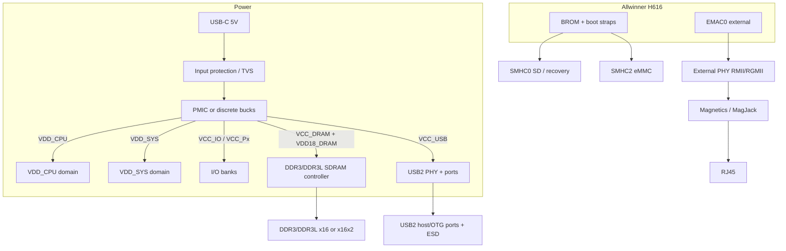
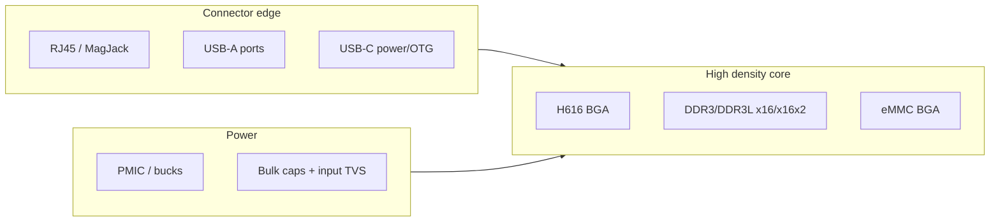
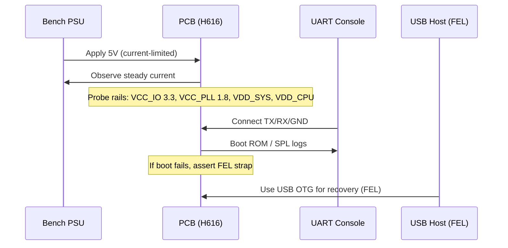

# Integrating the Allwinner H616 SoC into a KiCad PCB Design

## Executive summary

This report is an implementation-focused deep dive on integrating the **Allwinner H616** SoC into a **KiCad** schematic + PCB design suitable for manufacturing, bring-up, and firmware handoff. It prioritises primary sources: the **H616 datasheet**, the **Orange Pi Zero2 H616 reference schematic** (a proven H616 design), official **KiCad documentation**, and authoritative app notes for **DDR3**, **USB2/USB‑C**, and **Ethernet**. citeturn11view0turn13view0turn25search4turn33search1turn1search46turn2search48turn4search39turn3search44

Key integration conclusions:

- The H616 is a BGA SoC (**TFBGA‑284, 0.65 mm pitch**) with strict manufacturing handling (MSL3, defined out‑of‑bag floor life, baking conditions, and a lead‑free reflow profile). These are not “optional details”; they drive your assembly flow and DFM gates. citeturn26view6turn26view1turn26view0turn26view4  
- H616 boot + recovery strategy hinges on **Boot ROM** behaviour and the **FEL**/boot select pins: Boot ROM supports boot from **SD/eMMC (SMHC0, SMHC2)**, NAND, SPI NOR/NAND, and supports a **mandatory upgrade process through SMHC0 and USB**; **FEL high** alters the boot path toward Try‑Media boot vs mandatory upgrade. citeturn12view2turn16view0  
- The most important KiCad-specific pitfalls for an H616 board are (a) symbol/footprint correctness for BGA pin mapping, (b) encoding high-speed constraints through naming + net classes, and (c) KiCad length tuner behaviour: it computes **point‑to‑point** lengths and stops at branches; via lengths are only included if stack-up height is enabled and defined correctly. citeturn33search0turn0search0turn33search3  
- For Ethernet: H616 has **two EMACs**; **EMAC0** is the external one (RGMII/RMII), while **EMAC1 includes an embedded 100 M EPHY with no external pins**, meaning your RJ45 interface must use EMAC0 + an external PHY. citeturn16view8turn17view6  
- For USB: H616 provides **USB2.0 OTG x1 and USB2.0 HOST x3** with an integrated USB2 analog PHY; you still must design the board‑level ESD, connector, and routing correctly. citeturn16view8turn16view7turn2search46  

## Scope, assumptions, and required source files

### Scope

This document covers:
- H616 integration architecture at schematic + PCB level: signals, rails, clocks, resets, boot straps, key peripherals, and manufacturing/bring-up concerns.
- A KiCad-ready implementation plan: hierarchical sheets, naming rules, net classes, stack-up template, length matching strategy, and BGA escape approach.
- Interface design rules for DDR3, USB2/USB‑C power input, and Ethernet front-end, aligned to authoritative app notes. citeturn4search39turn3search44turn2search46turn1search46turn2search48  

### Assumptions

Some details depend on your attached “H616 Watchdog Board Breakdown”. In this environment I cannot access the attached breakdown file via the available internal file-search mechanism, so any requirement derived from it is marked **assumed — validate with breakdown**.

Assumed board-level requirements (validate against your breakdown):
- H616 + DDR3/DDR3L + eMMC.
- USB‑C used as 5 V power sink (and possibly OTG for recovery).
- 10/100 Ethernet via RJ45 MagJack.
- SPI display + buttons, and a debug UART header.

### Exact files needed to proceed without assumptions

To remove “assumed” everywhere and produce a pin‑accurate KiCad symbol/constraint set, provide these exact artefacts:
- `h616_watchdog_board_breakdown_v2.md` (or PDF export)  
- `H616_Datasheet_V1.0.pdf` (you can use the linux-sunxi copy already referenced) citeturn5search41  
- `H616_User_Manual_V1.0.pdf` (**needed** for full boot strap truth tables; the linux-sunxi PDF fetch failed in this environment) citeturn16view0  
- `Orange_Pi_Zero2_H616_Schematic_v1.3.pdf` (already referenced) citeturn13view0  
- `H616_pin_assignment_ballmap.csv` (or a machine-readable pin table from the datasheet/user manual)  
- Your chosen: DDR3/DDR3L datasheet + eMMC datasheet + Ethernet PHY datasheet (specific MPNs)

## H616 integration architecture overview

### High-level reference architecture

Orange Pi Zero2 is a proven H616 board and is an especially useful reference because it includes H616, DDR3, USB‑C power, PMIC, and Ethernet PHY integration. The linux-sunxi board page documents H616 @ 1.512 GHz, **1 GiB DDR3 @ 720 MHz (2× Samsung x16)**, and **5 V via USB‑C**, and includes the schematic link. citeturn5search2turn13view0  

Conceptual integration block diagram (SoC-centric):

Key architectural constraints from the H616 datasheet:
- Boot ROM supports SD/eMMC on **SMHC0 and SMHC2**, plus NAND and SPI flash; mandatory upgrade path is via **SMHC0 and USB**. citeturn12view2  
- USB subsystem: **USB2.0 OTG x1** and **USB2.0 HOST x3**. citeturn16view8  
- Ethernet: two EMACs; **EMAC0** supports **10/100/1000 with RGMII/RMII** for external PHY; **EMAC1** is 10/100 RMII with embedded EPHY and **no external pins**. citeturn16view8turn17view6  

## H616 pin and signal mapping summary

You should treat the H616 datasheet’s Pin Description + Pin Assignment tables as the authoritative source for final pin-to-ball mapping. This section provides a **KiCad-ready functional mapping** with directions, voltage domains, pulls, and net naming conventions, with explicit “assumed — validate” where needed.

### Power domains and their practical meaning

From the H616 recommended operating conditions:
- `VCC_IO` (GPIO F/H + system control) is a **3.3 V domain** (2.97–3.63 V). citeturn17view0turn17view2  
- `VCC_USB` (USB analog) is also a **3.3 V domain** (2.97–3.63 V). citeturn17view0turn17view8  
- `VCC_PLL`, `VCC_DCXO`, `VCC_HDMI` are **1.8 V class** domains (datasheet lists ranges around 1.62–1.98 V depending on rail). citeturn12view1turn19view0  
- `VDD_CPU` and `VDD_SYS` are sub‑1 V rails (the datasheet gives ranges; `VDD_CPU` listed as 0.81–1.1 V, `VDD_SYS` shown as 0.81–0.99 V). citeturn17view0turn17view1turn12view1  
- DRAM uses `VCC_DRAM` (varies by memory type) and `VDD18_DRAM` (1.8 V internal pad power). citeturn12view1turn12view0  

**Practical integration principle:** each I/O port group is powered by its associated VCC rail, and changing that rail changes logic thresholds and “safe” external pull-up voltages. You cannot treat “all GPIO are 3.3 V” as a safe default.

### Boot, system-control, and debug pins

Core system-control signals from H616 datasheet:
- `FEL` (input): changes boot flow; **FEL high → Try Media Boot**, else mandatory upgrade process. citeturn16view0  
- `BOOT_SEL[4:1]` (inputs): Boot media select. citeturn16view0  
- `JTAG_SEL` (input): selects which port outputs JTAG. citeturn16view0  
- `RESET` (I/O): low-active reset signal (low active). citeturn16view4  

Orange Pi Zero2 shows a practical mapping of these pins to H616 balls:
- It labels **`RESET A16`**, **`FEL B17`**, and **`JTAG_SEL C16`** in the SoC sheet, confirming these are treated as explicit board-level pins in a known-good design. citeturn15view1turn15view1  
- It also shows that several PC pins multiplex BOOT_SEL: e.g. **PC3 includes `BOOT_SEL1`**, **PC4 includes `BOOT_SEL2`**, **PC5 includes `BOOT_SEL3`**, **PC6 includes `BOOT_SEL4`**. citeturn15view4  

**Internal pull resistor “gotcha” that matters for straps:** the H616 datasheet provides a note showing internal pull-up / pull-down resistance differs by port:
- PL0~PL1 have internal pulls of **4.7 kΩ ±20%**
- PC0, PC3~PC7, PF3, PF6, PG1~PG5 have internal pulls of **15 kΩ ±20%**
- Other GPIO ports have **100 kΩ ±20%** pulls. citeturn19view0  

This means boot strap pins on PC3–PC7 may already have relatively strong internal pulls (~15 kΩ class). External strap resistor choices that seem “reasonable” (e.g., 100 kΩ) may be too weak to reliably override internal pulls. citeturn19view0turn15view4  

### Clocks and oscillators

The H616 has two clock inputs, each passing through an internal oscillator; the **24 MHz oscillator** provides the main reference clock and is provided through **DXIN**, with recommended 24 MHz crystal requirements listed in Table 5‑8. citeturn19view0turn16view4  

Practical SoC clock pins:
- `DXIN` / `DXOUT` (24 MHz crystal) and `VCC_DCXO` supply. citeturn16view4turn17view6turn19view0  
- `REFCLK_OUT` and `X32KFOUT` are fanout outputs for external devices (if used). citeturn16view4turn16view5  

**Implementation note (assumed — validate with datasheet crystal table):** Most Allwinner designs use a 24 MHz crystal with load capacitors sized to the chosen crystal’s CL. Treat it as a single-device crystal: do not share one crystal among multiple chips without an explicit clock buffer strategy.

### DDR interface pins and domains

From the H616 pin table excerpt:
- DRAM supply is `VCC_DRAM`; SDRAM controller pad/internal supply is `VDD18_DRAM`. citeturn12view1  
- DDR data bus signals include `SDQ0..SDQ31` as **I/O** in the `VCC_DRAM` domain. citeturn12view0  
- Data masks `SDQM0..SDQM3` are outputs in `VCC_DRAM`. citeturn12view0  
- Strobes: `SDQS0P/N` .. `SDQS3P/N` in `VCC_DRAM`. citeturn12view0  
- Clock: `SCKP/SCKN` outputs in `VCC_DRAM`. citeturn12view0  
- Address/control examples: `SA13..SA16`, `SBA0..`, `SCKE0/1`, etc. citeturn12view0  

**Typical net naming (KiCad-friendly):**
- `DDR_DQ0..DDR_DQ31`, `DDR_DM0..3`
- `DDR_DQS0_P/N` .. `DDR_DQS3_P/N`
- `DDR_CK_P/N` (map to `SCKP/SCKN`)
- `DDR_A0..`, `DDR_BA0..`, `DDR_CKE0/1`, `DDR_RESET_N`, `DDR_CS_N`, `DDR_ODT`, etc (**assumed — validate full list against pin assignment**)

**Length-matching targets (assumed — validate with SoC/memory tuning rules):** As a defensible default, apply Intel’s DDR3 byte-lane guidance: match DQ/DQS/DM within a byte lane to **±10 ps** and route those nets within a lane on the same layer to avoid velocity differences. citeturn33search1  

### SMHC (SD/eMMC) pins and domains

H616 exposes SD controller pins:
- `SDC1_CLK` (output), `SDC1_CMD` (I/O, open drain), etc.
- `SDC2_D[7:0]` (I/O), `SDC2_CLK` (output), `SDC2_CMD` (I/O, open drain), `SDC2_DS` (input), `SDC2_RST` (output). citeturn16view6  

H616 Boot ROM explicitly supports SD/eMMC boot from **SMHC0 and SMHC2**. citeturn12view2  

Additionally, the H616 datasheet provides SDIO electrical characteristics for 3.3 V and 1.8 V I/O modes, indicating VCCQ ranges and threshold relationships; these must align with your chosen eMMC voltage mode strategy. citeturn19view0  

**Typical net naming:**
- `EMMC_CLK`, `EMMC_CMD`, `EMMC_DAT0..7`, `EMMC_DS`, `EMMC_RST_N`
- If you use microSD on SMHC0 for recovery: `SD0_CLK`, `SD0_CMD`, `SD0_DAT0..3`, `SD0_DET` (det pin is a GPIO in practice; Orange Pi uses `SDC0-DET`). citeturn15view5turn14view3turn12view2  

### USB pins and domains

H616 package signal list:
- `USB0_DM/DP`, `USB1_DM/DP`, `USB2_DM/DP`, `USB3_DM/DP` as analog I/O pins. citeturn16view4turn16view7  
- `VCC_USB` is the USB analog power supply. citeturn16view7turn17view8  
- USB subsystem: 1× OTG + 3× Host. citeturn16view8  

**USB2 routing constraints** (board-level):
- High-speed USB2 differential pair mismatch should be ≤ **1.25 mm (50 mil)** per Microchip layout guidance; avoid 90° corners; route over unbroken reference planes; minimise and balance vias. citeturn2search46  

**USB‑C for power (UFP sink) basics:** if you are using USB‑C *only* for 5 V input (no PD), a UFP must place **Rd pull-downs on CC1 and CC2**, and **5.1 kΩ** is the accepted value where Type‑C current advertisement detection is desired. citeturn1search46  

### Ethernet MAC pins and domains

H616 has:
- Two EMAC interfaces: EMAC0 external (RGMII/RMII), EMAC1 internal 10/100 with embedded EPHY and **no external pins**. citeturn16view8  
- RGMII/RMII pins include TXD[3:0], RXD[3:0], TXCTL/RXCTL, TXCK, RXC, management pins `MDC/MDIO`, etc. citeturn16view9turn18view0  
- `RGMII_TXCK` acts as output in RGMII mode and as input in RMII mode per datasheet note, so your PHY clocking scheme depends on selected mode. citeturn16view9  

Layout rules for 10/100/1000 magnetics/RJ45 region: Microchip’s guidance defines a “magnetic noise zone” with **no planes under magnetics**, no digital signals routed between PHY and RJ45, and an explicit chassis ground strategy. citeturn2search48  

## KiCad schematic and library implementation

### Hierarchical sheet plan

For an H616 board, a monolithic schematic becomes unreviewable. Use hierarchical sheets:

- `SOC_CORE` (H616 symbol units; clocks; reset; straps)
- `DDR` (DRAM chips, VREF, termination options)
- `STORAGE` (eMMC on SMHC2; optional microSD on SMHC0 recovery)
- `POWER_TREE` (PMIC/regulators, sequencing, testpoints)
- `USB` (USB2 ports, Type‑C power CC, ESD, port power switches)
- `ETHERNET` (MAC pins, PHY, magnetics/RJ45, ESD, chassis ground network)
- `LOW_SPEED_IO` (SPI/I2C/UART/GPIO, buttons, display)
- `DEBUG_TEST` (UART header, JTAG header if used, strap jumpers, factory test pads)

### H616 symbol creation best practices in KiCad

Because H616 is BGA‑284, you will almost certainly need a custom symbol.

Best practices grounded in KiCad library conventions:
- Use **multi‑unit symbols**: group pins by function across units, and create a separate unit containing shared power pins if appropriate. citeturn25search0  
- Group pins **by function**, not by physical ball location, to keep the schematic intelligible. citeturn25search5turn25search2  
- Use pin stacking carefully: KiCad doesn’t natively map one logical pin to multiple footprint pins; stacking rules are a workaround and must follow KLC constraints. citeturn25search3  

Recommended H616 symbol unit split:
- Unit A: DDR interface pins (SDQ/SDQS/SCK/addr/ctrl)
- Unit B: SMHC0/1/2 pins
- Unit C: USB pins + VCC_USB
- Unit D: Ethernet pins (RGMII/RMII, MDC/MDIO)
- Unit E: SPI/UART/TWI/PWM/LRADC
- Unit PWR: all power pins grouped by rail (VDD_CPU, VDD_SYS, VCC_PLL, VCC_IO, VCC_PG/PC/PI, VCC_DRAM, VDD18_DRAM, VCC_DCXO, VCC_USB, etc.)

**Assumed — validate with datasheet pin assignment:** exact power pin count and ball coordinates.

### Net naming conventions that unlock KiCad’s routers

Differential pairs in KiCad are recognised only with a common base name and suffix style of `+/-` or `P/N`, and suffix styles cannot be mixed. citeturn0search0turn0search49turn0search1  

Practical convention:
- USB2: name `USB0_P` / `USB0_N` rather than `USB0_DP/USB0_DM` if you want KiCad to treat it as a pair automatically (or keep schematic net names and add a pair-friendly alias label at PCB stage—**assumed — validate with your workflow**). citeturn0search0  
- Ethernet MDI (PHY↔magnetics): `ETH_TX_P/N`, `ETH_RX_P/N`  
- DDR DQS and CK: `DDR_DQS0_P/N`, `DDR_CK_P/N`  

### Schematic-level guidance and starting values

#### USB‑C power input

If your Type‑C is only for 5 V sink power:
- Place Rd resistors: CC1→GND and CC2→GND; **5.1 kΩ** is the acceptable Rd value for a UFP expecting Type‑C current advertisement detection. citeturn1search46  
- Add a TVS at VBUS and optionally on CC pins (connector handling). (**assumed — validate with your ESD goals**)

#### Reset and straps

- Expose `RESET` to a small test pad and optionally a reset button; it is a low-active reset I/O pin. citeturn16view4turn15view1  
- Treat `FEL` and `BOOT_SEL[4:1]` as strap-managed nets; Orange Pi shows BOOT_SEL multiplexing on PC3/PC4/PC5/PC6. citeturn15view4turn16view0  
- Do not pick strap resistor values blindly: internal pulls can be as strong as **~4.7 kΩ on PL0/PL1** and **~15 kΩ on PC3–PC7 class pins**. citeturn19view0  

#### Clocks

- Provide a 24 MHz crystal on DXIN/DXOUT; H616 states DXIN provides the 24 MHz reference for PLL and main digital blocks and specifies 24 MHz crystal tolerance in Table 5‑8. citeturn19view0turn16view4  
- Route crystal loop short, symmetric, away from switching nodes; avoid other routing under/near it (**assumed — validate with board constraints**).

## PCB implementation in KiCad

### Stack-up template and layer assignment

A 6‑layer stack-up is a pragmatic baseline for H616 + DDR routing density and return-path integrity.

Microchip (Ethernet layout app note) provides an example 6‑layer stack with Layer 2 as ground and a dedicated power plane; it also advises keeping certain inner signal layers far apart. citeturn2search48  

**Assumed — validate with your fabricator controlled‑impedance stack:** 1.6 mm FR‑4, 6 layers:

| Layer | Purpose | Notes |
|---|---|---|
| L1 | Signals + components | DDR escape, short high-speed segments |
| L2 | Solid GND | Primary return plane; keep unbroken under DDR/USB/Ethernet |
| L3 | Power (split islands) | Rails: VDD_CPU, VDD_SYS, VCC_DRAM etc; avoid splits under high-speed nets |
| L4 | Signals | Secondary routing & matched routes |
| L5 | Solid GND | Second reference plane + EMI containment |
| L6 | Signals | Lower-speed/connector breakouts |

### Net classes and KiCad constraints

Create net classes early so PCB editing doesn’t devolve into manual policing.

Minimum net classes:
- `DDR_DQ_Lx`, `DDR_DQSx`, `DDR_CK`, `DDR_ADDR_CMD`
- `USB2_HS`
- `ETH_RGMII` or `ETH_RMII` (depending on design)
- `ETH_MDI` (PHY to magnetics diff pairs)
- `CLK_24M`, `CLK_RMII_50M`
- `PWR_CORE`, `PWR_DRAM`, `PWR_5V`

#### Length matching, via length, and KiCad’s tuner behaviour

KiCad length tuning priorities you must internalise:
- The length tuner calculates point‑to‑point paths and **stops at branches**; branches can be created by leftover stubs. citeturn33search0turn33search3  
- Via length calculation depends on the stack-up; vias can be excluded from length in Board Setup constraints. citeturn33search0turn33search3  

DDR matching defaults (reasonable starting point):
- Use **±10 ps** within a byte lane (DQ/DQS/DM) as a conservative initial rule. citeturn33search1  
- Convert delay to length using Intel’s FR‑4 stripline rule of **~180 ps/in** delay (≈7.1 ps/mm). citeturn33search6  
  - ±10 ps ≈ ±1.4 mm (stripline)  
  - ±20 ps ≈ ±2.8 mm (stripline)  

Label these as **assumed — validate with datasheet** because your actual propagation depends on stack-up geometry and effective dielectric.

### BGA escape strategy

H616 package is **TFBGA‑284, 14 mm × 12 mm, 0.65 mm pitch**, so standard dogbone escape on a 6‑layer PCB is plausible, but your fab capabilities dictate via drill/pad sizes. citeturn26view6turn26view7  

Recommended approach:
- Start with dogbones for outer rings; push dense groups (DDR) to L3/L4 quickly.
- Minimise layer changes for DDR lanes; keep via counts consistent within a matching group (**assumed rule, consistent with DDR layout doctrine across vendors**).
- Avoid via‑in‑pad unless routing density forces it (cost/yield increases). **Assumed — validate with assembler and fab.**

### Placement order and floorplan

Placement order that matches real risk:
1. SoC + DDR + eMMC cluster
2. PMIC/regulators and bulk caps (short power loops)
3. Ethernet PHY + magnetics + RJ45 (edge placement)
4. USB connectors + ESD + port power
5. Low-speed I/O, buttons, display
6. Debug headers and test points

Suggested PCB floorplan:

### High-speed routing and EMI controls

#### USB2

Microchip USB HS layout guidance gives concrete constraints:
- Pair mismatch ≤ **1.25 mm**
- Avoid 90° corners; use arcs/45°
- Route over unbroken reference planes
- Keep pairs short; minimise vias; balance vias within pair citeturn2search46  

#### Ethernet magnetics zone

Microchip’s Ethernet layout note defines:
- Void planes under magnetics
- Do not route digital signals between PHY and RJ45
- Route diff pairs tightly coupled; keep TX/RX separated by 3× spacing
- Example 6‑layer stack guidance citeturn2search48  

#### RMII clocking and PHY choice implications

If using RMII 10/100:
- Your design must provide or consume a 50 MHz reference clock depending on PHY mode.
- Microchip LAN8720A supports “REF_CLK in mode” (external 50 MHz into XTAL1/CLKIN) and “REF_CLK out mode” (PHY generates 50 MHz but with a timing compliance caveat). citeturn34search44turn34search1  
- TI DP83848 provides a 50 MHz clock output on 25MHz_OUT in RMII mode, but TI cautions in an RMII app note that this delayed clock should not necessarily be used as the RMII timing reference. citeturn34search3turn34search45  

**Recommended first-spin stance (assumed — validate with chosen PHY + SoC timing):** use a PHY mode where the MAC and PHY share a well-defined 50 MHz timing reference consistent with the PHY datasheet recommendations, and route the clock short over solid ground.

## Power architecture, boot/bring-up, DFM, and validation

### Full rail list and sequencing constraints

H616 power sequencing is explicitly defined with constraints:
- Each step should stabilise within **90–110%** of nominal before the next step. citeturn12view1  
- `VCC_IO` and `VCC_PLL` should ramp simultaneously to avoid leakage between 1.8 V and 3.3 V domains. citeturn12view1  
- `VCC_DRAM` must be stable **later than** `VDD18_DRAM`. citeturn12view1  
- `VDD_SYS` is recommended to ramp at least **8 ms later than `VCC_PLL`**; reset release and 24 MHz clock start have minimum timing guidance. citeturn17view1  

Practical rail planning table (values from datasheet where available; others are **assumed — validate with datasheet / reference design**):

| Rail | Nominal | Source | Consumers | Notes |
|---|---:|---|---|---|
| `VDD_CPU` | 0.81–1.1 V | PMIC/buck | CPU cores | Range given in datasheet citeturn17view0 |
| `VDD_SYS` | 0.81–0.99 V | PMIC/buck | system core | Sequencing guidance exists citeturn17view1 |
| `VDD_GPU` | 0.81–0.99 V | PMIC/buck | GPU | Range in datasheet citeturn17view0 |
| `VCC_PLL` | 1.8 V class | PMIC/LDO | PLL | ramp with VCC_IO citeturn12view1turn17view1 |
| `VCC_IO` | 3.3 V | PMIC/buck | GPIOF/GPIOH/control | 2.97–3.63 V range citeturn17view0 |
| `VCC_USB` | 3.3 V | PMIC/LDO | USB PHY analog | 2.97–3.63 V range citeturn17view0turn17view8 |
| `VCC_DRAM` | 1.35 V or 1.5 V | PMIC/buck | DDR3L or DDR3 I/O | permitted values shown citeturn12view1 |
| `VDD18_DRAM` | 1.8 V | LDO | SDRAM controller pad power | sequence constraint with VCC_DRAM citeturn12view1 |
| `VCC_DCXO` | 1.8 V class | LDO | 24 MHz oscillator | associated with DXIN/DXOUT citeturn16view4turn17view6 |

### PMIC versus discrete regulators

Reference design reality: Orange Pi Zero2 uses an **AXP305** PMIC (QFN footprint shown) with SCK/SDA/IRQ pins, and its block diagram shows the PMIC in the design’s central power role. citeturn14view0turn13view0  

Practical pmic/regulator options:

| Option | Pros | Cons | Notes / evidence |
|---|---|---|---|
| AXP305-like PMIC (reference-style) | Proven multi-rail sequencing pattern; fewer discrete parts | Datasheet availability can be awkward; PMIC integration risk if misconfigured | Orange Pi schematic uses AXP305 and shows pinout/footprint context citeturn14view0turn13view0 |
| AXP313A PMIC | Readily found datasheet; seen in H616/H618 ecosystem | Fewer rails than larger PMICs; may require extra regulators | AXP313A datasheet exists and linux-sunxi notes AXP313A on H616 TV boxes citeturn9search0turn9search1 |
| Discrete buck/LDO tree | Full control; easier sourcing diversity | More BOM lines; sequencing complexity; more layout work | **Assumed**; use only if you can manage sequencing constraints explicitly citeturn12view1turn17view1 |

DDR termination regulator option (only if needed): TI TPS51200 is designed as a sink/source DDR termination regulator and provides VTTREF buffered reference; it specifies minimum output cap and is a standard choice when VTT termination is required. citeturn6search0turn3search44  

### Boot and bring-up strategy

Boot ROM capabilities:
- Boot from SD/eMMC (SMHC0/SMHC2), NAND, SPI NOR/NAND
- Mandatory upgrade via SMHC0 and USB citeturn12view2  

Strap strategy:
- Use `FEL` and `BOOT_SEL[4:1]` as your primary hardware boot selectors; Orange Pi shows BOOT_SEL mapping onto PC pins in a real design. citeturn15view4turn16view0  
- Recognise internal pulls: PC3–PC7 can have ~15 k internal pulls, which affects how strong your strap resistors must be. citeturn19view0turn15view4  

Orange Pi practical recovery note: its linux-sunxi page highlights that the USB‑C power connector also carries OTG signals for FEL mode and that FEL mode can be entered without a valid boot image; this is a useful recovery model when implementing your own. citeturn5search2  

Recommended bring-up headers/testpoints:
- UART console: TX/RX/GND (Orange Pi exposes UART pads labelled). citeturn5search2turn14view3  
- Test pads: each major rail, reset, FEL, and key clocks (24 MHz, RMII 50 MHz if used).

Bring-up flow:

### Manufacturing and DFM for H616 BGA

The H616 datasheet includes explicit packaging handling requirements:
- The device is classified as **MSL3** with a **168 hour floor life** at specified conditions. citeturn26view1  
- Baking guidance: if storage humidity or out-of-bag duration exceeded, bake at **125 °C for 8 hours** with nitrogen protection, with limits on bake cycles. citeturn26view0  
- Lead-free reflow profile is provided (includes N2 purge recommendation and peak 240–250 °C). citeturn26view4  

DFM checklist for the H616 area:
- Confirm fab stack supports the via sizes you need for BGA escape (**assumed — validate with fab**).
- Provide fiducials near the BGA and on the board for assembly alignment (**assumed**).
- Require X‑ray inspection for BGA in assembly notes (**assumed**, but consistent with hidden-joint packages).

KiCad manufacturing outputs tips:
- Use schematic-editor BOM generation (KiCad notes PCB BOM export is legacy and may be removed). citeturn25search4  
- Placement/PnP: ensure hand-solder connectors are through-hole or DNP-marked so exports align with your assembly plan (**assumed workflow**).

### Risks, mitigations, and open questions

Highest integration risks:
- **Power sequencing violations** causing non-deterministic boot/DDR training issues; mitigated by enforcing datasheet sequencing constraints and validating with scope on first power-up. citeturn12view1turn17view1  
- **Boot strap instability** due to strong internal pulls on certain port groups; mitigated by selecting strap resistor values that dominate internal pulls and by verifying strap states at reset. citeturn19view0turn16view0  
- **KiCad length tuning misunderstandings** (branches stop tuner; via lengths depend on stack-up); mitigated by point-to-point topology discipline and correct stack-up configuration. citeturn33search0turn33search3  
- **Ethernet magnetics zone mistakes** (planes under magnetics, digital routing across the zone); mitigated by explicit keepouts and layout review against app note rules. citeturn2search48  
- **RMII clocking-mode mismatch** between PHY and MAC; mitigated by selecting PHY mode (REF_CLK in/out) consistent with datasheet guidance and your SoC clocking plan. citeturn34search44turn16view9turn34search45  

Open questions to resolve before schematic freeze:
- Which Ethernet mode do you need: RMII 10/100 vs RGMII 1Gb? (H616 supports both on EMAC0; EMAC1 cannot connect externally). citeturn16view8turn16view9  
- Confirm which USB port is used for OTG/FEL and whether your USB‑C connector will carry OTG signals or power-only (**assumed — validate with board requirements**). citeturn12view2turn16view8  
- DDR topology: x16 vs x16×2 and DDR3 vs DDR3L voltage choice (**assumed — validate with memory BOM and DRAM init tooling**).
- Obtain and use the H616 User Manual for the complete boot strap truth tables (**required file; retrieval failed here**). citeturn16view0turn12view2  

## Prioritised sources used

Primary integration sources:
- Allwinner **H616 Datasheet v1.0** (pins, rails, boot ROM features, sequencing, packaging/reflow). citeturn11view0turn16view4turn12view2turn12view1turn26view4  
- **Orange Pi Zero2 H616 schematic v1.3** (reference implementation of H616, PMIC, straps, labelled nets). citeturn13view0turn15view4turn14view0  
- linux-sunxi **Orange Pi Zero2** page (board behaviour notes and recovery context). citeturn5search2  

KiCad implementation sources:
- KiCad PCB Editor docs (diff pair naming, stack-up setting, length tuning behaviour and via-length handling). citeturn0search0turn33search0turn33search3  
- KiCad Library Conventions (multi-unit symbols, pin grouping, pin stacking). citeturn25search0turn25search3turn25search5  

Interface app notes:
- Intel DDR3 layout guidance (byte lane skew ±10 ps and layer consistency). citeturn33search1  
- Intel board delay guidance for FR‑4 stripline (~180 ps/in). citeturn33search6  
- TI DDR3 design requirements (general DDR physical guidance; prohibit plane splits under DDR routes). citeturn4search39  
- Microchip USB HS layout guidance (pair mismatch ≤1.25 mm, plane continuity, via minimisation). citeturn2search46  
- Microchip Ethernet PCB layout guidelines (magnetics noise zone, no planes under magnetics). citeturn2search48  
- Microchip USB‑C intro note (Rd pull-down 5.1 kΩ guidance). citeturn1search46  

If you re-upload the breakdown file content (or paste it into chat), I can re-issue this report with all board-specific requirements treated as **non-assumed**, and produce a pin-accurate H616 mapping table aligned exactly to your watchdog board interfaces.