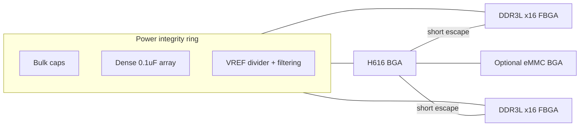
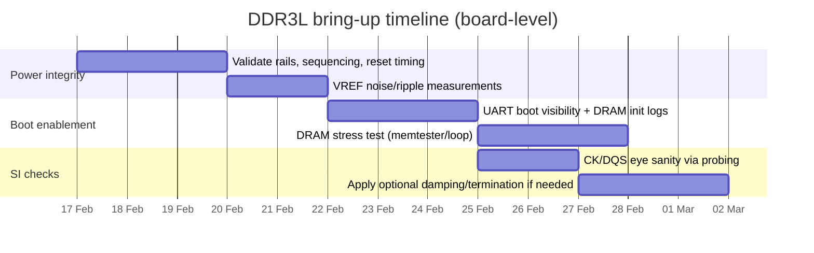

# DDR3 vs DDR3L on an Allwinner H616 Watchdog Board: Selection, Architecture, and KiCad Implementation Guide

## Executive summary

The **Allwinner H616** supports **DDR3 and DDR3L** on its external SDRAM interface, and its own recommended operating conditions explicitly include **VCC_DRAM options for DDR3 (1.5 V) and DDR3L (1.35 V)**. citeturn11view0turn11view1 In practice, a widely used H616 reference platform (Orange Pi Zero2) ships with **DDR3** and demonstrates a “known-good” discrete memory topology using **two x16 DDR3 devices** (for a 32‑bit bus) at a stated **720 MHz** DRAM clock. citeturn1search2turn1search6turn7view1

For your watchdog board (which requires the SoC + soldered DRAM on the PCB), the single biggest determinant of first-spin success is **memory power integrity + routing topology discipline**. Vendor documentation repeatedly emphasises that (a) DDR designs generally need **solid planes with no splits under DDR routing**, (b) **length/skew matching must be controlled at byte-lane granularity**, and (c) board stack-up must be designed around DDR (often **six layers minimum** for robust point-to-point designs). citeturn3search47turn12search5turn2search49turn4search0

**Recommendation (default, unless supply-chain constraints dictate otherwise):** choose **DDR3L** memory devices that are **explicitly 1.35 V parts but backward compatible to 1.5 V**, and run them at **1.35 V** to reduce power and heat while keeping compatibility fallback paths. Micron documents DDR3L as the low-voltage version of DDR3 and states backward compatibility to 1.5 V operation for DDR3L parts. citeturn3search8turn3search3turn2search7 H616’s own VCC_DRAM allowance includes 1.35 V for DDR3L. citeturn11view0turn11view1

This report focuses on everything you need to implement the DDR3(L) subsystem—**chips, rails, reference voltages, constraints, schematic patterns, PCB layout rules, KiCad setup, pitfalls, and bring-up/testing**—with all uncertain values explicitly labelled **assumed — validate with datasheet**.

## DDR3 versus DDR3L for H616

### What actually changes between DDR3 and DDR3L

At the PCB integration level, DDR3 vs DDR3L differs primarily in the **VDD/VDDQ rail**:
- **DDR3** nominally uses **1.5 V**
- **DDR3L** nominally uses **1.35 V**, and many DDR3L parts are **backward compatible** with 1.5 V operation (but only achieve 1.35 V power savings if the system provides 1.35 V). citeturn3search8turn3search3turn2search4

H616 explicitly supports DDR3/DDR3L and shows recommended operating conditions for **VCC_DRAM** that include **1.5 V (DDR3) and 1.35 V (DDR3L)**. citeturn11view0turn11view1

### Why DDR3L is usually the better default on this board

DDR3L’s advantages are practical rather than theoretical:

Power and thermals  
Lower nominal voltage reduces I/O switching power and overall memory subsystem power. A Micron statement describing DDR3L notes that 1.35 V DDR3L can provide meaningful subsystem power savings compared with 1.5 V DDR3 when the system supports the lower rail. citeturn2search4turn3search8  
For a small appliance PCB with limited heatsinking and no airflow guarantees, reducing unnecessary heat sources improves stability margins.

Supply flexibility and fallback  
Micron’s compatibility note explains DDR3L devices are backward compatible with DDR3 voltage operation (1.5 V) because they meet JEDEC 1.5 V specs when run at 1.5 V. citeturn3search3turn2search7  
That means a DDR3L selection can give you the option of temporarily running the rail at 1.5 V in early bring-up if you need to mirror a known-good DDR3 reference configuration (only if your parts and controller timings allow).

Alignment with H616 power sequencing  
H616’s power-on sequence includes DRAM-related rails and explicitly states sequencing constraints involving **VDD18_DRAM** and **VCC_DRAM**. In particular, it states **VCC_DRAM must be stable later than VDD18_DRAM** and provides other timing guidance before releasing reset and starting the 24 MHz clock. citeturn11view1turn11view0  
Choosing DDR3L does not complicate sequencing versus DDR3; it just changes the VCC_DRAM nominal value.

### When DDR3 might still be the right choice

If you intend to minimise risk by strictly copying a proven configuration, note that Orange Pi Zero2 is published as using **DDR3** (not DDR3L) in shipping hardware variants. citeturn1search6turn1search2turn7view1  
DDR3 may also be easier to source in certain markets at certain times; you should validate availability early. For example, Samsung’s DDR3 part used in the Zero2 ecosystem (K4B4G1646E-BYMA) is listed with substantial stock on LCSC at time of lookup. citeturn14search0turn1search2

**Decision summary:** DDR3L is recommended unless (a) you must exactly replicate Orange Pi’s DRAM timing/rail strategy for speed, (b) DDR3L supply chain is worse for your build window, or (c) your boot chain/DRAM init tooling is validated only on DDR3 rails.

## DDR3(L) subsystem architecture for H616

### Topology and what “success” looks like electrically

Your watchdog board is a soldered discrete DRAM design, not a DIMM/SODIMM design. It should be treated as a **point-to-point memory subsystem**:
- H616 ↔ one or two DDR3(L) components at very short trace lengths
- No “upgradeable memory connector” on the DDR bus (connectors add stubs and SI risk, and are fundamentally at odds with compact, high-speed routing)

This aligns with vendor guidance that point-to-point designs are the normal path for embedded DDR and that low-layer-count designs are only viable in very limited cases. Micron’s point-to-point hardware tips explicitly recommend **six-layer minimum** stack-ups and warns that 3–4 layer PCBs are generally unusable except in limited cases for DDR. citeturn2search49turn12search5

### What “connectors” DDR3 really needs

In embedded systems, DDR3/DDR3L **does not require external connectors**. Instead, the “connection” is the **BGA ballout** soldered directly to the PCB:
- DDR3(L) components are typically packaged in **FBGA** (for discrete chips). Micron’s DDR3L family datasheet lists multiple **FBGA packages**, including **96‑ball FBGA** options for x16 devices, and provides mechanical drawings and ball pad references. citeturn3search8turn15search2

The only time you need a “DDR connector” is if you choose a memory module format:
- e.g., a **204‑pin DDR3L SODIMM** module (which is a completely different system architecture, requiring a module connector and often SPD EEPROM considerations). citeturn2search5turn2search3  
This is not appropriate for a small H616 appliance PCB unless you explicitly need field-replaceable RAM and are willing to accept major SI/layout complexity.

### Signals you must implement

A DDR3 interface is organised into functional groups; a consistent grouping guide is provided in multiple vendor layout documents. citeturn12search45turn3search47turn12search4

Minimum signal groups:
- Differential clock: CK/CK#
- Address/command: A[ ], BA[ ], RAS#, CAS#, WE#
- Control: CS#, CKE, ODT, RESET# (plus any rank select if dual rank)
- Data groups (byte lanes): DQ, DQS/DQS#, DM per byte lane
- Calibration: ZQ pin with external resistor (common across DDR3 families)

The Orange Pi Zero2 memory sheet illustrates this classic organisation (clock nets, address/control, DQ/DQS groups, reset, and a ZQ resistor footprint) in an H616 context. citeturn7view1

### Power rails and where DDR gets its power from

**H616-side requirements (SoC rails that interact with DRAM):**
- H616 includes **VCC_DRAM** and **VDD18_DRAM** in its power sequence example, and includes explicit guidance that **VCC_DRAM must stabilise later than VDD18_DRAM**, plus minimum timing recommendations before releasing reset and starting the 24 MHz clock. citeturn11view1turn11view0
- H616 recommended operating conditions table enumerates VCC_DRAM values consistent with different memory types, including DDR3 (1.5 V) and DDR3L (1.35 V). citeturn11view0

**Memory-side rails (DDR3/DDR3L device rails):**
Typical DDR3(L) requires three “special” voltage concepts that designers routinely underestimate:
- **VDD/VDDQ**: the primary 1.35 V (DDR3L) or 1.5 V (DDR3) supply for core + I/O (often same rail)
- **VREF**: reference voltage nominally **VDDQ/2**, must be low noise and track the supply
- **VTT**: termination rail at **VDDQ/2**, required when you implement VTT-based parallel termination (common in fly-by address/command schemes)

Micron’s point-to-point note states that DDR requires accurate **VDDQ, VTT, and VREF**, and explicitly describes VTT as the termination voltage equal to VDDQ/2. citeturn1search37turn12search5  
However, not all small embedded designs populate VTT termination networks; some rely on short traces, controlled impedance, and ODT/drive strength tuning. This *must* be validated against your reference schematic and bring-up results (see pitfalls section).

**Where the power comes from on a real H616 board:**  
Orange Pi Zero2 uses a PMIC (AXP305) and shows explicit rails including **VCC-DRAM** as a PMIC output rail. citeturn7view2turn7view1  
For your board, you will likely generate DDR rails either with a PMIC or with dedicated buck converters.

### A concrete rail plan you should implement

Treat this as a “design contract” between schematic, layout, and bring-up.

| Rail | Nominal | Purpose | Source | Notes |
|---|---:|---|---|---|
| VDD18_DRAM (SoC) | 1.8 V | H616 DRAM pad/internal domain | PMIC/regulator | Must stabilise before VCC_DRAM per H616 sequence. citeturn11view1turn11view0 |
| VCC_DRAM / VDDQ | 1.35 V (DDR3L) or 1.5 V (DDR3) | DRAM core + I/O supply | PMIC/regulator | Choose 1.35 V if DDR3L; H616 supports both ranges. citeturn11view0turn3search8 |
| VREF (VREFDQ/VREFCA) | VDDQ/2 | DRAM reference | Divider + buffer or dedicated VREF reg | Must be low noise; see VREF guidelines below. citeturn1search37turn12search46turn12search48 |
| VTT (optional) | VDDQ/2 | Termination rail for fly-by termination resistors | DDR termination regulator (if used) | Only needed if you actually terminate addr/cmd/clk to VTT (more common in multi-load fly-by). citeturn12search0turn12search48 |

## Schematic blueprint for DDR3L on H616

This section tells you exactly what to draw, what to name it, and which “optional pads” to include so you can fix issues without a respin.

### Memory organisation choices for 512 MB

Your requirement is 512 MB DRAM (per your breakdown). There are two plausible hardware strategies:

- **Strategy A: Follow Orange Pi Zero2 topology (recommended for reduced risk)**  
  Use **two x16 DDR3(L) chips** to build a **32‑bit bus**. Orange Pi Zero2 uses exactly this pattern (2× Samsung x16) for 1 GiB. citeturn1search2turn7view1  
  For 512 MB total capacity, you would use **2× 2Gb x16** devices (each 256 MB) or equivalent density parts (**assumed — validate with H616 memory controller configs and the available DRAM init tooling**).

- **Strategy B: Single x16 device (simpler BOM, but higher integration risk)**  
  Use a single **4Gb x16** DDR3L part (4Gb = 512MB) and run a 16‑bit interface (**assumed — validate with H616 DRAM controller support for reduced bus width and required pinmux/straps**). H616 advertises a 32‑bit interface capability, but that doesn’t guarantee your board support package is prepared for 16‑bit topology without effort. citeturn11view0turn11view2

### Recommended DRAM type and two practical part options

**Recommendation:** DDR3L x16 FBGA‑96 parts, because they:
- meet the lower power goal,
- are often backward compatible with 1.5 V DDR3 operation, and
- match the package class used by many SBC reference designs. citeturn3search8turn3search3turn2search7

Component options (cost/availability snapshots are volatile; treat as indicative):

| Option | Type | Voltage | Package | Example distribution snapshot | Notes |
|---|---|---:|---|---|---|
| SK hynix H5TC4G63EFR‑RDA (4Gb DDR3L x16) | DDR3L | 1.35 V class | FBGA‑96 | LCSC shows stock and unit pricing. citeturn15search9 | Strong cost position; verify datasheet and ballout from official source before final footprint. |
| Samsung K4B4G1646E‑BYMA (4Gb DDR3 x16) | DDR3 | 1.5 V class | FBGA (x16) | LCSC shows stock and pricing. citeturn14search0 | Known to be used in H616 reference boards. citeturn1search2 |
| Micron MT41K256M16 family (4Gb DDR3L x16) | DDR3L | 1.35 V | 96‑ball FBGA variants | Official Micron datasheet available via DigiKey. citeturn3search8turn15search2 | Datasheet quality is excellent; availability depends on sourcing channel. |

### Net naming scheme that works in KiCad

KiCad’s differential-pair router recognises differential pairs only when nets share a base name with **suffix `P/N` or `+/-`**, and suffix styles cannot be mixed. citeturn4search2turn4search6  
So you must name DDR differential nets in a KiCad-compatible way:

- Clock: `DDR_CK_P`, `DDR_CK_N`
- Strobes: `DDR_DQS0_P`, `DDR_DQS0_N`, etc.

For single-ended nets (DQ, DM, addr/cmd), use consistent prefixes so you can assign net classes by name:
- `DDR_DQ0…DDR_DQ31`
- `DDR_DM0…DDR_DM3`
- `DDR_A0…DDR_A15`, `DDR_BA0…DDR_BA2`
- `DDR_RAS_N`, `DDR_CAS_N`, `DDR_WE_N`, `DDR_CS0_N`, `DDR_CKE0`, `DDR_ODT0`, `DDR_RESET_N`
- If 2 chips (32-bit): explicitly map “lower” and “upper” byte groups in the schematic, even if routed flexibly.

### Mandatory support components people forget

These are the items that repeatedly cause “board boots sometimes / only warm / only one DRAM chip works” failures.

ZQ calibration resistor (RZQ)  
Micron’s DDR3L functional block diagrams explicitly show the ZQ calibration function and external RZQ. citeturn14search1turn3search8  
**Starting point:** 240 Ω 1% to ground on the DRAM’s ZQ pin (**assumed — validate with chosen DRAM datasheet**). Orange Pi uses a 240 Ω 1% resistor in its DDR section in an H616 design context. citeturn7view1

VREF generation  
Micron and NXP both emphasise that VREF must be half VDDQ and must be low noise; Micron TN‑41‑08 provides concrete routing/decoupling guidance and tolerance expectations. citeturn12search46turn12search5  
**Default implementation (common):** 1% resistor divider from VDDQ to ground, heavily decoupled. Micron TN‑46‑14 recommends specific routing and decoupling practices for VREF, including spacing and placing capacitors between VREF and VDDQ/VSSQ. citeturn1search37turn12search5  
Orange Pi implements VREF with a resistor divider (1 k/1 k shown) plus local caps. citeturn7view1

Differential clock termination  
Micron TN‑46‑14 recommends a differential termination resistor in the range **100–200 Ω** between CK and CK# near the DDR input, with placement depending on topology and split lengths. citeturn12search5turn12search46  
Orange Pi appears to use **100 Ω across the clock pair** in its DDR sheet. citeturn7view1  
**Default:** 100 Ω (0402) placed close to the DRAM clock pins (**assumed — validate with DRAM/controller scheme**).

Reset behaviour and power sequencing  
H616 requires sequencing discipline and minimum delays before releasing reset and starting the 24 MHz clock; this influences whether you need a PMIC-controlled reset or a supervisor. citeturn11view1  
If you ignore this, DDR training instability will masquerade as “layout bugs”.

Supply relationship constraints  
Micron datasheet notes that VDD and VDDQ must stay within a defined delta (example states within 300 mV) and places constraints on VREF maximum relative to VDDQ. citeturn15search2turn3search8  
If you supply VDD and VDDQ separately, you must design the ramp and steady-state tolerances accordingly (but many embedded DDR3L parts use a single rail for both).

## PCB layout and KiCad rule setup for DDR3(L)

### Stack-up and layer assignment

A DDR layout should be built around **solid reference planes and predictable return paths**. TI’s DDR3 requirements emphasise that **no plane splits are allowed under DDR routing**, and recommends SDRAMs mounted on the **top side next to the SoC** for single-rank designs. citeturn3search47turn3search48  
Micron TN‑46‑14 recommends a **minimum of six layers** and states that 3–4 layers are largely unusable except in very limited cases. citeturn2search49turn12search5

**Recommended stack-up (baseline): 6-layer FR‑4**  
This is a practical, prototype-friendly form factor and aligns with both Micron’s and typical industry expectations. citeturn2search49turn12search5turn4search1

| Layer | Role | Notes |
|---|---|---|
| L1 | DDR escape + short routes | Microstrip; keep DDR mostly here/L4 |
| L2 | Solid GND | Primary return for L1 |
| L3 | Power (VDDQ, VDD18_DRAM islands) | Avoid splits under DDR routes |
| L4 | DDR routing (secondary) | Prefer for longer matched runs; stripline |
| L5 | Solid GND | Shielding + L4 return |
| L6 | Non-DDR signals | Keep DDR off L6 unless unavoidable |

**KiCad action:** set stack-up in **Board Setup → Physical Stackup** and enter realistic dielectric thicknesses, because KiCad’s length and via height calculations depend on stack-up settings. KiCad also notes it supports only an even number of copper layers. citeturn4search1turn4search0

### Electrical length matching targets and conversions

You will see length matching specified in time terms (ps) and in physical terms (mils/mm). Intel’s DDR3 routing guidance includes:
- **byte-lane matching** (DQ/DQS/DM) within **±10 ps**, and
- address/command matched to clock within **±20 ps**. citeturn0search5turn12search4

To convert ps ↔ mm, you need propagation delay assumptions:
- Intel board design guidance notes FR‑4 stripline induces ~**180 ps/in** delay. citeturn13search0  
- Many engineering “rules of thumb” place microstrip around **150 ps/in** and stripline around **180 ps/in**, but you should ultimately compute delay from your actual stack-up and field solver. citeturn13search0turn13search13turn13search3

**Assumed — validate with fab stack-up:**  
- Microstrip: 150 ps/in ≈ 5.9 ps/mm  
- Stripline: 180 ps/in ≈ 7.1 ps/mm citeturn13search0turn13search3turn13search13

Practical physical tolerances implied:
- ±10 ps inside a byte lane ≈ ±1.7 mm (microstrip) or ±1.4 mm (stripline)
- ±20 ps addr/cmd to clock ≈ ±3.4 mm (microstrip) or ±2.8 mm (stripline)

**Important nuance:** matching must be done within functional groups (byte lanes), not globally “all nets same length”.

### Impedance and spacing targets

Use vendor-validated impedance framing:
- TI’s DDR3 design requirements specify **50 Ω single-ended** routes (±5%) and **100 Ω differential** for DQS pairs (±5%). citeturn3search46turn3search48
- Intel DDR3 guidelines similarly reference differential clock routing and strong matching constraints. citeturn12search4turn0search5

**Assumed — validate with your fab stack-up:**  
- 50 Ω single-ended (DQ, addr/cmd, control)
- 100 Ω differential (DQS, CK pairs)

Spacing guidance (practical):
- Maintain consistent reference plane (prefer GND) under data/strobe signals; do not route at plane edges or over antipads. citeturn12search45turn3search47
- Keep DDR clocks away from address nets; Intel explicitly warns not to route CK/CKE close to address signals due to noise/crosstalk susceptibility. citeturn12search4

### Via strategy and “same number of vias” rule

A classic DDR pitfall is allowing one net in a matched group to traverse more vias than others, accidentally introducing different stub lengths and delays.

TI’s DDR3 routing rules state:
- All nets in each data group must have the **same number of vias** (maximum of two), and
- routing data nets within a byte-lane on the same layer avoids skew from via barrels. citeturn3search7turn3search48

**Design guidance to encode:** every net in `DDR_DQ_L0` should have identical via count and similar layer transitions (same for each lane, and for DQS pairs).

### KiCad: net classes, tuning profiles, and DRC enforcement

KiCad setup steps that matter for DDR:

Net classes for DDR groups  
KiCad net classes define default track width, clearance, via geometry, and differential pair parameters. citeturn4search2turn4search3  
Create net classes such as:
- `DDR_CK` (diff)
- `DDR_DQS0`, `DDR_DQS1`, … (diff, per lane)
- `DDR_DQ_L0`, `DDR_DQ_L1`, … (single-ended)
- `DDR_ADDR_CMD` (single-ended)
- `DDR_CTRL` (single-ended)

Tuning profiles (time-domain tuning)  
KiCad supports assigning a “tuning profile” to a net class, with per-layer geometries and propagation delay values for time-domain tuning. citeturn4search3turn4search0  
Use this if you want to tune to **ps limits** rather than purely length.

Length tuner pitfalls  
KiCad’s length tuner only supports **point-to-point** nets. Branches, even accidental stub tracks, break tuning. KiCad explicitly recommends using cleanup tools to remove stubs. citeturn4search0turn4search44  
This is one of the most common “why won’t KiCad tune my DDR” errors.

Differential pair naming restriction  
KiCad’s differential router requires the P/N or +/- suffix convention (and you cannot mix suffix styles). citeturn4search2turn4search6  
This matters immediately for `DDR_CK_P/N` and `DDR_DQSx_P/N`.

### Placement order and floorplan

If you do nothing else right, do this:

1. Place H616 and DDR chips on the same side, as close as physically possible. TI strongly recommends SDRAMs on the same PCB side as the SoC for single-rank designs. citeturn3search47turn3search48  
2. Place decoupling first around the BGA escape region (especially VDDQ and VREF-related caps).
3. Route DDR data lanes and DQS first, then addr/cmd/control, then clocks.

Suggested DDR floorplan (conceptual):

## Power integrity, VREF, and decoupling plan

### The rail discipline you must follow

H616’s power-on sequencing imposes DRAM-related sequencing rules:
- Consecutive steps should not start until the previous supplies stabilise within 90–110% of nominal.
- VCC_IO and VCC_PLL should ramp together to avoid leakage between 1.8 V and 3.3 V domains.
- **VCC_DRAM must be stable later than VDD18_DRAM.**
- RESET release and 24 MHz clock start have minimum delay recommendations. citeturn11view1turn11view0

This isn’t “nice to have”; violating it produces failure modes that look exactly like routing problems.

### VREF is the silent killer

Micron and NXP both provide concrete “treat VREF as analogue” guidance:
- VREF must be half VDDQ and track it across conditions, with strict peak-to-peak noise constraints; routing and clearance constraints are recommended. citeturn12search46turn12search48turn1search37
- Micron TN‑46‑14 recommends VREF routing with a minimum trace width (20–25 mil), clearance (15–25 mil), and capacitors between VREF and VDDQ and between VREF and VSSQ. citeturn1search37turn12search5

Actionable VREF implementation:
- Generate VREF with a **1% resistor divider** from VDDQ to GND (**assumed — validate with your DRAM datasheet’s VREF tolerance and whether separate VREFDQ/VREFCA are required**). This is a documented approach in Micron design guides. citeturn12search46turn12search5
- Place **distributed decoupling** along the VREF route and close to the DRAM VREF pins; Micron provides explicit capacitor distribution guidance in its design guide. citeturn12search46turn1search37
- Route VREF away from switching nodes and DDR clocks; consider shielding with ground.

Orange Pi’s DDR sheet shows a VREF divider and local decoupling as an example pattern in an H616 design. citeturn7view1

### Do you need VTT?

If you terminate address/command/control lines at the end of a fly-by chain, VTT termination is the classic approach. Altera’s DDR3 termination guidance states that address/command signals (including CKE) should be terminated to **VTT at the end of the fly-by topology** in discrete memory implementations (but not required for DIMMs). citeturn12search0turn12search3  
NXP’s hardware development guide provides practical VTT island placement and decoupling guidance: place VTT near termination resistors, use a wide island for current, and add 0.1 µF caps near resistor packs plus bulk capacitance on the island. citeturn12search48

However, small embedded boards sometimes omit VTT and rely on short traces and ODT/drive strength. Orange Pi’s DDR page is a useful “empirical reference”: it shows the DRAM wiring and VREF generation without an obvious VTT termination network on that sheet. citeturn7view1turn1search2  
**Assumed — validate by comparing the full reference schematic and your intended DRAM speed:** start without VTT if you copy the Orange Pi style topology and keep traces very short; but include footprints for optional termination/resistor packs and a VTT regulator footprint area if PCB area allows (cheap insurance).

### Bulk versus local capacitor strategy

A practical approach recommended across vendor guides:
- Bulk capacitance near regulators (to handle low-frequency load steps).
- Dense 0.1 µF (and smaller values if required) close to DRAM power balls and the SoC DRAM domain for high-frequency decoupling.
- Keep decoupling stubs short; TI explicitly calls out keeping decoupling stubs short and using wide traces to reduce inductance. citeturn3search47turn3search48

Micron’s note about VDD/VDDQ relationships and VREF constraints is also a reminder: supply relationship and decoupling isn’t optional. citeturn15search2turn3search8

## Common pitfalls and best practices

### Pitfalls that repeatedly cause DDR bring-up failure

Routing over plane splits  
DDR routes crossing split planes break return paths; TI explicitly states no splits are allowed under DDR routes. citeturn3search47turn3search48

“Length matched” but not “delay matched”  
If you route on different layers with different effective dielectric constants, equal geometric length ≠ equal delay. Intel and TI both recommend keeping byte-lane groups on the same layer to avoid velocity differences. citeturn0search5turn3search7turn12search4

Unequal via counts inside a byte-lane  
TI requires equal via counts per net in a matched group, and limits via count, because via barrels add skew and discontinuities. citeturn3search7turn3search48

VREF treated like “just another net”  
Vendor guidance treats VREF as a low-noise analogue reference; poor routing and decoupling here ruins margins. citeturn12search46turn1search37turn12search48

Overconfidence in deskew/training  
Intel’s DDR3 layout guidance warns not to rely on controller deskew beyond limited board mismatch. citeturn0search5

KiCad length tuning blocked by stubs/branches  
KiCad explicitly warns that stub tracks can make a net appear branched and prevent proper tuning; the length tuner stops at branches. citeturn4search0turn4search44

### Best-practice “etiquette” for memory on a PCB project

Encode constraints in the design files  
Don’t leave DDR constraints in a README only. Use KiCad net classes, tuning profiles, and (where necessary) custom rules so the PCB tool enforces the rules during routing. citeturn4search2turn4search3turn4search0

Design for rework and characterisation  
Even if you omit termination resistors initially, include **0 Ω option footprints** for:
- series damping on clocks or select address/control lines (**assumed — validate with your SI plan**)
- alternative VREF divider values (pads for resistor swap)
- optional C across CK/CK# if you need it (some DIMM designs use a “compensation capacitor” concept on clock nets; vendor references discuss clock termination schemes) citeturn12search3turn12search47

Keep DDR off connectors  
If you must measure DDR, use carefully placed test pads for rails/reset/clock observation, not a header that stubs the bus. High-speed stubs are generally harmful; many guidelines specify stringent stub limits (e.g., <80 mil in certain fly-by groups). citeturn3search46turn3search7

## Bring-up, validation, and what to probe

### Step-by-step bring-up plan

Key test points to include (and why):
- VDDQ (1.35/1.5), VDD18_DRAM (1.8), VREF, GND near DRAM and near SoC
- RESET_N (SoC reset and DRAM reset)
- CK_P/CK_N probe pads (high impedance; avoid stubs)
- ZQ resistor node (verify correct value and connection)

Expected behaviours (high-level):
- Rails meet H616 sequencing guidance (VDD18_DRAM before VCC_DRAM; reset release timing; 24 MHz clock timing). citeturn11view1
- VREF ≈ VDDQ/2 and low noise; distributed decoupling should keep ripple within the memory’s tolerance guidelines; Micron design guidance gives explicit noise-related warnings and decoupling strategies. citeturn12search46turn1search37

### Debug decision tree when DDR fails

If DDR fails to train/boot:
1) Confirm sequencing and rail stability per H616 power-on rules. citeturn11view1turn11view0  
2) Measure VREF noise and verify it is half VDDQ; implement shielding/clearance changes if needed. citeturn12search46turn12search48turn1search37  
3) Check ZQ resistor presence/value and routing (common omission). citeturn14search1turn7view1  
4) Check byte-lane via symmetry and whether any net crosses plane splits. citeturn3search47turn3search7  
5) Populate optional clock termination (if not already) or adjust clock termination placement per Micron guidance. citeturn12search5turn12search46

## Decisions and open questions before schematic freeze

- Will you implement a 32‑bit bus with 2× x16 parts (most “copy reference” path) or attempt a 16‑bit bus with 1× x16 part (riskier BSP/DRAM-init dependency)? citeturn1search2turn11view0  
- Will you include a VTT termination rail and termination resistor footprints, or copy the minimal approach and keep trace lengths ultra-short? (If you use fly-by termination, vendors recommend terminating to VTT at end, and give VTT island guidance.) citeturn12search0turn12search48turn3search46  
- Which fab stack-up will you standardise on? You cannot finalise impedance widths/gaps or accurate ps/mm tuning without it; KiCad’s via length handling and time-domain tuning depend on stack-up configuration. citeturn4search1turn4search0  
- DRAM init toolchain: are you using a vendor BSP/U‑Boot build known to support your exact DDR topology? (Orange Pi’s existence is evidence the ecosystem supports certain DDR3 configs, but that does not automatically mean your custom topology is supported without retuning.) citeturn1search2turn1search1

---

**Most important primary references to pull immediately for your design pack (in priority order):**  
H616 datasheet power sequencing + VCC_DRAM ranges citeturn11view1turn11view0; Orange Pi Zero2 H616 DDR schematic sheet for a proven topology citeturn7view1turn6view0; Micron DDR3L datasheet for package/pad guidance and electrical constraints citeturn3search8turn15search2; Micron TN‑46‑14 and TN‑41‑08 for point-to-point and VREF guidance citeturn12search5turn12search46turn1search37; TI DDR3 design requirements for impedance/via/plane rules citeturn3search47turn3search46turn3search48; KiCad PCB Editor documentation for stack-up, net classes, differential routing, and length tuner constraints citeturn4search2turn4search0turn4search1