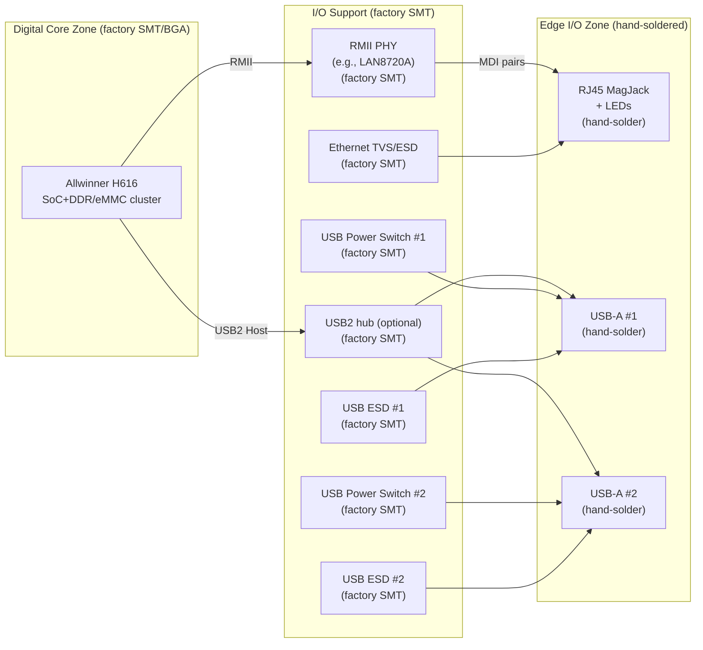
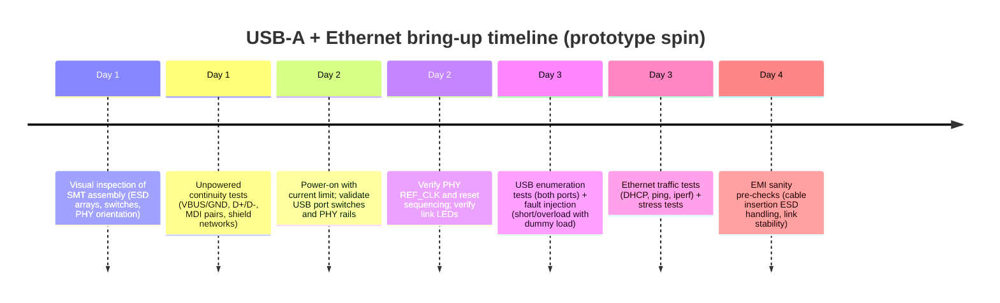

# Self‑Soldered USB‑A and Ethernet I/O Implementation for the H616 Watchdog PCB in KiCad

## Executive summary

The attached board breakdown for the **H616 Watchdog PCB** establishes a **Scenario 2** manufacturing model: the factory assembles all SMT/BGA, and you **hand‑solder only the “chunky” edge connectors**, specifically **RJ45 (with integrated magnetics/MagJack)** and **2× USB‑A host ports** (plus headers). fileciteturn3file4 fileciteturn3file3 This document turns that intent into a **KiCad‑ready** implementation plan focused on **USB‑A host ports and 10/100 Ethernet (RJ45+magnetics)**, covering schematic blocks, power protection, routing constraints, DFM, and a step‑by‑step validation plan.

Key architecture decisions (practical, prototype‑friendly):

- Use **controlled, current‑limited VBUS switching per USB‑A port** (rather than “just pour 5 V”) to prevent shorts/overload from browning out the SoC and to create clean, measurable bring‑up checkpoints. Adjustable USB power switches like **TPS2553** exist specifically for this purpose. citeturn9search4  
- For Ethernet, use **H616 EMAC0 + an external PHY + MagJack** (the H616 ecosystem uses an external PHY for cabled Ethernet in typical designs). fileciteturn3file6  
- Encode “don’t‑mess‑this‑up” constraints in KiCad itself: **rule areas** (keepouts) around the MagJack “magnetic zone”, **net classes** for VBUS current traces and the USB/Ethernet differential pairs, and **differential‑pair naming** so KiCad’s diff‑pair router behaves correctly. citeturn5search3turn5search1  
- Follow proven EMI/ESD discipline at the connector edge. Microchip’s Ethernet PHY layout guidance explicitly states **no ground plane under magnetics/RJ45**, and provides common‑mode choke placement guidance and example EMI capacitors. citeturn3search37  
- Follow authoritative USB HS routing rules: Microchip’s AN26.2 gives concrete constraints including **≤1.25 mm intra‑pair mismatch**, continuous reference planes, and trace length guidance for HS. citeturn4search42

## Scope and assumptions

### Scope

This document focuses on implementing these subsystems on the H616 watchdog PCB:

- **2× USB‑A host ports**, including VBUS power distribution, port protection, ESD, and USB2 routing to the SoC or hub
- **10/100 Ethernet via RJ45 MagJack**, including PHY selection, RMII routing, MDI pair routing to magnetics, ESD strategy, “magnetic keepout” rules, shield/chassis grounding strategy, and LED wiring

It assumes the rest of the SoC platform (DDR/eMMC/power sequencing) is handled by your existing H616 design work. fileciteturn3file6 fileciteturn3file1

### Source‑of‑truth constraints from your breakdown

From the attached breakdown and allied internal design notes:

- The board requires **USB‑C 5 V sink power input**, **2× USB‑A host ports**, and **RJ45 MagJack Ethernet**. fileciteturn3file4  
- Build model is **factory SMT/BGA**, **hand‑solder RJ45 and USB‑A**. fileciteturn3file4 fileciteturn3file3  
- Ethernet target is **10/100** (not the first‑spin priority for gigabit). fileciteturn3file4  

### Assumptions to be validated

These are reasonable defaults; validate against your final schematic choices and datasheets:

- **USB topology**: *assumed — validate with datasheet* that you will use either:
  - H616 native USB host ports directly, or
  - a USB2 hub IC such as **FE1.1S** (commonly used, and referenced in your internal planning docs). fileciteturn3file3 citeturn1search0  
- **Ethernet PHY**: *assumed — validate with datasheet* that you will use a small, widely supported 10/100 RMII PHY such as **Microchip LAN8720A**. citeturn0search48turn0search0  
- **USB‑A port current**: *assumed — validate with product requirements* that each port should support **500 mA (USB2 default)**; design headroom for 900 mA is useful but optional.

### Exact missing filenames (only if you want fully pin‑accurate netlists)

If you want this document to directly output a pin‑accurate mapping table, provide/confirm:

- `H616_Datasheet_V1.0.pdf` (or the cleaned copy) citeturn17search0  
- `Orange_Pi_Zero2_H616_Schematic_v1.3.pdf` citeturn6search44turn6search0  
- Your chosen PHY datasheet (e.g., `LAN8720A-LAN8720Ai-Data-Sheet-DS00002165.pdf`) citeturn16search26turn0search48  
- Your chosen MagJack datasheet (exact MPN)  
- Your chosen USB‑A receptacle datasheet (exact MPN)

## Connector‑zone architecture and placement

### Board zoning and why it matters

Your mechanical decision (“hand‑solder connectors”) drives a very clear board floorplan: put I/O connectors on edges in an **I/O zone**, keep the H616+DDR cluster in a **quiet digital core zone**, and keep high‑di/dt power switching in a **power entry zone** (near USB‑C 5 V in). This matches the board breakdown’s “zones” concept and is consistent with Ethernet/USB EMI best practice. fileciteturn3file4 citeturn3search37turn4search42

Suggested high‑level floorplan (connector zones highlighted):

### Mechanical constraints and keepouts you should model in KiCad

USB‑A receptacles (through‑hole, right‑angle recommended)
- Ensure the **connector shell sits flush with the board edge**, and model the shell outline on `Dwgs.User` and/or as a footprint courtyard extension (**assumed — validate with chosen connector drawing**).  
- Prefer connectors with **through‑hole shell tabs** plus signal pins: they take insertion force far better when hand‑soldered.

RJ45 MagJack (through‑hole)
- Reserve a “**magnetic keepout**” under the MagJack where **copper pours and planes are forbidden** (the exact keepout shape should be based on the MagJack datasheet; at minimum cover under the magnetics region and the path to the RJ45 opening). Microchip’s PHY layout guidance is explicit: **no ground plane under TX/RX pairs, magnetics, or the RJ45 jack, nor between magnetics and RJ45**. citeturn3search37  
- Keep the RJ45 latch, LED windows, and cable strain area clear of tall components (enclosure integration).

KiCad implementation: use **Rule Areas (Keepouts)** to enforce these mechanically/electrically critical regions. KiCad rule areas can block tracks/vias/pads/zones/footprints and can be named to make DRC messages clear. citeturn5search3

## Schematic implementation for USB‑A host ports

### USB architecture options

You have two viable approaches:

Direct host routing (simpler if you have enough host ports)
- H616 provides multiple USB2 ports in the H616 ecosystem; if you can dedicate two host ports, route them directly to the two USB‑A receptacles with ESD + power switching. fileciteturn3file6  

Hub‑based fanout (often used in SBC designs)
- If your design consumes host ports internally or you prefer a single upstream connection, use a USB2 hub controller such as **FE1.1S**. The FE1.1S datasheet describes it as a USB2 high-speed hub and lists integration features: integrated pull‑ups/pull‑downs, integrated 5 V→3.3 V/1.8 V regulators, and an integrated 12 MHz oscillator. citeturn1search0  

**Assumed recommendation:** hub‑based fanout is reasonable if you expect to use one USB‑A permanently for Wi‑Fi dongle (as your breakdown suggests) and want the other available for accessories; validate port allocation against your H616 USB port usage plan. fileciteturn3file4 fileciteturn3file3

### USB‑A pin mapping and net naming

USB‑A receptacle signals (host port):
- `VBUS` (5 V output from your board)
- `D-`, `D+` (USB2 differential pair)
- `GND`
- `SHIELD` / connector shell (mechanical & EMC)

KiCad net naming (KiCad diff‑pair router friendly)
- Use `USB1_P` / `USB1_N` and `USB2_P` / `USB2_N` (or `USB1+` / `USB1-`) so KiCad recognises pairs. KiCad defines diff pairs by base name + suffix (`+/-` or `P/N`), and suffix styles cannot be mixed. citeturn5search1turn5search2  
- Keep `USB1_VBUS`, `USB2_VBUS` for clarity.
- Use `USBA1_SHIELD`, `USBA2_SHIELD` for shell connections.

### VBUS power distribution and protection

A robust host port needs **controlled VBUS**, not just a polygon fill.

Recommended per‑port power chain:
- `+5V_IN` (from USB‑C power) → input bulk capacitance → per‑port current‑limited switch → USB‑A `VBUS`
- Optionally add a resettable fuse (PPTC) per port or per group.

Per‑port current‑limited power switch options (2–3)
| Part | Type | Current limit | Package/footprint | Notes |
|---|---|---:|---|---|
| TI **TPS2553** | Adjustable USB power switch | 0.075–1.7 A | small IC footprint (check TI package) | Adjustable ILIMIT, designed as a USB power‑distribution switch. citeturn9search4 |
| TI **TPS2051** | Fixed‑limit USB power switch | 0.9 A limit (0.5 A load class) | SOIC/PDIP variants | Designed for capacitive loads/shorts; includes current limit, thermal shutdown, controlled rise time. citeturn12search0 |
| Microchip **MIC2026/2076** | Dual‑channel distribution switch | 2× channels, current limit class | SOIC‑8 | Dual-channel, internal current limit, thermal shutdown, soft‑start, fault flags; 2 ports per IC. citeturn12search48turn12search1 |

Resettable fuse (PPTC) option (if you want “belt and braces”)
- Littelfuse **1206L050** provides 0.5 A hold, 1 A trip class behaviour (device family example), intended for resettable over‑current protection and explicitly listed for USB applications. citeturn13search0  

**Assumed — validate with product requirements:** Choose either “power switch only” (common in embedded) or “PPTC + power switch” (more fault tolerance but higher voltage drop and some uncertainty around trip behaviour with fast loads).

### USB ESD/TVS selection and placement

Board‑level ESD for USB is not optional. Select ESD parts that explicitly state IEC 61000‑4‑2 performance and have low line capacitance.

USB D+/D− ESD array options (2–3)
| Part | Lines | Capacitance (order of magnitude) | Notable ratings | Notes |
|---|---:|---:|---|---|
| TI **TPD2EUSB30** | 2 lines | ~0.7 pF typ | IEC 61000‑4‑2 level 4, plus IEC 61000‑4‑5 surge rating (5 A 8/20 µs) | “Flow‑through” pin mapping helps routing; usable for USB2/USB3. citeturn9search0turn9search5 |
| ST **USBLC6‑2** | 2 lines + VBUS | 3.5 pF max class | IEC 61000‑4‑2 level 4; explicitly targets USB2 HS and protects VBUS | Convenient “all‑in‑one” style; verify whether you still want a separate VBUS TVS. citeturn9search1turn9search49 |
| Nexperia **PESD5V0X2UT** | 2 lines | 0.76 pF typ | ESD up to 22 kV (IEC 61000‑4‑2) | Good for high‑speed lines; package is SOT23. citeturn11search3 |

VBUS surge clamp (optional but often recommended)
- A robust 5 V TVS option is **SMBJ5.0A** (600 W class series) designed for transient protection on power rails, with 5 V standoff and clamping information provided in Littelfuse specifications. citeturn19search0  
**Assumed — validate with your USB‑C input protection strategy:** You may already have a 5 V TVS at the power entry; if so, you might not need another at each port.

Placement rules (schematic → PCB intent)
- Place USB ESD **adjacent to the USB‑A connector pins** with the shortest possible path from D+/D− to the ESD device and from the device to ground (low inductance is the whole point).  
- Do not let the ESD ground return share a long, thin path with noisy power currents.

### Optional USB common‑mode choke strategy

A USB CMC can help EMI in difficult enclosures, but it can also degrade eye margins if chosen poorly; treat it as a **stuffing option**:
- Add a footprint for a USB2 CMC in series with D+/D− near the connector (or near the hub/SoC depending on EMI diagnosis).  
- Populate as DNP initially unless your early EMI testing suggests need.

## Schematic implementation for RJ45 MagJack Ethernet

### PHY and MAC interface choices

For a 10/100 design, a common PHY choice is **Microchip LAN8720A**, which supports RMII and can run from a single 3.3 V supply using an integrated regulator path per its datasheet and distributor rescans. citeturn0search0turn0search48  

LAN8720A RMII reference clock pitfalls you must decide early:
- In **REF_CLK In mode**, the PHY expects an external **50 MHz reference clock** driven into `XTAL1/CLKIN`. citeturn16search2  
- In **REF_CLK Out mode**, the PHY can generate 50 MHz from a 25 MHz crystal, but the datasheet warns this mode is not RMII‑spec compliant, and requires timing analysis. citeturn16search2turn16search26  

**Recommendation (assumed — validate with H616 MAC timing):** Use **REF_CLK In mode** with a dedicated 50 MHz oscillator or SoC‑provided clock if available and specified, to avoid the RMII non‑compliance caveat. If you choose REF_CLK Out mode, treat it as an explicit risk item and verify timing margins with H616 documentation. citeturn16search2turn16search26

### RMII signal set and net naming

RMII between H616 EMAC0 and PHY typically includes:
- `RMII_TXD0`, `RMII_TXD1`, `RMII_TXEN`
- `RMII_RXD0`, `RMII_RXD1`, `RMII_CRS_DV`, (optionally `RMII_RXER`)
- `RMII_MDC`, `RMII_MDIO`
- `RMII_REF_CLK` (50 MHz)
- `PHY_RST_N`, optional `PHY_INT_N` (note: some pins multiplex with REFCLKO depending on PHY mode) citeturn16search2turn16search26  

Add 0 Ω resistor footprints (stuffing options) for:
- series damping on `RMII_REF_CLK` near source
- series damping on `RMII_TXD[1:0]` and `RMII_RXD[1:0]` if bring‑up shows edge ringing (**assumed — validate with scope during bring‑up**)

PHY strap pins (LAN8720A example)
- LAN8720A strap pins are latched on POR/reset and may require external resistors “augmented” if the strap pin is connected to a load, and the designer must ensure strap timing is met before latching. citeturn16search1turn16search26  
KiCad action: place strap resistors near PHY; include test pads on strap states if you anticipate debug.

### MDI pairs, MagJack, and “magnetic keepout” discipline

Whether magnetics are integrated in the MagJack or are discrete, treat the region around them as a special electromagnetic boundary.

Microchip Ethernet PHY layout guidance (SMSC AN18.6) gives explicit, implementable rules:
- **No ground plane** should extend under the TX/RX differential pairs, under the magnetics, or under the RJ45 jack; if common‑mode capacitors are used, a ground plane may be located under the TX/RX signals only up to those capacitors, but must not extend beyond. citeturn3search37  
- Common‑mode chokes may be added on TX/RX pairs; they should be placed within **10 mm** of the integrated RJ45 module and located on the magnetics side of EMI suppression capacitors; typical common‑mode impedance should be **~2 kΩ @ 100 MHz or higher**. citeturn3search37  

**KiCad action:** create a named rule area (e.g., `ETH_MAGNETIC_KEEPout`) that forbids:
- zone fills (copper pours) on all layers under the MagJack
- unrelated tracks/vias between PHY and MagJack
- optionally, forbid vias entirely to prevent return-path discontinuities

### MagJack selection and LED integration

For a hand‑solder design, choose a **through‑hole integrated MagJack** with integrated magnetics and (optionally) LEDs.

Example MagJack options (2–3) with availability snapshots
| Part | Supplier snapshot | Notes |
|---|---|---|
| Amphenol **RJMG1BD3B8K1ANR** | Farnell lists it as through‑hole, shielded, “with magnetics” and LEDs, price shown (€4.14 ex VAT at time of crawl). citeturn7search0 | Strong vendor; make sure to use the exact datasheet for pinout and footprint. |
| TE Connectivity **5‑2301994‑8** (industrial RJ45 with integrated magnetics) | Farnell describes 10/100 support, integrated magnetics, through‑hole termination, high dielectric withstand voltage, and extended temperature range. citeturn7search2 | Industrial‑grade options can improve robustness; check mechanical envelope and PCB keepout. |
| HanRun **HR911105A** (very common low-cost MagJack class) | Datasheet‑style summaries note integrated magnetics and 1500 Vrms isolation class. citeturn1search6 | Extremely common footprint in low-cost designs; validate pinout carefully because clones/variants exist. *Assumed — validate with official HanRun datasheet if available from your source.* |

LED wiring patterns
- Many MagJacks expose LED anode/cathode pins. Implement LED resistors as stuffing options (e.g., 330 Ω–1 kΩ **assumed — validate with the PHY LED drive current spec and MagJack LED ratings**).
- If you use PHY LED pins, follow the PHY datasheet recommended LED wiring; e.g., LAN8720A exposes LED outputs and provides mode/config strap interactions (**assumed**; validate per exact datasheet section). citeturn0search0turn16search1  

### Ethernet cable-side surge/ESD protection

For RJ45 ESD protection strategy in small embedded devices:
- Place a TVS diode array near the connector (cable side) and ensure a low‑impedance return to the chassis/shield reference (or to the defined “ETH_CHASSIS” island).  

Example TVS array options:
| Part | Status | Key points |
|---|---|---|
| Littelfuse **SC3051‑04HTG** | Active | 4‑channel TVS array; indicates IEC 61000‑4‑2 ±30 kV and IEC 61000‑4‑5 surge (22 A 8/20 µs) in its series description. citeturn18search1turn18search2 |
| Semtech **RClamp0524PB** (alternative class) | Active | Ultra‑low capacitance TVS array protecting four lines; lists IEC61000‑4‑2 and IEC61000‑4‑5 ratings. citeturn10search5 |

**Assumed — validate with MagJack/magnetics guidance:** Many designs place ESD on the cable side (after magnetics) for surge robustness, but the exact placement depends on your isolation strategy and the MagJack pinout.

## KiCad PCB layout rules, stack‑up, and constraint setup

### Assumed stack‑up template for a prototype‑friendly 6‑layer board

This is a pragmatic baseline for an H616 class board with DDR and multiple high‑speed edges. All dimensions are **assumed — validate with your chosen fabricator’s controlled impedance stack‑up**.

| Layer | Name | Role | Notes |
|---|---|---|---|
| L1 | F.Cu | High‑speed routing + components | USB D+/D−, PHY routing, short runs |
| L2 | In1.Cu | Solid GND plane | Primary return plane; no splits under USB/RMII |
| L3 | In2.Cu | Power plane / rails | 5 V pours, 3.3 V, 1.8 V islands |
| L4 | In3.Cu | Signals | Secondary routing / swap layer for congestion |
| L5 | In4.Cu | Solid GND plane | Secondary return / EMI control |
| L6 | B.Cu | Low‑speed + connectors | Use sparingly for USB/Ethernet due to via stubs |

### Net classes and KiCad settings

Create net classes early so DRC enforces your intent.

Suggested net classes (example; widths are placeholders until stack‑up confirmed)
- `USB2_HS`: `USB1_P/N`, `USB2_P/N`
- `ETH_MDI`: `ETH_TX_P/N`, `ETH_RX_P/N` (PHY ↔ MagJack)
- `RMII`: management and RMII signals (single-ended digital, 50 MHz clock)
- `VBUS_5V`: `USBA1_VBUS`, `USBA2_VBUS` (high current)
- `SHIELD_CHASSIS`: `USBA*_SHIELD`, `ETH_SHIELD`, `CHASSIS_GND` island

Differential pairs in KiCad
- Ensure your nets use a consistent suffix scheme (`_P/_N` or `+/-`). Otherwise the diff pair router will not engage. citeturn5search1turn5search2

Rule areas (keepouts) in KiCad
- Use rule areas to enforce: “no copper under magnetics”, “no vias in antenna / magnetic zone”, and “no routing under connector keepouts”. KiCad supports named rule areas and can raise DRC errors if tracks/vias/pads/zones are inside them. citeturn5search3

### USB2 routing rules to enforce

Microchip’s AN26.2 gives hard constraints to encode as KiCad goals:
- Intra‑pair mismatch (HS): **≤1.25 mm (50 mil)** between D+ and D−. citeturn4search42  
- Avoid 90° corners; use arcs/45°; route over unbroken reference planes; keep pairs short; minimise vias. citeturn4search42  
- Trace length guidance: HS traces longer than ~15 cm may degrade quality (a practical warning for long runs). citeturn4search42  

Impedance targets (assumed)
- USB2 HS aims for **~90 Ω differential** (typically 45 Ω single-ended). *Assumed — validate with your fab’s impedance table and your chosen layer (microstrip/stripline).*

Practical KiCad settings (assumed)
- Set `USB2_HS` diff pair width/gap for 90 Ω on L1 over L2. Use the fab’s stackup table.  
- Allow the router to create small uncoupled fanouts at pads, but keep them short.

### Ethernet routing rules to enforce

Magnetics region rules (must‑do)
- **No copper planes under magnetics/RJ45** and no plane under the MDI pairs in that region, per Microchip guidance. citeturn3search37  

MDI pair routing
- Route ETH MDI pairs as **tight differential pairs**, same layer, minimal vias.  
- Target **100 Ω differential** on the PHY ↔ MagJack MDI pairs (*assumed — validate with PHY/magnetics requirements and stack‑up*). Orange Pi’s RGMII PHY sheet explicitly calls out 100 Ω diff pair routing as a design note, reinforcing this norm. citeturn6search44  

Common‑mode chokes and EMI capacitors (optional but plan footprints)
- Microchip guidance suggests CMCs within 10 mm of the integrated RJ45 module and gives a typical common‑mode impedance spec (~2 kΩ @ 100 MHz) for selection. citeturn3search37  

RMII clocking routing
- Treat the 50 MHz REF_CLK as a sensitive clock net: short, isolated, over solid ground, avoid running parallel to MDI/USB.

### VBUS current‑carrying routing and thermal relief

Because these connectors are hand‑soldered, you want both:
- good copper for current and mechanical strength, and
- not so much copper that hand‑soldering becomes miserable.

Recommendations:
- Use a **wide VBUS trace or pour** from the power switch to the connector; stitch with vias if you use top+inner pours (**assumed**).  
- For through‑hole pins connected to large planes, enable **thermal relief** spokes on plane connections where solderability matters most (especially ground pins and shield tabs). This is a balance: shield tabs want strong mechanical grounding; you can combine thermal relief on the pin with stitching vias around it for mechanical reinforcement (**assumed**).

## Power, safety, and grounding strategy

### USB‑A safety and robustness

What you must protect against:
- hard short on VBUS
- inrush into large downstream device capacitance
- ESD into connector pins and shield

A robust baseline design:
- Per‑port current‑limited switch (TPS2553/TPS2051/MIC2026 class) with fault indication so firmware can log / shut down the port. citeturn9search4turn12search0turn12search48  
- ESD diode array on D+/D− at the connector edge (TPD2EUSB30/USBLC6‑2/PESD5V0X2UT class). citeturn9search0turn9search49turn11search3  
- Optional PPTC as a last‑resort fault limiter (1206L050 class). citeturn13search0  

USB current “advertising”
- USB‑A host ports generally default to USB2 current rules; explicit charging advertisement (BC1.2 / proprietary) is optional and should not be added unless you have a clear requirement (**assumed**). If you implement “charging downstream port” modes via a hub, follow that hub’s datasheet (some hubs include charging‑support features). citeturn1search0turn1search2  

### Ethernet isolation and shield/chassis grounding

Ethernet magnetics provide galvanic isolation; the PCB must maintain that isolation and manage EMI:
- Keep “shield/chassis” (RJ45 can shield, MagJack housing) as its own copper island and connect to digital ground with **stuffing options** (e.g., 1 nF capacitor + 0 Ω + high‑value bleed resistor footprints). This allows EMC tuning without board respin (**assumed — validate with enclosure grounding model**).  
- Ensure any EMI capacitors from MDI pairs are placed and referenced consistent with Microchip’s “plane must not extend beyond capacitors” guidance. citeturn3search37  

## Manufacturing, DFM, and KiCad outputs for Scenario 2

### Choosing connector footprint styles for hand soldering

USB‑A
- Prefer **through‑hole** USB‑A connectors with shell stakes/tabs (mechanical strength). Example right‑angle through‑hole USB‑A receptacles are sold by TE and Würth; Farnell listings show typical mechanical class and price for such parts. citeturn8search0turn8search2  

RJ45 MagJack
- Through‑hole MagJacks are the correct match for hand solder (large pins, mechanical stability). Your candidate MagJacks are explicitly through‑hole in distributor listings. citeturn7search0turn7search2  

### KiCad repository and sheet plan for this subsystem

Recommended schematic sheets (subset relevant to this doc):
- `USB_IO.kicad_sch`: hub (if used), ESD, per‑port switches, connectors, test points
- `ETHERNET_IO.kicad_sch`: PHY, RMII header/test pads, MagJack, ESD, LEDs, chassis network
- `POWER_5V_USB.kicad_sch`: 5 V entry distribution, VBUS rails, fuse/switch enable nets, measurement points

### DNP and “hand‑solder” handling in KiCad

You want the factory to assemble all SMT (hub/PHY/ESD/switches) and to **not** place the connectors.

KiCad supports this in two complementary ways:
- Set the connector footprints’ fabrication attribute / properties and mark as DNP where appropriate.  
- When generating placement files, KiCad’s placement export dialog includes options to **exclude footprints with through‑hole pads** and/or **exclude footprints with the Do Not Populate flag**. citeturn5search0turn5search40  

Practical policy (recommended):
- Mark USB‑A and RJ45 footprints as **DNP** and/or through‑hole so they are excluded from pick‑and‑place.  
- Provide a separate “HAND_SOLDER_BOM.csv” that lists only connectors and the exact soldering notes (see next section).

### Required fabrication and assembly outputs

For fab:
- Gerbers (copper, mask, silk, paste), board outline on `Edge.Cuts`
- NC drill files (plated/non‑plated)
- Stack‑up note and impedance targets (USB 90 Ω diff, Ethernet MDI 100 Ω diff) (*assumed values; validate*)  

For PCBA (factory SMT):
- BOM with MPNs and DNP flags
- Pick‑and‑place/centroid file (excluding through‑hole/DNP per above) citeturn5search0  
- Assembly drawings showing connector orientations, LED polarity, and test pads

For hand solder:
- Hand‑solder BOM
- Annotated drawings (top/bottom) identifying connector pin 1 orientation and any special soldering notes

### Hand‑soldering guidance

USB‑A and RJ45 shells are large thermal masses:
- Use flux generously and consider preheat; shells wick heat quickly (**assumed**).  
- If shield tabs are tied directly into large copper pours, you may struggle to wet the joint; design thermal relief where feasible as discussed earlier (**assumed**).

Panelisation tips (prototype friendly)
- Add panel rails or tooling holes if your assembler wants them, but keep break‑off tabs away from connector zones to avoid mechanical stress during depanelisation (**assumed**).

## Bring‑up, validation, and common pitfalls

### Step‑by‑step bring‑up plan for USB‑A ports

Instrumentation: bench PSU, DMM, scope, optionally USB protocol analyser.

Bring‑up sequence:
1. **Continuity & shorts (unpowered)**  
   Verify no short between `USBAx_VBUS` and GND; verify D+/D− not shorted to each other or to ground.
2. **Power‑only validation**  
   Power the board, enable each port switch and verify:
   - VBUS rises to ~5 V at the USB‑A pin
   - fault pin behaviour is sane (if your chosen switch exposes it) citeturn9search4turn12search48  
3. **Enumeration test**  
   Plug a known good USB2 device into each port and confirm enumeration (dmesg / lsusb on Linux).
4. **Stress tests**  
   Cold‑plug, hot‑unplug, repeated insertion cycles; verify no brownouts and no SoC resets.

Scope probe points (add test pads):
- `TP_USBA1_VBUS`, `TP_USBA2_VBUS` (measure inrush and dips)
- `TP_USB1_P/N`, `TP_USB2_P/N` (only if you can probe without creating stubs; otherwise rely on protocol analysis)

Failure modes and likely causes:
- Device does not enumerate → D+/D− swapped, ESD part mis‑routed (long stubs), missing ground reference continuity, hub not powered/reset properly. Use Microchip USB routing constraints as checklist. citeturn4search42  
- Port power collapses → current limit too low / PPTC tripping / switch thermal shutdown; confirm switch ILIMIT configuration. citeturn9search4turn13search0  

### Step‑by‑step bring‑up plan for Ethernet (PHY + MagJack)

Instrumentation: bench PSU, DMM, scope, known good Ethernet switch, optionally packet generator.

Bring‑up sequence:
1. **Continuity & isolation (unpowered)**  
   Verify PHY supply rails not shorted; check that chassis/shield network isn’t accidentally tying cable side directly to digital ground (unless intentionally).  
2. **PHY clock and reset**  
   Verify PHY REF_CLK is present and stable and that reset timing is correct. If LAN8720A is used, confirm chosen REF_CLK mode is consistent: REF_CLK In mode expects external 50 MHz at `XTAL1/CLKIN`; REF_CLK Out mode requires a 25 MHz crystal and has timing caveats. citeturn16search2turn16search26  
3. **Link test**  
   Plug into a switch and confirm link LED activity (either PHY LEDs or MagJack LEDs).  
4. **Traffic test**  
   Bring interface up under Linux, DHCP, ping, iperf.
5. **Noise/EMI sanity checks**  
   Wiggle USB devices while Ethernet is running; a fragile ground strategy shows up as Ethernet errors.

Scope probe points (add test pads):
- `TP_PHY_3V3`, `TP_PHY_1V2` (if PHY uses internal/external regulator), `TP_PHY_RST_N`
- `TP_RMII_REF_CLK` (50 MHz integrity)
- Optionally a high‑impedance probe pad at each MDI pair near PHY (avoid stubs)

Failure modes and debug shortlist:
- No link at all → wrong MagJack pinout / swapped pairs / REF_CLK wrong mode / straps latched incorrectly. LAN8720A strap pins latch at reset and require correct levels before latch. citeturn16search1turn16search26  
- Link flaps or CRC errors → magnetics keepout violated (planes/copper under magnetics), MDI impedance/routing asymmetry, poor shield/chassis grounding. Microchip guidance explicitly warns against planes in these regions. citeturn3search37  

### Common pitfalls list (detailed)

USB‑A pitfalls:
- Wrong footprint orientation: USB‑A drawings can be misleading “front view vs PCB view”. Mitigate by placing a 3D model and printing a 1:1 placement drawing for dry‑fit (**assumed**).  
- ESD device placed far from connector: leads to high inductance and ineffective protection.  
- No per‑port current limiting: a shorted dongle can drop the entire 5 V rail and crash the device.

Ethernet pitfalls:
- Copper plane under magnetics/RJ45: increases common‑mode coupling and EMI; explicitly discouraged by Microchip guidance. citeturn3search37  
- Inadvertent chassis‑to‑digital ground hard tie: can worsen EMI in floating enclosures; keep stuffing options.  
- RMII REF_CLK mode mismatch: using LAN8720A REF_CLK Out without verifying MAC timing; datasheet warns it is not RMII spec compliant and requires timing analysis. citeturn16search2turn16search26  

KiCad workflow pitfalls:
- Diff pair naming not router‑compatible: KiCad requires consistent `_P/_N` or `+/-` naming. citeturn5search1turn5search2  
- Keepouts not encoded: rule areas are the correct way to “freeze” the magnetics keepout into DRC‑enforced rules. citeturn5search3  
- Hand‑solder connectors accidentally included in PnP: use KiCad’s placement export options to exclude DNP and/or through‑hole footprints. citeturn5search0turn5search40  

### Bring‑up timeline chart

### Key sources used and prioritised

Primary integration and reference materials:
- Microchip **AN26.2** USB hub/layout guidelines (USB HS intra‑pair mismatch, routing over unbroken planes, via minimisation). citeturn4search42turn4search3  
- Microchip/SMSC **AN18.6** Ethernet PHY layout guidelines (no plane under magnetics/RJ45, CMC location within 10 mm, typical impedance). citeturn3search37  
- Microchip **LAN8720A** datasheet excerpts (RMII timing, REF_CLK modes, strap latching constraints). citeturn16search26turn16search1turn0search48  
- KiCad PCB Editor documentation for:
  - Differential pair naming requirements. citeturn5search1turn5search2  
  - Rule areas / keepouts. citeturn5search3  
  - Placement export controls (exclude through‑hole and/or DNP). citeturn5search0turn5search40  

Representative component datasheets / vendor pages:
- TI **TPS2553** USB power switch (adjustable current limit). citeturn9search4  
- Microchip **MIC2026** family (dual-channel power distribution switch). citeturn12search48turn12search1  
- TI **TPD2EUSB30** ESD array (low capacitance, IEC ratings). citeturn9search0turn9search5  
- ST **USBLC6‑2** ESD protection (USB2 HS + VBUS protection). citeturn9search49turn9search1  
- Littelfuse **1206L050** PPTC resettable fuse (USB use case). citeturn13search0  
- Littelfuse **SC3051‑04HTG** TVS array (Ethernet/ports). citeturn18search2turn18search1  

Internal project sources (your design intent):
- Board breakdown and Scenario‑2 manufacturing model (hand‑solder connectors). fileciteturn3file4 fileciteturn3file3  
- KiCad design integration guidance for the overall H616 board context. fileciteturn3file1 fileciteturn3file6