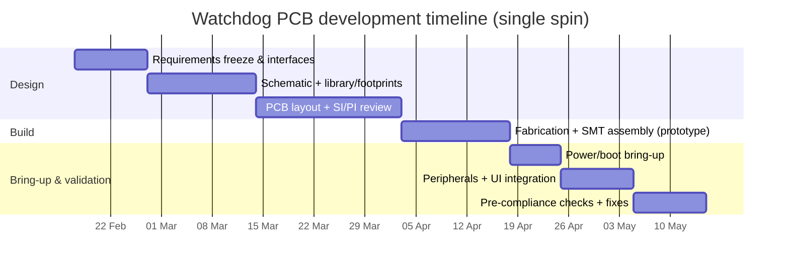

# PCB Design Research for Running the Watchdog Rust Project on Custom Hardware

## Executive summary

The provided ZIP is a Rust workspace for an embedded Linux “field device” style application comprising a local LCD UI, a privileged daemon, and networking subsystems (wired and wireless). Its current “known-good” hardware target (per the archive’s documentation and codepaths) is a Raspberry Pi Zero 2 W with a small SPI TFT HAT and multiple GPIO buttons; the UI uses Linux `spidev` for the TFT and Linux GPIO character devices for inputs. The Pi Zero 2 W platform choice is consistent with constrained resources (512 MB RAM, small display, input polling) and low power. citeturn0search10turn0search0

A custom PCB can run this project if it provides, at minimum, a 64‑bit ARM Linux-capable compute subsystem, SPI for the TFT, at least 8 GPIO inputs, and robust power and storage. The uploaded internal specification (“H616 watchdog board — Scenario 2”) narrows this further to an Allwinner H616 SoC platform with 512 MB DDR3/DDR3L, 8 GB eMMC, USB‑C power input, dual USB‑A, and an SPI TFT plus eight buttons. fileciteturn0file0 The H616 family is widely used in small SBCs; Linux mainline support for H616 boards (including Orange Pi Zero2) exists, and H616-class boards commonly expose 5 V USB‑C power input and multiple USB 2.0 host ports, making them plausible compute anchors for a dedicated appliance PCB. citeturn14search2turn10search1turn1search7

Because the project’s current TFT control pins and device paths appear Pi-centric (e.g., `/dev/spidev0.0`, `/dev/gpiochip0`, and fixed GPIO line numbers), a pure “hardware-only” port to a non-Pi SoC is unlikely to be drop-in without at least minor software/device-tree adaptation (e.g., configurable GPIO lines, or a kernel driver presenting the display/buttons as standard Linux framebuffer/input devices). This is a key technical risk to address early in bring-up.

Safety note (scope constraint): the repository describes capabilities that may be dual-use. This report focuses on hardware architecture, reliability, and compliance-oriented design for a lawful network appliance. It does not provide instructions for misuse of networks.

## Project artefact catalogue and inferred system requirements

### Archive structure and content types

Inspection of the ZIP shows a Rust workspace with multiple internal crates, installation scripts, systemd unit files, and extensive engineering notes/logs. There are no PCB CAD files (KiCad/Altium), no schematics, no mechanical drawings, and no electronic BOM inside the ZIP; therefore, the PCB must be designed from inferred hardware requirements plus any external specification (such as the uploaded H616 board breakdown).  

At a high level, the archive contains:
- Rust crates corresponding to UI, privileged daemon, IPC, and networking subsystems.
- Installers for Debian-family systems and service definitions (systemd) to run the UI and daemon under Linux.
- Operational and design notes (including UI/display performance notes) that help bound SPI throughput requirements and button polling behaviour.

### Purpose and functional blocks

The archive’s own “architecture” section decomposes the system into:
- LCD UI crate: menu rendering, SPI display driving, and GPIO button handling.
- Core orchestrator, privileged daemon, and IPC client: separation of privilege, job execution, and state reporting.
- Wired and wireless networking crates: interface control, discovery, and packet-level operations.
- Captive portal HTTP server crate.
- Crypto/encryption and WPA handshake processing crates.

This implies the PCB’s minimum viable “computer” is an embedded Linux SBC-class platform (not a small MCU) with workable filesystem/storage, networking I/O, and the ability to grant network capabilities to privileged services.

### Required interfaces and peripherals

From the codepaths and target hardware notes, the following interfaces are functionally required:

Digital interfaces:
- SPI master for the TFT display (Linux `spidev` compatible).
- GPIO for at least eight buttons (active-low with pull-ups is explicitly compatible with common HAT patterns).  
- USB host for external peripherals; the internal H616 board spec calls for two USB‑A ports. fileciteturn0file0
- Ethernet (wired) is a core expectation; the H616 board spec calls for 10/100 with an RJ45 MagJack. fileciteturn0file0

RF interfaces:
- The repository’s original Pi target includes on-board Wi‑Fi; the H616 board spec instead assumes external USB Wi‑Fi (no on-board RF) to simplify PCB RF design and regulatory overhead. fileciteturn0file0

Power interfaces:
- 5 V input is consistent across the “Pi-like” ecosystem; Orange Pi Zero2 documentation and typical H616 SBCs use USB‑C for 5 V input (often specified as ≥2 A). citeturn10search1turn10search48

Analogue/RF front ends:
- No necessarily-required high-resolution analogue sensing is evident for minimum functionality; the principal “actuation” is display backlight control and LEDs (optional).

Mechanical constraints:
- The original UI target references a Waveshare 1.44" LCD HAT that is physically sized for the Pi Zero form factor (≈65 mm × 30.2 mm) and uses SPI with a fixed wiring scheme. citeturn0search0  
- The H616 PCB spec (uploaded) does not constrain board outline, but includes the practical manufacturing assumption: factory SMT/BGA for fine-pitch parts, hand-soldered connectors. fileciteturn0file0

## Hardware architecture and interface specification

### Baseline reference platform and what it implies

The Raspberry Pi Zero 2 W is a quad‑core 64‑bit Arm (Cortex‑A53) platform with 512 MB RAM in a compact form factor. citeturn0search10 The referenced Waveshare 1.44" LCD HAT is an SPI TFT module (ST7735S) intended for small embedded UIs; it enumerates specific Pi header pins for SPI and control (DC/RESET/BL/backlight and joystick/button lines), reinforcing that the software’s “happy path” is Pi header-compatible. citeturn0search0

Design implication: any non-Pi PCB should either emulate the Pi’s Linux device interface expectations (device nodes + GPIO numbering) or change the software to be hardware-agnostic (configurable GPIO chip/lines; ideally Linux input subsystem).

### Recommended compute subsystem direction: Allwinner H616 class

Allwinner H616 boards commonly present the exact class of SoC resources the project expects: 64‑bit quad Cortex‑A53 CPU, USB 2.0 host/OTG, SD/eMMC storage interfaces, and an integrated Ethernet MAC (paired with an external PHY on many boards). citeturn1search7turn14search2 The Orange Pi Zero2 is a well-documented H616 board family (with published schematics) and shows a typical integration pattern: USB‑C 5 V in, multiple USB 2.0 ports, DDR3 memory, Ethernet, and exposed low-speed headers. citeturn10search1turn15view0

Design implication: reuse known-good H616 reference designs (e.g., Orange Pi Zero2 schematic patterns) to reduce first-spin risk, while tailoring I/O to the watchdog device requirements.

### Wired Ethernet interface options

There are two credible Ethernet architectures:

Option using 10/100 RMII (lower complexity, lower cost):
- H616 Ethernet MAC + RMII PHY such as Microchip LAN8720A (RMII 10/100). The LAN8720A is a compact QFN device and can run from a single 3.3 V supply with an integrated 1.2 V regulator (per datasheet feature list). citeturn7view0turn3search47  
- LAN8720A availability (example): Farnell Ireland lists LAN8720A‑CP with stock and unit pricing, supporting “real-world” sourcing feasibility for small runs. citeturn3search0

Option using Gigabit RGMII (higher throughput, higher routing sensitivity):
- Orange Pi Zero2 uses a Realtek RTL8211F gigabit PHY and includes 100 Ω differential constraints on the magnetics side in its reference schematic sheet. citeturn16view2  
- RTL8211F-type parts are available in common assembly ecosystems (e.g., JLCPCB parts library pages show QFN package selection and pricing), but gigabit adds stricter routing and clock quality requirements. citeturn25search11turn25search4

Recommendation for the watchdog PCB: if the product requirement is “reliable field appliance” rather than maximum throughput, 10/100 RMII is a prudent first revision choice (simpler EMI/routing, smaller BOM, less signal-integrity risk). The uploaded H616 board spec already aligns to 10/100 + MagJack. fileciteturn0file0

### USB and external peripherals

USB 2.0 routing requires controlled differential impedance and careful intra-pair matching. Microchip’s USB layout guidance (for hubs, but broadly applicable) recommends: avoid 90° corners, route over continuous reference planes, keep HS traces short, minimise vias, and match the differential pair lengths tightly (for HS, max ~1.25 mm mismatch). citeturn2search47

Implementation choices:
- Use H616’s native USB host ports directly to two USB‑A receptacles (preferred; fewer chips).
- Add current-limited high-side power switches per port (protect against shorts and overcurrent; allows software-controlled VBUS if desired).
- ESD protection arrays on D+/D− near the connector, with a low-inductance return path to chassis/ground.

### Display and button interface baseline

The Waveshare 1.44" LCD HAT is an SPI display module with documented dimensions and pinout expectations for SPI and GPIO control lines. citeturn0search0  
Even if you do not reuse this exact module, it provides a strong “interface template”:
- SPI: SCLK/MOSI (and optionally MISO if the display reads back).
- Control: DC, RESET.
- Backlight: PWM-capable GPIO (or transistor switch).

For production-friendly integration, a connectorised TFT module (0.1" header or FPC) is preferable to a raw panel unless you are prepared to manage FPC mechanics and assembly variability.

## Power, clocking, and component selection

### Power tree and rails

A reference H616 power tree is visible in the Orange Pi Zero2 schematic set. The “POWER TREE” sheet shows a multi-rail PMIC generating core rails for CPU and GPU as well as system rails (3.3 V domains, 1.8 V domains, and auxiliary rails). citeturn16view0turn15view0 This strongly suggests that a PMIC-based approach is common and reduces discrete regulator count and sequencing complexity.

For USB‑C 5 V input without USB‑PD complexity, a sink should present Rd pull-downs on CC1 and CC2. Microchip’s USB Type‑C introduction note states that 5.1 kΩ is the acceptable Rd value (with specified tolerance) for a UFP/sink to be detected and powered. citeturn8search45  
Design implication: the watchdog PCB can be powered by “dumb” 5 V USB‑C sources using only CC resistors; USB‑PD is optional unless you require >5 V or role swaps.

Suggested rails (typical for H616-class SoCs; validate against chosen SoC/PMIC reference design):
- 5 V input: USB‑C VBUS, protected by TVS + fuse/limiter.
- Core rails: CPU core (~0.9–1.1 V typical in reference designs), GPU/SYS core (~0.9 V typical in reference designs). citeturn16view0turn22search8
- DRAM rail: DDR3/DDR3L typically requires a dedicated DRAM supply; use the reference design and memory datasheet to select 1.5 V (DDR3) or 1.35 V (DDR3L) and ensure clean decoupling and proper VREF generation.
- I/O rails: 3.3 V for PHY, USB, and general I/O; 1.8 V for assorted internal domains (seen in reference power trees). citeturn16view0

Power budget guidance:
- Orange Pi Zero2 class systems are typically specified for 5 V input at ≥2 A. citeturn10search48turn14search2
- Your USB-A ports dominate the worst-case budget; two ports at 500 mA each already require 5 V × 1 A = 5 W headroom, before SoC consumption and losses.  
Recommendation: design for 5 V input at 3 A nominal (15 W) with port power switching to enforce per-port limits; then validate real-world draw during peak workloads (CPU + storage + Ethernet + USB peripherals).

### Clocking and timing domains

Key clock domains to accommodate:
- SoC reference crystal (commonly 24 MHz on Allwinner boards; Orange Pi Zero2 schematic block indicates a 24 MHz domain). citeturn15view0turn14search2
- Ethernet PHY clocking: RMII PHYs often use 25 MHz crystals (LAN8720A explicitly supports a 25 MHz crystal option). citeturn7view0turn3search47
- USB hub (if used): FE1.1S hub controller integrates a 12 MHz oscillator and PLL architecture per its datasheet feature list, influencing placement around the hub IC and decoupling expectations. citeturn3search8
- eMMC high-speed timing: if you enable HS200/HS400 modes, routing constraints become more stringent; treat eMMC similarly to a high-speed parallel interface with short, clean routing and robust power integrity.

### Storage selection and eMMC option table

The internal spec calls for 8 GB eMMC as a deliberate sizing choice. fileciteturn0file0 A concrete 8 GB eMMC example is Samsung KLM8G1GETF‑B041 (FBGA‑153, 11.5 × 13 mm). Samsung’s product pages identify 8 GB capacity, 1.8/3.3 V I/O compatibility, and HS400 interface capability (variant dependent). citeturn26search10turn26search47 LCSC listings provide indicative price and stock snapshots for this part number and package. citeturn26search11

| eMMC option | Package | Key electrical notes | Availability and indicative cost (Feb 2026 snapshot) | Risk notes |
|---|---|---|---|---|
| Samsung KLM8G1GETF‑B041 (8 GB) | FBGA‑153 (11.5×13) | VCCQ supports 1.8 V or 3.3 V; HS400/HS200 class interfaces depending on configuration. citeturn26search47turn26search10 | LCSC lists stock and unit pricing for small quantities (example listing). citeturn26search11 | Some regional Samsung pages mark certain variants/status differently; treat lifecycle as a supply-chain risk and qualify alternates early. citeturn26search0turn26search10 |
| Kioxia / SanDisk / others (8 GB class) | BGA‑153 common | Similar dual-rail concept (VCC + VCCQ) typical for eMMC; confirm exact supported bus modes per part. | LCSC category listings show multiple 8 GB eMMC options with stock counts. citeturn26search6 | Divergent pinouts exist despite similar “BGA‑153” wording; confirm JEDEC footprint compatibility before multi-source claims. |

Recommendation: pick an eMMC with a stable supply chain and freeze the footprint early; avoid “mystery” distributor sources for the first manufacturing run. For assembly, plan for X-ray inspection if using BGA eMMC (some assemblers flag it as required). citeturn26search2

### Ethernet PHY option table

| PHY option | Speed | Interface | Footprint | Pros | Cons |
|---|---|---|---|---|---|
| Microchip LAN8720A | 10/100 | RMII | QFN‑24 (4×4 mm) citeturn7view0 | Simpler routing; well-documented; widely stocked by mainstream distributors. citeturn3search0turn7view0 | Not gigabit; requires careful magnetics/ESD design like any Ethernet port. |
| Realtek RTL8211F family | 10/100/1000 | RGMII (common variants) | QFN (e.g., WQFN‑40) citeturn25search11 | Higher throughput; widely used on H616 boards. citeturn16view2 | More complex timing/routing; PHY datasheet distribution may be restricted; adds SI risk. citeturn25search0 |

### Recommended “first-spin” BOM summary

A full BOM depends on confirmed SoC package choice, DRAM package, enclosure, and connector mechanics. The following is a realistic “minimum viable” BOM set aligned with the uploaded H616 watchdog specification plus known-good reference patterns:

- Compute: Allwinner H616 SoC (BGA), 512 MB DDR3/DDR3L (BGA), 8 GB eMMC (BGA‑153). citeturn1search7turn26search47  
- Power: multi-rail PMIC approach (AXP305-class as seen in H616 reference designs) or equivalent discrete bucks/LDOs; include USB‑C CC Rd resistors (5.1 kΩ) for 5 V sink behaviour. citeturn16view0turn8search45  
- Ethernet: LAN8720A + RJ45 MagJack (for 10/100 RMII path) or RTL8211F + magnetics (for gigabit path). citeturn7view0turn3search0turn16view2  
- USB: two USB‑A connectors; ESD protection for D+/D−; per-port power switch; follow USB routing rules. citeturn2search47  
- UI: SPI TFT connector (or module footprint), eight tactile switches (or a button board connector), backlight driver transistor if needed. citeturn0search0  
- Debug: 3‑pin UART header (TX/RX/GND) for early boot logging (consistent with many SBC practices).

## PCB stack-up, layout, EMC, and testability plan

### PCB layer count, material, and impedance control

Given the combination of BGA SoC + BGA DRAM + BGA eMMC and multiple high-speed-ish interfaces (USB 2.0 HS, Ethernet, DDR3), a 6‑layer FR‑4 stack-up is a pragmatic baseline for routing density and reference-plane control.

A typical 6‑layer performance-oriented arrangement is SIG/GND/SIG(or PWR)/SIG(or PWR)/GND/SIG, which reduces EMI and improves return paths compared to 4‑layer in high-density designs. citeturn4search1turn4search7  
For impedance-controlled manufacturing, use your chosen fabricator’s published stack-ups and calculators (e.g., JLCPCB impedance stack-up tables and calculator guidance) and specify target impedances (USB HS ~90 Ω diff; Ethernet MDI ~100 Ω diff; general fast single-ended nets ~50 Ω controlled where necessary). citeturn4search0turn4search8

Example 6‑layer stack-up table (to be confirmed with fab engineering)
- L1: Signal + components (microstrip over L2 GND)
- L2: Solid GND plane
- L3: Power plane / split rails (keep splits away from high-speed routes)
- L4: Signal (stripline between L3/L5 or L2/L5 depending on final stack)
- L5: Solid GND plane
- L6: Signal + components

### DDR3 placement and routing strategy

DDR routing is the dominant PCB risk. Even if the SoC controller provides training, you must follow tight length-matching, layer consistency, and spacing rules.

Intel’s DDR3 layout guidance captures broadly applicable constraints: keep memory routes short, route memory signals between adjacent planes, avoid adjacent signal layers, and length-match within byte lanes (DQ/DQS/DM) tightly (example guideline: ±10 ps within a byte lane group), with clocks and address/command matched to their references. citeturn2search0turn2search7

Practical DDR3 strategy for first-spin success:
- Place DRAM as close as physically possible to the SoC, with a clear BGA escape region.
- Use at least one solid ground plane adjacent to the DDR routing layer(s).
- Route each byte lane on a single layer where feasible; minimise vias (each via adds discontinuity and skew).
- Provide substantial local decoupling at DRAM VDD/VDDQ/VREF pins/balls, following the memory vendor’s datasheet.

### USB, Ethernet, and mixed-signal routing rules

USB 2.0 HS:
- Match D+ and D− lengths tightly; Microchip’s guidance gives a concrete mismatch limit for HS pairs (≤1.25 mm) and recommends routing over unbroken planes, avoiding sharp corners, and minimising vias. citeturn2search47
- Place ESD protection close to connectors with a direct, low-inductance return path to ground.

Ethernet:
- Follow either RMII (SoC↔PHY) rules (short, clean single-ended clocks/data) plus 100 Ω differential MDI pairs (PHY↔magnetics/RJ45), or for gigabit PHY follow RGMII timing constraints and reference schematics.
- The Orange Pi Zero2 reference schematic explicitly marks 100 Ω differential impedance on Ethernet pairs and shows typical strap/pull networks and magnetics connectivity. citeturn16view2turn15view0

Mixed-signal/EMC:
- Partition the PCB into “noisy” (SoC/DRAM/PMIC/switching) and “connector/IO” zones, maintaining continuous return paths.
- Use stitching vias around connector shields and at plane transitions.
- Add common-mode chokes on external high-speed lines only if EMI testing demonstrates need (start without unless prior products required them; chokes can degrade signal integrity).

ESD/EMI validation target:
- A common system-level reference is IEC 61000‑4‑2, with severity levels commonly cited up to ±8 kV contact and ±15 kV air at Level 4 (vendor application notes summarise these levels). citeturn9search50  
Design implication: add ESD diodes, shield grounding, and robust chassis/ground referencing so the appliance can survive typical real-world handling.

### Decoupling and thermal management

Decoupling:
- Treat PMIC rails and SoC rails as a power distribution network design problem: use bulk capacitance near regulator outputs, and dense high-frequency decoupling at SoC/DRAM balls/pins.
- Ensure each high-speed IC has local 0.1 µF class caps at each supply pin group plus additional capacitance for dynamic loads; exact values should be guided by the SoC/PMIC reference BOMs.

Thermal:
- H616-class SBCs often recommend heat sinking for sustained load; Orange Pi documentation notes adding a heatsink if temperature is a concern. citeturn10search0  
- Provide a thermal via array under the SoC (where package allows) tied to an internal ground plane; keep copper symmetry to reduce board warpage.

### Testability, programming, and debug interfaces

Include, at minimum:
- UART console header (3‑pin) for bootloader/kernel logs.
- Test points for: 5 V input, 3.3 V, 1.8 V, DRAM rail, CPU core rail, and any PHY rails.
- USB D+/D− test pads (high-impedance probing only; keep stub length minimal).
- Ethernet MDIO/MDC access pads (optional) for PHY bring-up.
- A “force boot”/recovery mechanism (strap or button) consistent with SoC boot ROM behaviour.

### Layout checklist

Use this as a sign-off gate before fab:
- Stack-up confirmed with fabricator; impedance targets declared; critical pairs assigned to controlled-impedance layers. citeturn4search0turn4search8
- DDR3: byte lanes length-matched; clocks/address/command matched per controller guidance; minimal vias; continuous reference plane. citeturn2search0turn2search7
- USB HS: D+/D− matched; no 90° corners; minimal vias; continuous return plane; ESD placed at connector. citeturn2search47
- Ethernet: MDI pairs routed as 100 Ω differential with symmetry; magnetics placement and Bob‑Smith termination/shielding per MagJack/reference design. citeturn16view2turn7view0
- USB‑C power: CC1/CC2 Rd (5.1 kΩ) present; input TVS and protection fitted. citeturn8search45
- Manufacturing: fiducials, panel rails (if needed), and clear connector courtyard for hand-solder operations.

## Manufacturing, validation, risks, and schedule

### Fabrication and assembly file set

For turnkey SMT assembly, fabricators typically require:
- Gerbers (copper, mask, silk, paste, drills).
- BOM (machine-readable, with MPNs).
- CPL / pick-and-place centroid file. citeturn9search2turn9search10

Also produce:
- Assembly drawings (top/bottom), polarity marks, and torque notes for connectors.
- Test point map and bring-up checklist.
- Programming notes (UART settings; boot media).

### Validation and test procedures

Bring-up should be staged to isolate faults:

Power-on and rails:
- Validate USB‑C input negotiation (basic 5 V present) and check inrush/current limiting.
- Measure each rail at no-load and under controlled load; confirm PMIC sequencing and ripple.

Boot chain:
- Verify boot ROM sees the intended boot medium (eMMC or SD) and reaches bootloader.
- Capture UART logs for each stage; make this a manufacturing acceptance test artifact.

Peripheral interfaces:
- SPI display: confirm SPI clock rate and signal quality; verify backlight control and reset sequencing; confirm refresh latency at target `max_speed_hz` (SPI bandwidth math suggests full-screen updates can be tens to hundreds of milliseconds at 4 MHz, which aligns with “menu UI” style operations). citeturn0search0
- Buttons: verify GPIO polarity, debounce behaviour, and absence of ghosting/noise; consider adding RC filtering or Schmitt inputs if EMI causes false triggers.
- Ethernet: link up/down stability, traffic throughput, ESD resilience at RJ45.
- USB: enumerate devices on both ports; validate signal integrity by stress testing large transfers; ensure port power switching behaves correctly under overload.

EMC/ESD pre-compliance:
- Perform IEC 61000‑4‑2 style contact/air discharge checks at connector shells and enclosure touch points to identify weak grounding/ESD paths early. citeturn9search50

### Risks and mitigations

Highest risks:
- DDR3 routing and bring-up: mitigate by copying a proven H616 reference layout topology (e.g., Orange Pi family) and using 6 layers with strong plane adjacency. citeturn15view0turn2search0
- Software portability of GPIO/display: mitigate by either (a) designing the board to expose the UI via Linux-standard interfaces (framebuffer + gpio-keys), or (b) implementing configuration for GPIO lines and SPI device selection in software early, before committing PCB pinmux.
- Supply chain volatility: mitigate by selecting components with stable distributor presence (LAN8720A is an example with mainstream availability; eMMC/PMIC parts may require dual sourcing). citeturn3search0turn26search11
- Assembly yield for BGA: mitigate with conservative design rules, AOI + X-ray for BGA parts, and clear rework strategy.

### Estimated cost and timeline

Without a fixed production volume, only ranges are responsible. A realistic first cycle for a BGA-based embedded Linux PCB is:

Timeline (typical, assuming one revision spin):

Cost drivers:
- PCB: 6‑layer impedance-controlled boards increase cost over 4‑layer; HDI features (via-in-pad, small drills) add.
- Assembly: BGA placement + X-ray inspection can add cost and constrain assembler choice.
- Components: eMMC and PMIC availability/cost dominate; Ethernet PHY and passives are comparatively stable (e.g., LAN8720A pricing is sub‑€2 in small quantities on mainstream distributors). citeturn3search0turn26search11

A practical approach for cost and risk control is to prototype on an existing H616 SBC (e.g., Orange Pi Zero2 class) plus a carrier/UI board, then consolidate into a single PCB once software portability and UI electrical characteristics are proven. That approach leverages published reference designs and reduces “unknown unknowns” in revision one. citeturn14search2turn15view0